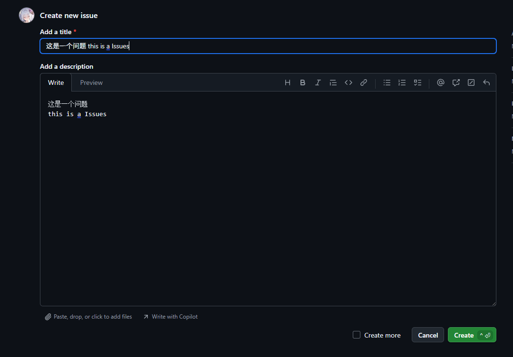

# Feedback

Welcome to report any issues you encounter while using `xiaozi craft`.

## Feedback Channels

- Submit an issue report on GitHub Issues
- Attach your Minecraft version, mod list, and relevant logs

## How to Submit an Issue Report?

## Method 1: Submit an issue report on GitHub Issues

1. Open the [GitHub Issues](https://github.com/366862732/xiaozi-craft/issues) page.  
You can click the hyperlink in the previous sentence, or copy the URL below:
```text
https://github.com/366862732/xiaozi-craft/issues
```
If you don't have a GitHub account, you need to sign up first. (Or use Method 2.)

## 1. First, open the xiaozi craft GitHub Issues page.

#### Click the green "New Issue" button in the view.

## 2. Fill in the title and description of the issue report.
:::tip
Make sure to clearly state what the problem is, how it manifests, and the steps to reproduce it.
:::

"Add a Title" is the title of your report.  
"Add a Description" is the detailed description of your report (you can use Markdown format).

## 3. Upload relevant log files.
:::tip
You need to upload relevant log files, such as `latest.log` or `debug.log`. The more detailed the logs you provide, the better, as this helps us pinpoint the issue more accurately.  
These log files are usually found in the `logs` folder under your xiaozi craft working directory.
:::
:::tip
If you encounter a JVM crash, such as a file named like `hs_err_pid23640.log`, you can also upload that log file.  
This file is usually placed directly in your xiaozi craft working directory after the crash.
:::
:::tip
If you are reporting a game crash, you can also upload the game crash log file.  
Files named like `crash_report_2023-08-01_12-00-00.log` – these are usually stored in the `crash_report` folder under your xiaozi craft working directory after the crash.
:::
You can upload files by dragging them from your file explorer into the upload area, like this:

:::warning
You must upload relevant log files, otherwise we cannot diagnose the issue. Any log files generated from the problem are acceptable.
:::

## 4. Click the "Create" button.
:::warning
Before clicking this button, please confirm the following:
1. You have clearly filled in the issue title, description, and reproduction steps.
2. You have uploaded the relevant log files.
3. The log files you upload correspond to the same occurrence, not from other issues.
4. You have specified which version of xiaozi craft you are using, including both the game version and the xiaozi craft version. (The version number can be found in the top-left corner of the xiaozi craft title screen.)
5. Do not upload log files from old versions. We only accept issues from the latest version and LTS/LTSC versions. (Issues from older versions will be rejected.)
:::
After confirming all the items in the checklist above, click the "Create" button.


## Method 2: Report issues via email
:::tip
Considering that you may not have a GitHub account, you can also report issues via email.
:::
:::tip
Send an email to our mailbox, describing the specific problem and the steps to reproduce it. This is similar to steps 2–3 in Method 1.
:::
Email: [366862732@qq.com](mailto:366862732@qq.com)  
If you prefer not to use the hyperlink, you can also copy the email address directly:
```text
Email: 366862732@qq.com
```
xiaozi Graphics Development Team 2026/07/21 