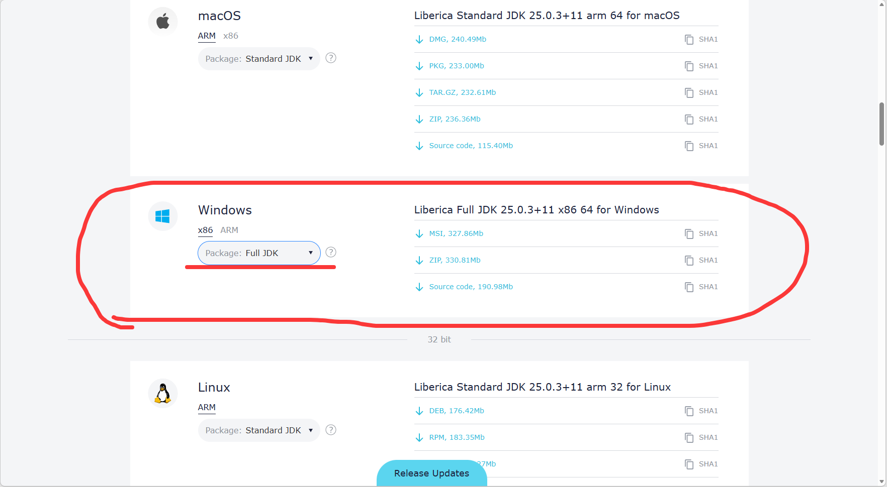
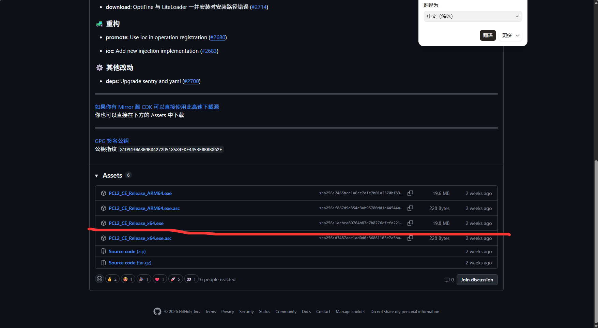
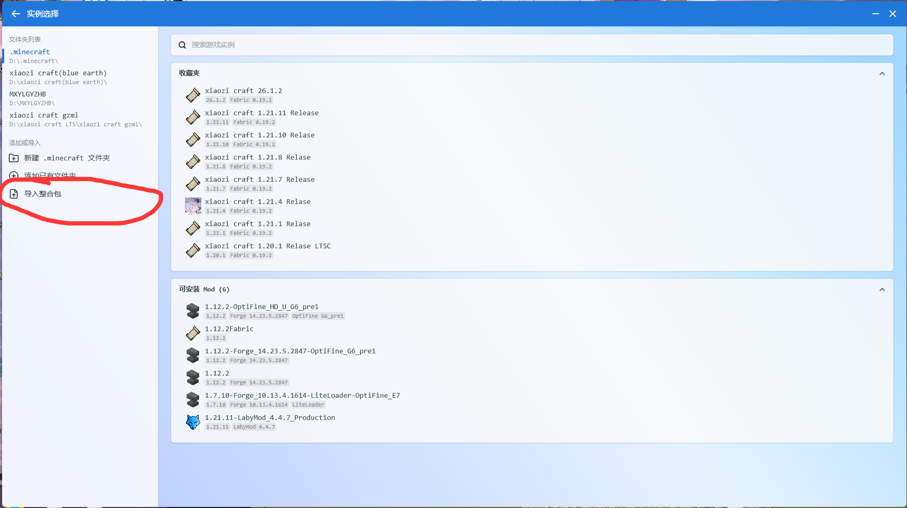
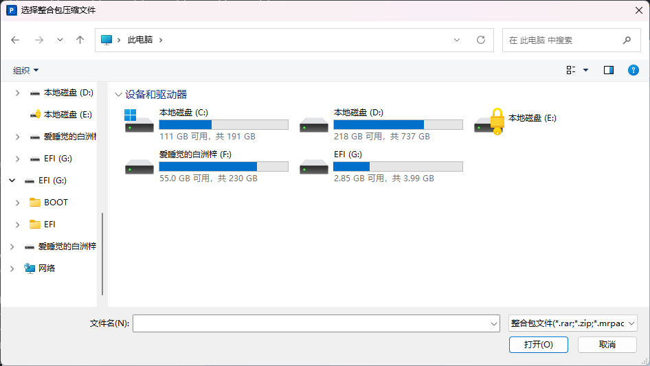
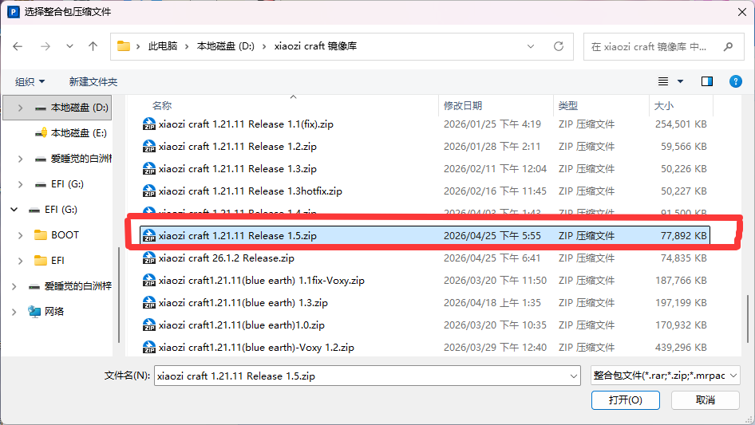
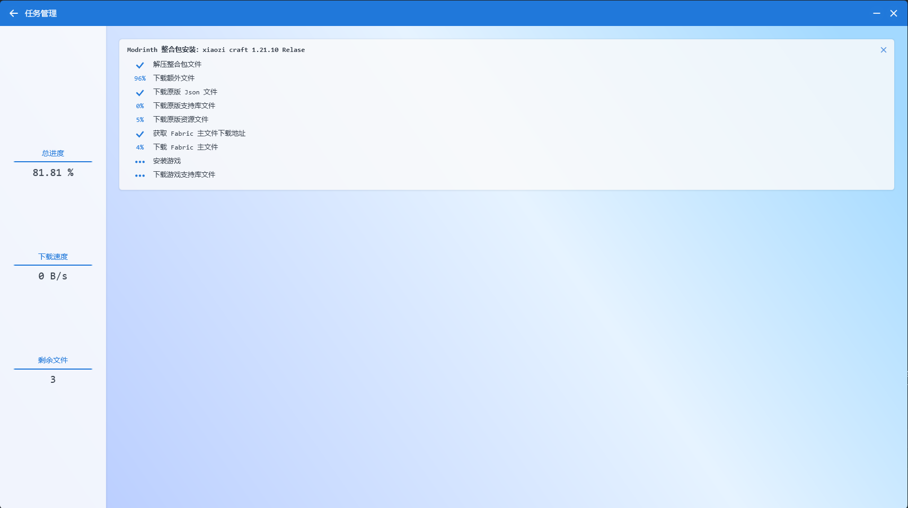
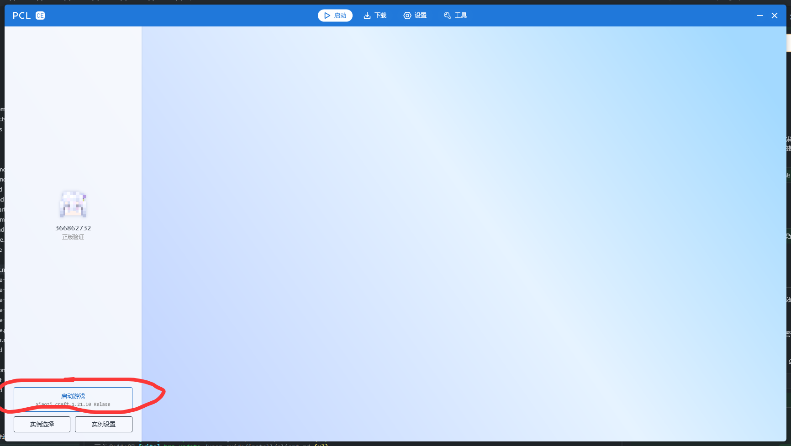
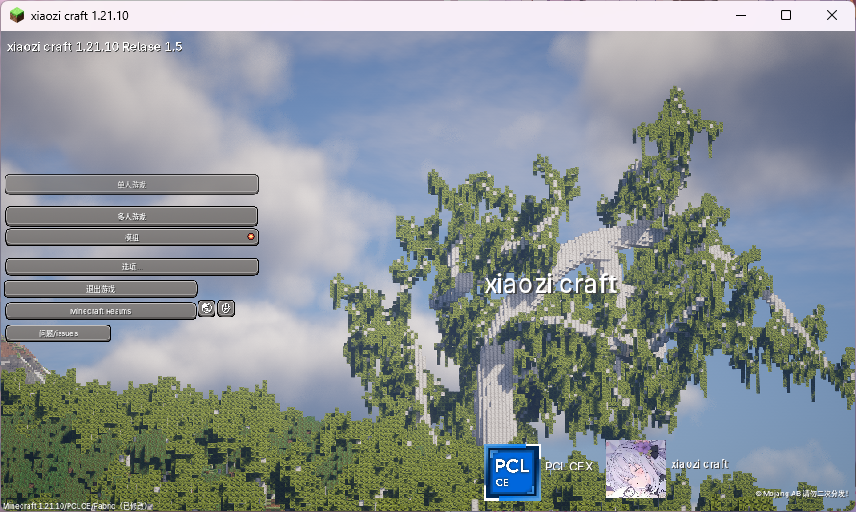

# Client

Before you start playing Minecraft Java Edition, you need to install a Java runtime first.

```text
There are two recommended download sources:
Oracle: https://www.oracle.com/java/technologies/java-jdk-downloads.html
BellSoft: https://bellsoft.com/products/jdk/
Choose either one, but make sure you download a 64-bit Java version.
```

At the moment, BellSoft Java is strongly recommended.



Remember to select the full edition.

Run this command to verify that Java was installed correctly:

```bash
java -version
```

You should see output similar to this:

```text
java version "17"
Java Runtime Environment (build 17+10)
OpenJDK Runtime Environment (build 17+10)
```

If you see something similar, Java was installed successfully.

### 2. After Java is ready, you still need a launcher. We recommend PCLCE.

```text
PCLCE download page:
https://github.com/PCL-Community/PCL-CE/releases/latest
```

Choose the correct version for your operating system architecture.



### 3. After downloading it, open PCLCE and click the option to install a modpack.



Select the downloaded `xiaozi craft` modpack archive. It is usually a `.zip` file.



It usually looks like this. Select it and open it.



PCLCE will start installing the modpack automatically.



It will download the required files automatically.

::: warning
If the download stalls for a long time, cancel the task and repeat step 3.
:::

Next, just launch the game by selecting the `xiaozi craft` modpack.



Looks good.


