# Installing the xiaozi craft Server (Linux)
Before we begin, don't be intimidated by the seemingly complex Linux operations. We will break down every step in detail for installing the xiaozi craft server on a Linux server.
## Method 1: Install using the MSLX Panel Manager (Recommended)
Q: Why do we recommend installing with the MSLX Panel Manager?
A: The MSLX Panel Manager is a web-based interface that provides simple installation and management features for the xiaozi craft server. It also supports batch installation and management of multiple server instances, which is very convenient when you need to manage multiple servers.
A: The installation and configuration of the MSLX Panel Manager is very simple. You only need to visit the MSLX Panel Manager URL in your browser and follow the prompts to install.
## Verify Your System
This tutorial uses the Ubuntu 26.04 LTS Server edition for demonstration.
```bash
Welcome to Ubuntu 26.04 LTS (GNU/Linux 7.0.0-29-generic x86_64)

 * Documentation:  https://docs.ubuntu.com
 * Management:     https://landscape.canonical.com
 * Support:        https://ubuntu.com/pro

 System information as of Thu Aug 13 11:58:30 AM UTC 2026

  System load:            0.44
  Usage of /:             13.0% of 61.71GB
  Memory usage:           5%
  Swap usage:             0%
  Temperature:            29.9 C
  Processes:              293
  Users logged in:        0
  IPv4 address for ens33: 192.168.2.174
  IPv6 address for ens33: fda8:5ae0:d97a:fd00:20c:29ff:feb6:ed10


Expanded Security Maintenance for Applications is not enabled.

51 updates can be applied immediately.
To see these additional updates run: apt list --upgradable

Enable ESM Apps to receive additional future security updates.
See https://ubuntu.com/esm or run: sudo pro status


Last login: Wed Aug 12 15:19:26 2026 from 192.168.2.24
xiaozi@xiaozicraft-server:~$ fastfetch
                             ....              xiaozi@xiaozicraft-server
              .',:clooo:  .:looooo:.           -------------------------
           .;looooooooc  .oooooooooo'          OS: Ubuntu 26.04 (Resolute Raccoon) x86_64
        .;looooool:,''.  :ooooooooooc          Host: VMware Virtual Platform
       ;looool;.         'oooooooooo,          Kernel: Linux 7.0.0-29-generic
      ;clool'             .cooooooc.  ,,       Uptime: 50 seconds
         ...                ......  .:oo,      Packages: 739 (dpkg)
  .;clol:,.                        .loooo'     Shell: bash 5.3.9
 :ooooooooo,                        'ooool     Terminal: /dev/pts/0
'ooooooooooo.                        loooo.    CPU: 2 x 12th Gen Intel(R) Core(TM) i7-12700KF (6) @ 3.61 GHz
'ooooooooool                         coooo.    GPU: VMware SVGA II Adapter
 ,loooooooc.                        .loooo.    Memory: 574.46 MiB / 7.20 GiB (8%)
   .,;;;'.                          ;ooooc     Swap: 0 B / 4.00 GiB (0%)
       ...                         ,ooool.     Disk (/): 8.04 GiB / 61.71 GiB (13%) - ext4
    .cooooc.              ..',,'.  .cooo.      Local IP (ens33): 192.168.2.174/24
      ;ooooo:.           ;oooooooc.  :l.       Locale: en_US.UTF-8
       .coooooc,..      coooooooooo.
         .:ooooooolc:. .ooooooooooo'
           .':loooooo;  ,oooooooooc
               ..';::c'  .;loooo:'
xiaozi@xiaozicraft-server:~$
```
## Install using curl
Enter the following command in your console to install the MSLX Panel Manager:
```bash
curl -sL "https://files.mslmc.cn/d/MSL/MSL%20Resources/MSLX/scripts/20260708/install_common.sh?sign=S4vPlcS2dhdrSEFr4vkOmiCgfp_E6UMxwb7l-kTpmKo=:0" | sudo bash
```
Since the command contains sudo, we need to enter the password once to elevate privileges.
```bash
xiaozi@xiaozicraft-server:~$ curl -sL "https://files.mslmc.cn/d/MSL/MSL%20Resources/MSLX/scripts/20260708/install_common.sh?sign=S4vPlcS2dhdrSEFr4vkOmiCgfp_E6UMxwb7l-kTpmKo=:0" | sudo bash
[sudo: authenticate] Password: *********
```
Shortly after, you will enter the MSLX installation wizard on Linux.
```bash
=========================================
    MSLX-Daemon Installation/Update Wizard (Linux)
=========================================
[System Check] Optimizing temporary storage space...
>> Temporary directory: /opt/mslx_temp_setup

[Configuration Wizard 1/3] Please enter the installation directory:
Directory path (default /opt/mslx):
Here, you will be asked to choose the installation directory path. The default is /opt/mslx, but if you wish to customize it, enter another path here. We will use the default path (press Enter to accept the default).
Next, you will see the second step of the installation wizard: selecting the listening mode.
```bash
[Configuration Wizard 2/3] Please select the listening mode:
 1) Listen on localhost (127.0.0.1) - Recommended
 2) Listen on all interfaces (0.0.0.0)
Option [1-2] (default 1):
```
Listen on localhost (127.0.0.1) — This means only this machine can access it. Not recommended for production environments, because your server is command-line based and cannot open a browser.
Listen on all interfaces (0.0.0.0) — Highly recommended. Selecting this allows all devices on the local network to access the MSLX Panel Manager. You can use another computer to access it.
Next, you will reach the third step: selecting the listening port.
```bash
[Configuration Wizard 3/3] Please enter the listening port:
Port number (default 1027):
```
Pressing Enter directly means using the default port 1027. However, if you have special needs—for example, if port 1027 is already occupied—you can enter another port number here and press Enter to confirm.

:::warning
The port number range is 1024–65535. Do not attempt to enter anything outside this range!
:::
Start Installation
```bash
[2/5] Installing system dependencies...

[3/5] Detecting/Configuring .NET SDK environment...
Valid .NET 10.0 SDK found: /usr/lib/dotnet (skipping installation)

[4/5] Deploying/Updating MSLX-Daemon...
Download link: https://api.mslmc.cn/v3/download/update?software=MSLX&system=Linux&direct=true&arch=x64
  % Total    % Received % Xferd  Average Speed   Time    Time     Time  Current
                                 Dload  Upload   Total   Spent    Left  Speed
  0      0   0      0   0      0      0      0           00:02              0
100    119  100    119   0      0     44      0   00:02   00:02              0
100     82  100     82   0      0     26      0   00:03   00:03              0
100  7.54M  100  7.54M   0      0  1.46M      0   00:05   00:05          3.55M
File deployed (overwrite update completed)

[5/5] Configuring Systemd service...
Created symlink '/etc/systemd/system/multi-user.target.wants/mslx.service' → '/etc/systemd/system/mslx.service'.
Systemd service started.

Waiting for service initialization (5s)...

=========================================
        MSLX-Daemon Running Status
=========================================
Status: ● Running (PID: 2185)
Directory: /opt/mslx
Address: http://192.168.2.174:1027
-----------------------------------------
>>> Initial Credentials Capture:
Aug 13 12:13:34 xiaozicraft-server MSLX-Daemon[2185]:       Your default API Key is: CGMlz8iTesw2OIJjpLAMn2PAkZ73HQPJnjG4u22ZolBmqwJ7aoFD3BAGC3XjNKmE
Aug 13 12:13:34 xiaozicraft-server MSLX-Daemon[2185]: info: MSLX.Daemon.Utils.ConfigUtils.UserListConfig[]
Aug 13 12:13:34 xiaozicraft-server MSLX-Daemon[2185]:       Default admin user initialized: mslx / Yr7UqIw9YKlkhzyx
Aug 13 12:13:34 xiaozicraft-server MSLX-Daemon[2185]: info: MSLX.Daemon.Utils.ConfigUtils.UserListConfig[]
Aug 13 12:13:34 xiaozicraft-server MSLX-Daemon[2185]:       Username: mslx
Aug 13 12:13:34 xiaozicraft-server MSLX-Daemon[2185]: Password: Yr7UqIw9YKlkhzyx
Aug 13 12:13:34 xiaozicraft-server MSLX-Daemon[2185]: info: MSLX.Daemon.Utils.ConfigUtils.UserListConfig[]
Aug 13 12:13:34 xiaozicraft-server MSLX-Daemon[2185]:       Initial account credentials exported to: /opt/mslx/DaemonData/默认账户信息.txt
-----------------------------------------
>>> Quick Management Commands:
  Start: systemctl start mslx
  Stop: systemctl stop mslx
  Restart: systemctl restart mslx
  Logs: journalctl -u mslx -f
=========================================
xiaozi@xiaozicraft-server:~$
```
There is a lot of information here. Let's break it down one by one:
Installation Directory: /opt/mslx
Listening Mode: Listen on all interfaces (0.0.0.0)
Listening Port: 1027
API Key: CGMlz8iTesw2OIJjpLAMn2PAkZ73HQPJnjG4u22ZolBmqwJ7aoFD3BAGC3XjNKmE
Default Admin User: mslx / Password: Yr7UqIw9YKlkhzyx

:::tip
#### Forgot your admin password?
Enter this command in the terminal to print the username and password information:

```bash
cat /opt/mslx/DaemonData/默认账户信息.txt
```
```bash
xiaozi@xiaozicraft-server:~$ cat /opt/mslx/DaemonData/默认账户信息.txt
==================================================
MSLX-Daemon Initialization Successful - Default Admin Credentials
==================================================
Generated at: 2026-08-13 12:13:34

【Security Notice】
Please be sure to change the default username and password in User Management after your first login to the console!
To prevent your daemon panel from being maliciously scanned and compromised.

【Account Information】
Login Username: mslx
Default Password: Yr7UqIw9YKlkhzyx

【Console Address】
If the browser does not open automatically, please manually visit the configured port (default http://localhost:1027)
xiaozi@xiaozicraft-server:~$
```
:::warning
### Please make sure to remember your username and password! Otherwise you will have to uninstall and reinstall.
Uninstall command:

```bash
curl -sL "https://files.mslmc.cn/d/MSL/MSL%20Resources/MSLX/scripts/20260708/uninstall.sh?sign=FFmB7MaL5FZXohXRQ7vslfcQ6gIO_Opx1-wG7tmuRjw=:0" | sudo bash
```
:::
:::
Log in to the MSLX Console
The access address is generally your Linux server's IP address plus the port number.
For example: http://192.168.2.174:1027
Log in using the username and password we just obtained.

From here on, it's the same as the Windows version.
Create a server instance, specifying the server name and storage path.
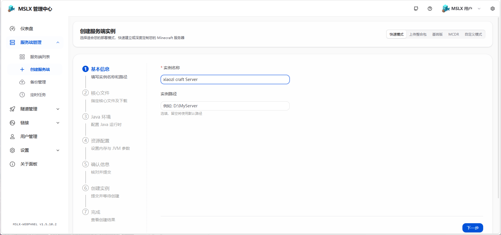
Select the server core. Note: xiaozi craft uses the Fabric loader. Do not select the wrong one!
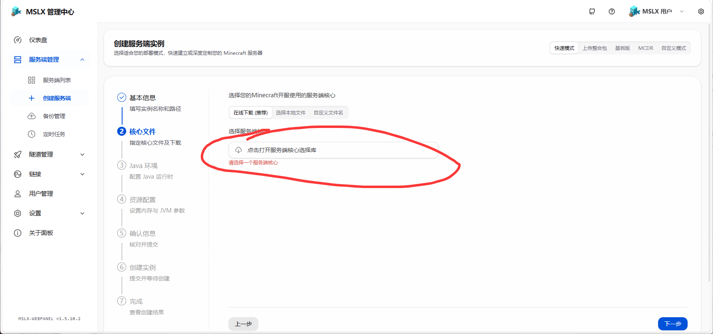

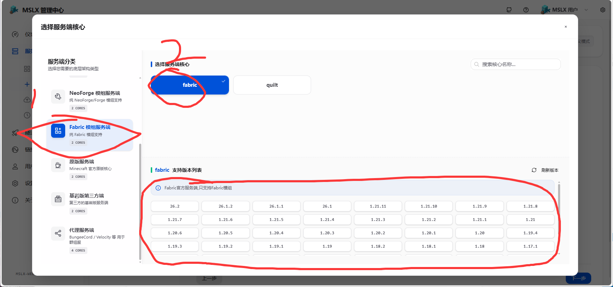
Here, select the Fabric core, game version 26.1.2.
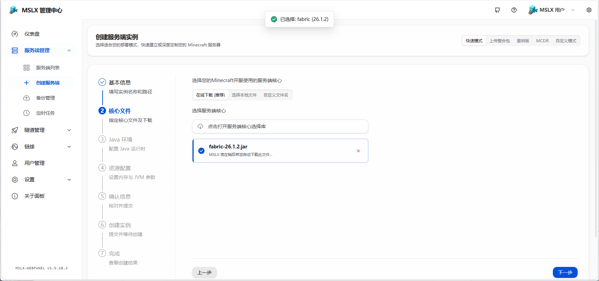
Select Java version 25. Because the version is 26.1.2, MSLX automatically selected Java 25.

Memory and JVM arguments. If you want better performance, you can try setting minimum memory equal to maximum memory (lock memory pages).
For JVM arguments, if you want better performance, you can try the entries from the JVM arguments article, or use the JVM arguments officially provided by xiaozi craft.
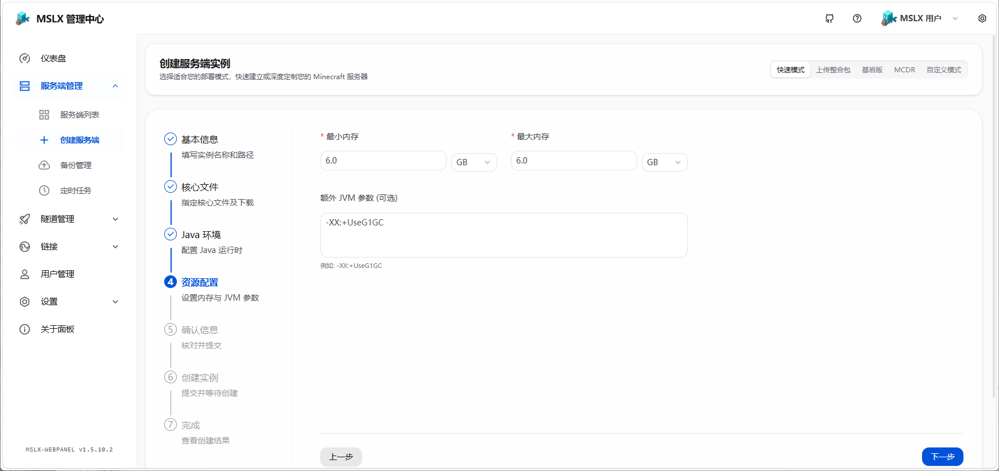
Finally, confirm the information and create.
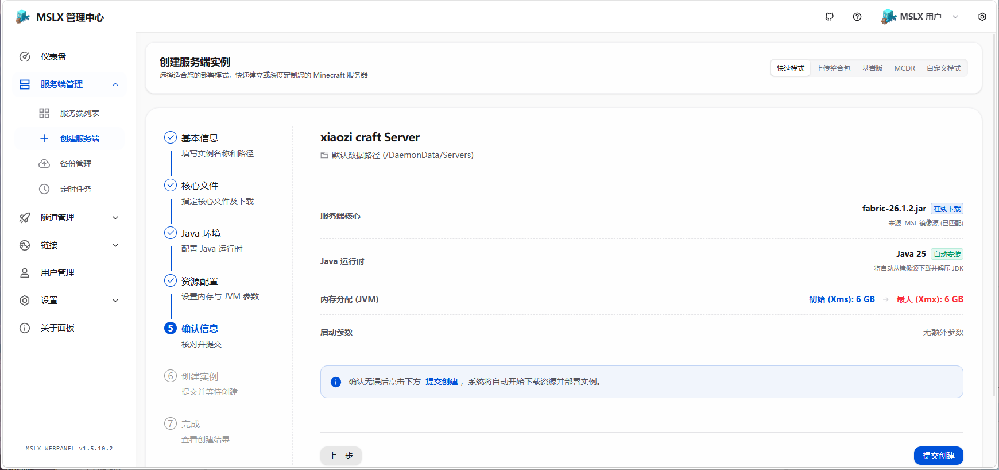
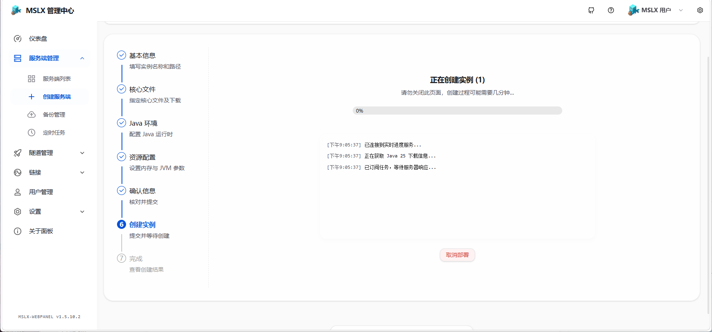

Start the server first and wait for the support libraries to finish downloading.
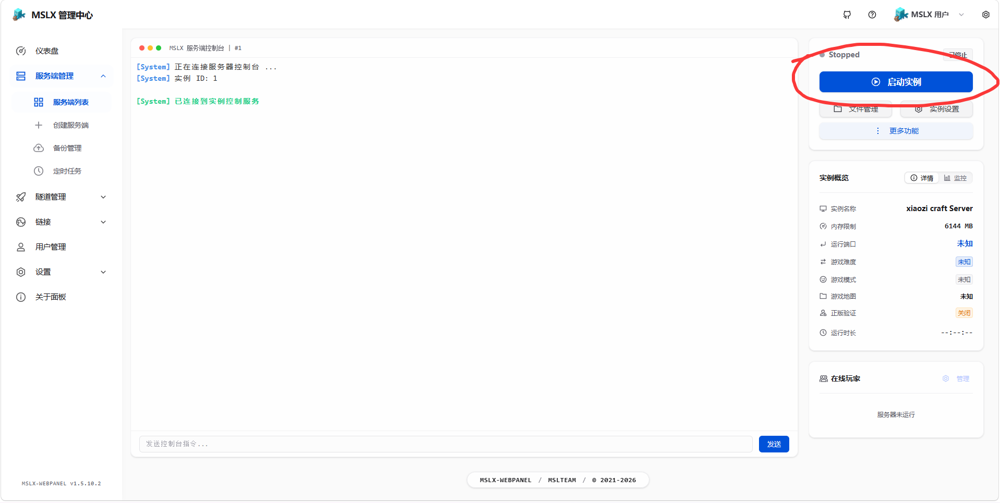
```bash
[System] Connecting to server console...
[System] Instance ID: 1

[System] Sending startup command...
[MSLX-Daemon] Initializing service...
>>> [MSLX] EULA agreement has not been signed yet. Server startup has been stopped, waiting for user action...
[MSLX-Daemon] Initializing service...
[MSLX-Daemon] Starting server instance...
[MSLX] Server process started, PID: 3489
Downloading Minecraft server
Installing Fabric Loader 0.19.3(26.1.2) on the server
Downloading required files
Downloading library org.ow2.asm:asm:9.10.1
Downloading library org.ow2.asm:asm-analysis:9.10.1
Downloading library org.ow2.asm:asm-commons:9.10.1
Downloading library org.ow2.asm:asm-tree:9.10.1
Downloading library org.ow2.asm:asm-util:9.10.1
Downloading library net.fabricmc:sponge-mixin:0.17.3+mixin.0.8.7
Downloading library net.fabricmc:fabric-loader:0.19.3
Generating server launch JAR
Unpacking 26.1.2/server-26.1.2.jar (versions:26.1.2) to versions/26.1.2/server-26.1.2.jar
Unpacking at/yawk/lz4/lz4-java/1.10.1/lz4-java-1.10.1.jar (libraries:at.yawk.lz4:lz4-java:1.10.1) to libraries/at/yawk/lz4/lz4-java/1.10.1/lz4-java-1.10.1.jar
Unpacking com/azure/azure-json/1.4.0/azure-json-1.4.0.jar (libraries:com.azure:azure-json:1.4.0) to libraries/com/azure/azure-json/1.4.0/azure-json-1.4.0.jar
Unpacking com/github/oshi/oshi-core/6.9.0/oshi-core-6.9.0.jar (libraries:com.github.oshi:oshi-core:6.9.0) to libraries/com/github/oshi/oshi-core/6.9.0/oshi-core-6.9.0.jar
Unpacking com/google/code/gson/gson/2.13.2/gson-2.13.2.jar (libraries:com.google.code.gson:gson:2.13.2) to libraries/com/google/code/gson/gson/2.13.2/gson-2.13.2.jar
Unpacking com/google/guava/failureaccess/1.0.3/failureaccess-1.0.3.jar (libraries:com.google.guava:failureaccess:1.0.3) to libraries/com/google/guava/failureaccess/1.0.3/failureaccess-1.0.3.jar
Unpacking com/google/guava/guava/33.5.0-jre/guava-33.5.0-jre.jar (libraries:com.google.guava:guava:33.5.0-jre) to libraries/com/google/guava/guava/33.5.0-jre/guava-33.5.0-jre.jar
Unpacking com/microsoft/azure/msal4j/1.23.1/msal4j-1.23.1.jar (libraries:com.microsoft.azure:msal4j:1.23.1) to libraries/com/microsoft/azure/msal4j/1.23.1/msal4j-1.23.1.jar
Unpacking com/mojang/authlib/7.0.63/authlib-7.0.63.jar (libraries:com.mojang:authlib:7.0.63) to libraries/com/mojang/authlib/7.0.63/authlib-7.0.63.jar
Unpacking com/mojang/brigadier/1.3.10/brigadier-1.3.10.jar (libraries:com.mojang:brigadier:1.3.10) to libraries/com/mojang/brigadier/1.3.10/brigadier-1.3.10.jar
Unpacking com/mojang/datafixerupper/9.0.19/datafixerupper-9.0.19.jar (libraries:com.mojang:datafixerupper:9.0.19) to libraries/com/mojang/datafixerupper/9.0.19/datafixerupper-9.0.19.jar
Unpacking com/mojang/jtracy/1.0.37/jtracy-1.0.37.jar (libraries:com.mojang:jtracy:1.0.37) to libraries/com/mojang/jtracy/1.0.37/jtracy-1.0.37.jar
Unpacking com/mojang/logging/1.6.11/logging-1.6.11.jar (libraries:com.mojang:logging:1.6.11) to libraries/com/mojang/logging/1.6.11/logging-1.6.11.jar
Unpacking commons-io/commons-io/2.20.0/commons-io-2.20.0.jar (libraries:commons-io:commons-io:2.20.0) to libraries/commons-io/commons-io/2.20.0/commons-io-2.20.0.jar
Unpacking io/netty/netty-buffer/4.2.7.Final/netty-buffer-4.2.7.Final.jar (libraries:io.netty:netty-buffer:4.2.7.Final) to libraries/io/netty/netty-buffer/4.2.7.Final/netty-buffer-4.2.7.Final.jar
Unpacking io/netty/netty-codec-base/4.2.7.Final/netty-codec-base-4.2.7.Final.jar (libraries:io.netty:netty-codec-base:4.2.7.Final) to libraries/io/netty/netty-codec-base/4.2.7.Final/netty-codec-base-4.2.7.Final.jar
Unpacking io/netty/netty-codec-compression/4.2.7.Final/netty-codec-compression-4.2.7.Final.jar (libraries:io.netty:netty-codec-compression:4.2.7.Final) to libraries/io/netty/netty-codec-compression/4.2.7.Final/netty-codec-compression-4.2.7.Final.jar
Unpacking io/netty/netty-codec-http/4.2.7.Final/netty-codec-http-4.2.7.Final.jar (libraries:io.netty:netty-codec-http:4.2.7.Final) to libraries/io/netty/netty-codec-http/4.2.7.Final/netty-codec-http-4.2.7.Final.jar
Unpacking io/netty/netty-common/4.2.7.Final/netty-common-4.2.7.Final.jar (libraries:io.netty:netty-common:4.2.7.Final) to libraries/io/netty/netty-common/4.2.7.Final/netty-common-4.2.7.Final.jar
Unpacking io/netty/netty-handler/4.2.7.Final/netty-handler-4.2.7.Final.jar (libraries:io.netty:netty-handler:4.2.7.Final) to libraries/io/netty/netty-handler/4.2.7.Final/netty-handler-4.2.7.Final.jar
Unpacking io/netty/netty-resolver/4.2.7.Final/netty-resolver-4.2.7.Final.jar (libraries:io.netty:netty-resolver:4.2.7.Final) to libraries/io/netty/netty-resolver/4.2.7.Final/netty-resolver-4.2.7.Final.jar
Unpacking io/netty/netty-transport/4.2.7.Final/netty-transport-4.2.7.Final.jar (libraries:io.netty:netty-transport:4.2.7.Final) to libraries/io/netty/netty-transport/4.2.7.Final/netty-transport-4.2.7.Final.jar
Unpacking io/netty/netty-transport-classes-epoll/4.2.7.Final/netty-transport-classes-epoll-4.2.7.Final.jar (libraries:io.netty:netty-transport-classes-epoll:4.2.7.Final) to libraries/io/netty/netty-transport-classes-epoll/4.2.7.Final/netty-transport-classes-epoll-4.2.7.Final.jar
Unpacking io/netty/netty-transport-classes-kqueue/4.2.7.Final/netty-transport-classes-kqueue-4.2.7.Final.jar (libraries:io.netty:netty-transport-classes-kqueue:4.2.7.Final) to libraries/io/netty/netty-transport-classes-kqueue/4.2.7.Final/netty-transport-classes-kqueue-4.2.7.Final.jar
Unpacking io/netty/netty-transport-native-epoll/4.2.7.Final/netty-transport-native-epoll-4.2.7.Final-linux-x86_64.jar (libraries:io.netty:netty-transport-native-epoll:4.2.7.Final:linux-x86_64) to libraries/io/netty/netty-transport-native-epoll/4.2.7.Final/netty-transport-native-epoll-4.2.7.Final-linux-x86_64.jar
Unpacking io/netty/netty-transport-native-epoll/4.2.7.Final/netty-transport-native-epoll-4.2.7.Final-linux-aarch_64.jar (libraries:io.netty:netty-transport-native-epoll:4.2.7.Final:linux-aarch_64) to libraries/io/netty/netty-transport-native-epoll/4.2.7.Final/netty-transport-native-epoll-4.2.7.Final-linux-aarch_64.jar
Unpacking io/netty/netty-transport-native-kqueue/4.2.7.Final/netty-transport-native-kqueue-4.2.7.Final-osx-x86_64.jar (libraries:io.netty:netty-transport-native-kqueue:4.2.7.Final:osx-x86_64) to libraries/io/netty/netty-transport-native-kqueue/4.2.7.Final/netty-transport-native-kqueue-4.2.7.Final-osx-x86_64.jar
Unpacking io/netty/netty-transport-native-kqueue/4.2.7.Final/netty-transport-native-kqueue-4.2.7.Final-osx-aarch_64.jar (libraries:io.netty:netty-transport-native-kqueue:4.2.7.Final:osx-aarch_64) to libraries/io/netty/netty-transport-native-kqueue/4.2.7.Final/netty-transport-native-kqueue-4.2.7.Final-osx-aarch_64.jar
Unpacking io/netty/netty-transport-native-unix-common/4.2.7.Final/netty-transport-native-unix-common-4.2.7.Final.jar (libraries:io.netty:netty-transport-native-unix-common:4.2.7.Final) to libraries/io/netty/netty-transport-native-unix-common/4.2.7.Final/netty-transport-native-unix-common-4.2.7.Final.jar
Unpacking it/unimi/dsi/fastutil/8.5.18/fastutil-8.5.18.jar (libraries:it.unimi.dsi:fastutil:8.5.18) to libraries/it/unimi/dsi/fastutil/8.5.18/fastutil-8.5.18.jar
Unpacking net/java/dev/jna/jna/5.17.0/jna-5.17.0.jar (libraries:net.java.dev.jna:jna:5.17.0) to libraries/net/java/dev/jna/jna/5.17.0/jna-5.17.0.jar
Unpacking net/java/dev/jna/jna-platform/5.17.0/jna-platform-5.17.0.jar (libraries:net.java.dev.jna:jna-platform:5.17.0) to libraries/net/java/dev/jna/jna-platform/5.17.0/jna-platform-5.17.0.jar
Unpacking net/sf/jopt-simple/jopt-simple/5.0.4/jopt-simple-5.0.4.jar (libraries:net.sf.jopt-simple:jopt-simple:5.0.4) to libraries/net/sf/jopt-simple/jopt-simple/5.0.4/jopt-simple-5.0.4.jar
Unpacking org/apache/commons/commons-lang3/3.19.0/commons-lang3-3.19.0.jar (libraries:org.apache.commons:commons-lang3:3.19.0) to libraries/org/apache/commons/commons-lang3/3.19.0/commons-lang3-3.19.0.jar
Unpacking org/apache/logging/log4j/log4j-api/2.25.2/log4j-api-2.25.2.jar (libraries:org.apache.logging.log4j:log4j-api:2.25.2) to libraries/org/apache/logging/log4j/log4j-api/2.25.2/log4j-api-2.25.2.jar
Unpacking org/apache/logging/log4j/log4j-core/2.25.2/log4j-core-2.25.2.jar (libraries:org.apache.logging.log4j:log4j-core:2.25.2) to libraries/org/apache/logging/log4j/log4j-core/2.25.2/log4j-core-2.25.2.jar
Unpacking org/apache/logging/log4j/log4j-slf4j2-impl/2.25.2/log4j-slf4j2-impl-2.25.2.jar (libraries:org.apache.logging.log4j:log4j-slf4j2-impl:2.25.2) to libraries/org/apache/logging/log4j/log4j-slf4j2-impl/2.25.2/log4j-slf4j2-impl-2.25.2.jar
Unpacking org/joml/joml/1.10.8/joml-1.10.8.jar (libraries:org.joml:joml:1.10.8) to libraries/org/joml/joml/1.10.8/joml-1.10.8.jar
Unpacking org/jspecify/jspecify/1.0.0/jspecify-1.0.0.jar (libraries:org.jspecify:jspecify:1.0.0) to libraries/org/jspecify/jspecify/1.0.0/jspecify-1.0.0.jar
Unpacking org/slf4j/slf4j-api/2.0.17/slf4j-api-2.0.17.jar (libraries:org.slf4j:slf4j-api:2.0.17) to libraries/org/slf4j/slf4j-api/2.0.17/slf4j-api-2.0.17.jar
Starting net.fabricmc.loader.impl.game.minecraft.BundlerClassPathCapture
[13:09:49] [main/INFO]: Loading Minecraft 26.1.2 with Fabric Loader 0.19.3
[13:09:49] [main/INFO]: Mappings not present!
[13:09:49] [main/INFO]: Loading 4 mods:
        - fabricloader 0.19.3
           \-- mixinextras 0.5.4
        - java 25
        - minecraft 26.1.2
[13:09:49] [main/INFO]: SpongePowered MIXIN Subsystem Version=0.8.7 Source=file:/opt/mslx/DaemonData/Servers/1/libraries/net/fabricmc/sponge-mixin/0.17.3+mixin.0.8.7/sponge-mixin-0.17.3+mixin.0.8.7.jar Service=Knot/Fabric Env=SERVER
WARNING: A terminally deprecated method in sun.misc.Unsafe has been called
WARNING: sun.misc.Unsafe::objectFieldOffset has been called by org.joml.MemUtil$MemUtilUnsafe (file:/opt/mslx/DaemonData/Servers/1/libraries/org/joml/joml/1.10.8/joml-1.10.8.jar)
WARNING: Please consider reporting this to the maintainers of class org.joml.MemUtil$MemUtilUnsafe
WARNING: sun.misc.Unsafe::objectFieldOffset will be removed in a future release
[13:09:55] [main/ERROR]: Failed to load properties from file: server.properties
java.nio.file.NoSuchFileException: server.properties
        at java.base/sun.nio.fs.UnixException.translateToIOException(UnixException.java:92)
        at java.base/sun.nio.fs.UnixException.rethrowAsIOException(UnixException.java:106)
        at java.base/sun.nio.fs.UnixException.rethrowAsIOException(UnixException.java:111)
        at java.base/sun.nio.fs.UnixFileSystemProvider.newFileChannel(UnixFileSystemProvider.java:213)
        at java.base/sun.nio.fs.UnixFileSystemProvider.newByteChannel(UnixFileSystemProvider.java:244)
        at java.base/java.nio.file.Files.newByteChannel(Files.java:357)
        at java.base/java.nio.file.Files.newByteChannel(Files.java:399)
        at java.base/java.nio.file.spi.FileSystemProvider.newInputStream(FileSystemProvider.java:371)
        at java.base/java.nio.file.Files.newInputStream(Files.java:154)
        at knot//net.minecraft.server.dedicated.Settings.loadFromFile(Settings.java:62)
        at knot//net.minecraft.server.dedicated.DedicatedServerProperties.fromFile(DedicatedServerProperties.java:154)
        at knot//net.minecraft.server.dedicated.DedicatedServerSettings.<init>(DedicatedServerSettings.java:12)
        at knot//net.minecraft.server.Main.main(Main.java:114)
        at net.fabricmc.loader.impl.game.minecraft.MinecraftGameProvider.launch(MinecraftGameProvider.java:514)
        at net.fabricmc.loader.impl.launch.knot.Knot.launch(Knot.java:72)
        at net.fabricmc.loader.impl.launch.knot.KnotServer.main(KnotServer.java:23)
        at net.fabricmc.loader.impl.launch.server.FabricServerLauncher.main(FabricServerLauncher.java:69)
        at net.fabricmc.installer.ServerLauncher.main(ServerLauncher.java:69)
[13:09:55] [main/INFO]: Environment: Environment[sessionHost=https://sessionserver.mojang.com, servicesHost=https://api.minecraftservices.com, profilesHost=https://api.mojang.com, name=PROD]
[13:09:55] [Worker-Main-4/INFO]: No existing world data, creating new world
[13:09:56] [main/INFO]: Loaded 1515 recipes
[13:09:56] [main/INFO]: Loaded 1617 advancements
[13:09:56] [Server thread/INFO]: Starting minecraft server version 26.1.2
[13:09:56] [Server thread/INFO]: Loading properties
[13:09:56] [Server thread/INFO]: Default game type: SURVIVAL
[13:09:56] [Server thread/INFO]: Generating keypair
[13:09:56] [Server thread/INFO]: Starting Minecraft server on *:25565
[13:09:56] [Server thread/INFO]: Preparing level "world"
[13:09:56] [Server thread/INFO]: Selecting global world spawn...
[13:09:59] [Server thread/INFO]: Loading 0 persistent chunks...
[13:09:59] [Server thread/INFO]: Preparing spawn area: 100%
[13:09:59] [Server thread/INFO]: Time elapsed: 3122 ms
[13:09:59] [Server thread/INFO]: Done (3.343s)! For help, type "help"
[13:09:59] [Server thread/INFO]: Saving chunks for level 'ServerLevel[world]'/minecraft:overworld
[13:10:00] [Server thread/INFO]: Saving chunks for level 'ServerLevel[world]'/minecraft:the_nether
[13:10:00] [Server thread/INFO]: Saving chunks for level 'ServerLevel[world]'/minecraft:the_end
[13:10:00] [Server thread/INFO]: ThreadedAnvilChunkStorage (world): All chunks are saved
[13:10:00] [Server thread/INFO]: ThreadedAnvilChunkStorage (DIM-1): All chunks are saved
[13:10:00] [Server thread/INFO]: ThreadedAnvilChunkStorage (DIM1): All chunks are saved
[13:10:00] [Server thread/INFO]: ThreadedAnvilChunkStorage: All dimensions are saved
```
Type stop to stop the server, then start uploading the xiaozi craft mods.
```bash
[MSLX-Daemon] Command sent: stop
[13:11:04] [Server thread/INFO]: Stopping the server
[13:11:04] [Server thread/INFO]: Stopping server
[13:11:04] [Server thread/INFO]: Saving players
[13:11:04] [Server thread/INFO]: Saving worlds
[13:11:04] [Server thread/INFO]: Saving chunks for level 'ServerLevel[world]'/minecraft:overworld
[13:11:04] [Server thread/INFO]: Saving chunks for level 'ServerLevel[world]'/minecraft:the_nether
[13:11:04] [Server thread/INFO]: Saving chunks for level 'ServerLevel[world]'/minecraft:the_end
[13:11:04] [Server thread/INFO]: ThreadedAnvilChunkStorage (world): All chunks are saved
[13:11:04] [Server thread/INFO]: ThreadedAnvilChunkStorage (DIM-1): All chunks are saved
[13:11:04] [Server thread/INFO]: ThreadedAnvilChunkStorage (DIM1): All chunks are saved
[13:11:04] [Server thread/INFO]: ThreadedAnvilChunkStorage: All dimensions are saved
[MSLX] Server process stopped, exit code: 0 (Normal shutdown)
```


Press Ctrl+A to select all mods for upload.


Identify and delete the client-side mods.
:::tip
Note:
Although MSLX can help you identify client-side mods to delete, the deletion may not be complete. You may need to manually check again.

Acceptance Criteria:
- The server starts normally without lag or errors.
:::
:::
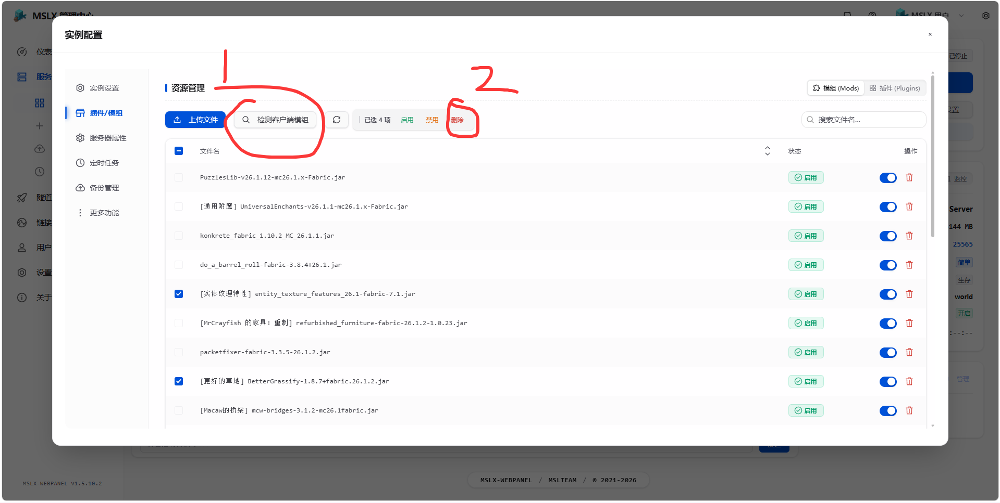
After deleting them, try starting the server again.
```bash
[System] Connecting to server console...
[System] Instance ID: 1

[System] Sending startup command...
[MSLX-Daemon] Initializing service...
[MSLX-Daemon] Starting server instance...
[MSLX] Server process started, PID: 3691
Starting net.fabricmc.loader.impl.game.minecraft.BundlerClassPathCapture
[13:26:14] [main/INFO]: Loading Minecraft 26.1.2 with Fabric Loader 0.19.3
[13:26:14] [main/INFO]: Mappings not present!
[13:26:15] [main/WARN]: Warnings were found!
 - Mod 'Debugify' (debugify) 26.1.2.2 recommends any version of modmenu, which is missing!
         - You should install any version of modmenu for the optimal experience.
 - Mod 'Forge Config API Port' (forgeconfigapiport) 26.1.5 recommends any version of modmenu, which is missing!
         - You should install any version of modmenu for the optimal experience.
[13:26:15] [main/INFO]: Loading 179 mods:
        - almanac 1.6.2
           \-- cloth-config 26.1.154
                \-- cloth-basic-math 0.6.1
        - anvianslib 1.4.1
        - async 0.2.4+alpha-26.1.2
           |-- fabric-permissions-api-v0 0.7.0
           \-- io_github_axalotldev_api 1.0.4
        - balm 26.1.2.10
           \-- kuma_api 26.1.2.2
        - biomesoplenty 26.1.2.0.21
           |-- com_google_code_findbugs_jsr305 3.0.2
           \-- net_jodah_typetools 0.6.3
        - c2me 0.4.0-alpha.0.44+26.1.2
           |-- c2me-base 0.4.0-alpha.0.44+26.1.2
           |-- c2me-client-uncapvd 0.4.0-alpha.0.44+26.1.2
           |-- c2me-fixes-chunkio-threading-issues 0.4.0-alpha.0.44+26.1.2
           |-- c2me-fixes-general-threading-issues 0.4.0-alpha.0.44+26.1.2
           |-- c2me-fixes-worldgen-threading-issues 0.4.0-alpha.0.44+26.1.2
           |-- c2me-fixes-worldgen-vanilla-bugs 0.4.0-alpha.0.44+26.1.2
           |-- c2me-notickvd 0.4.0-alpha.0.44+26.1.2
           |-- c2me-opts-allocs 0.4.0-alpha.0.44+26.1.2
           |-- c2me-opts-chunkio 0.4.0-alpha.0.44+26.1.2
           |-- c2me-opts-dfc 0.4.0-alpha.0.44+26.1.2
           |-- c2me-opts-math 0.4.0-alpha.0.44+26.1.2
           |-- c2me-opts-natives-math 0.4.0-alpha.0.44+26.1.2
           |-- c2me-opts-scheduling 0.4.0-alpha.0.44+26.1.2
           |-- c2me-opts-worldgen-general 0.4.0-alpha.0.44+26.1.2
           |-- c2me-opts-worldgen-vanilla 0.4.0-alpha.0.44+26.1.2
           |-- c2me-rewrites-chunk-serializer 0.4.0-alpha.0.44+26.1.2
           |-- c2me-rewrites-chunk-system 0.4.0-alpha.0.44+26.1.2
           |-- c2me-rewrites-chunkio 0.4.0-alpha.0.44+26.1.2
           |-- c2me-server-utils 0.4.0-alpha.0.44+26.1.2
           |-- c2me-threading-lighting 0.4.0-alpha.0.44+26.1.2
           |-- com_github_ben-manes_caffeine_caffeine 3.2.1
           |-- com_ibm_async_asyncutil 0.1.0
           |-- io_reactivex_rxjava3_rxjava 3.1.12
           |-- mixinsquared 0.3.7-beta.1
           |-- net_objecthunter_exp4j 0.4.8
           |-- org_jctools_jctools-core 4.0.5
           \-- org_reactivestreams_reactive-streams 1.0.4
        - chunky 1.5.3
        - cicada 0.15.2+26.1
           \-- org_yaml_snakeyaml 2.2
        - collective 8.32
        - configured 2.7.5
        - crash_assistant 1.11.11
        - creativecore 2.14.16
           \-- net_neoforged_bus 7.2.0
        - debugify 26.1.2.2
        - easymagic 26.1.0
        - fabric-api 0.155.2+26.1.2
           |-- fabric-api-base 2.0.3+ece063234c
           |-- fabric-api-lookup-api-v1 2.0.12+d5a053b64c
           |-- fabric-biome-api-v1 18.0.5+2fa62b4e4c
           |-- fabric-block-api-v1 3.0.2+ec56b6014c
           |-- fabric-block-getter-api-v2 2.0.6+ec56b6014c
           |-- fabric-command-api-v2 3.0.5+e2bdee784c
           |-- fabric-content-registries-v0 11.3.0+0082c9664c
           |-- fabric-convention-tags-v2 4.6.2+4f11f7994c
           |-- fabric-crash-report-info-v1 1.0.3+9f78a5a84c
           |-- fabric-creative-tab-api-v1 5.0.11+d871b99e4c
           |-- fabric-data-attachment-api-v1 2.2.9+44a0bd1d4c
           |-- fabric-data-generation-api-v1 24.3.3+cda368334c
           |-- fabric-debug-api-v1 1.0.1+c792624d4c
           |-- fabric-dimensions-v1 5.1.7+ad343a8d4c
           |-- fabric-entity-events-v1 5.0.2+e2bdee784c
           |-- fabric-events-interaction-v0 5.2.2+07b380be4c
           |-- fabric-game-rule-api-v1 4.0.5+d871b99e4c
           |-- fabric-item-api-v1 14.3.0+6d1aaa724c
           |-- fabric-key-mapping-api-v1 2.0.4+e2bdee784c
           |-- fabric-lifecycle-events-v1 4.1.1+df84eb3d4c
           |-- fabric-loot-api-v3 3.0.12+00a1fba64c
           |-- fabric-menu-api-v1 2.0.14+d871b99e4c
           |-- fabric-message-api-v1 7.0.5+dae8ce3e4c
           |-- fabric-model-loading-api-v1 8.0.11+c80601bb4c
           |-- fabric-networking-api-v1 6.3.1+554860db4c
           |-- fabric-object-builder-api-v1 23.1.0+abb459f14c
           |-- fabric-particles-v1 5.0.15+b61fef434c
           |-- fabric-permission-api-v1 1.0.2+7437387b4c
           |-- fabric-recipe-api-v1 9.0.16+be4b75ae4c
           |-- fabric-registry-sync-v0 7.1.0+2fa62b4e4c
           |-- fabric-renderer-api-v1 13.0.8+c80601bb4c
           |-- fabric-renderer-indigo 8.1.5+1403e82c4c
           |-- fabric-rendering-fluids-v1 6.0.1+d871b99e4c
           |-- fabric-rendering-v1 23.3.1+e9207d814c
           |-- fabric-resource-conditions-api-v1 6.1.0+83dd0ba34c
           |-- fabric-resource-loader-v0 3.3.17+4fc5413f4c
           |-- fabric-resource-loader-v1 2.0.10+7c44c7324c
           |-- fabric-screen-api-v1 5.1.0+981dd9b24c
           |-- fabric-serialization-api-v1 2.0.3+11a26f314c
           |-- fabric-sound-api-v1 2.0.4+11a26f314c
           |-- fabric-tag-api-v1 2.1.1+371cf5db4c
           |-- fabric-transfer-api-v1 8.0.6+357ea7334c
           \-- fabric-transitive-access-wideners-v1 8.1.3+3ff549fb4c
        - fabric-language-kotlin 1.13.13+kotlin.2.4.10
           |-- org_jetbrains_kotlin_kotlin-reflect 2.4.10
           |-- org_jetbrains_kotlin_kotlin-stdlib 2.4.10
           |-- org_jetbrains_kotlin_kotlin-stdlib-jdk7 2.4.10
           |-- org_jetbrains_kotlin_kotlin-stdlib-jdk8 2.4.10
           |-- org_jetbrains_kotlinx_atomicfu-jvm 0.33.0
           |-- org_jetbrains_kotlinx_kotlinx-coroutines-core-jvm 1.11.0
           |-- org_jetbrains_kotlinx_kotlinx-coroutines-jdk8 1.11.0
           |-- org_jetbrains_kotlinx_kotlinx-datetime-jvm 0.8.0
           |-- org_jetbrains_kotlinx_kotlinx-io-bytestring-jvm 0.9.1
           |-- org_jetbrains_kotlinx_kotlinx-io-core-jvm 0.9.1
           |-- org_jetbrains_kotlinx_kotlinx-serialization-cbor-jvm 1.11.0
           |-- org_jetbrains_kotlinx_kotlinx-serialization-core-jvm 1.11.0
           \-- org_jetbrains_kotlinx_kotlinx-serialization-json-jvm 1.11.0
        - fabricloader 0.19.3
           \-- mixinextras 0.5.4
        - farmersdelight 26.1-3.6.7+refabricated
        - fastitemframes 26.1.0
        - forgeconfigapiport 26.1.5
           |-- com_electronwill_night-config_core 3.8.3
           \-- com_electronwill_night-config_toml 3.8.3
        - framework 0.13.23
           |-- com_electronwill_night-config_core 3.8.3
           |-- com_electronwill_night-config_toml 3.8.3
           |-- org_javassist_javassist 3.30.2-GA
           \-- org_reflections_reflections 0.10.2
        - glitchcore 26.1.2.0.2
           \-- net_jodah_typetools 0.6.3
        - java 25
        - jei 29.16.0.47
        - krypton 0.3.0
           \-- com_velocitypowered_velocity-native 3.4.0-SNAPSHOT
        - letmedespawn 1.6.2
        - lithium 0.24.7+mc26.1.2
        - lithostitched 1.7.13
        - mcwbridges 3.1.2
        - mcwdoors 1.1.5
        - mcwfurnitures 3.4.2
        - mcwholidays 1.1.2
        - mcwlights 1.1.5
        - mcwpaintings 1.1.0
        - mcwpaths 1.1.1
        - mcwroofs 2.3.2
        - mcwstairs 1.0.2
        - mcwtrpdoors 1.1.5
        - mcwwindows 2.4.2
        - midnightlib 1.9.3
        - minecraft 26.1.2
        - mo_glass 1.12-MC26.1.2
        - mr_vanilla_refresh 1.4.31
        - mru 1.0.31+26.1.2
        - notenoughcrashes 4.4.9+26.1.2
        - packetfixer 3.3.5
        - placeholder-api 3.0.0+26.1
        - prickle 26.1.2.6
        - puzzleslib 26.1.12
        - refurbished_furniture 1.0.23
        - scalablelux 0.3.0-alpha.0.2+26.1.2
        - sit 1.5.1
        - sound_physics_remastered 1.5.1+26.1.2
        - spark 1.10.173
           \-- fabric-permissions-api-v0 0.7.0
        - superfastmath 0.0.4-26.1.2
           \-- org_apache_commons_commons-math3 3.6.1
        - tcdcommons 5.3.2+fabric-26.1
        - tectonic 3.0.26
           \-- apollib 1.1.4
                \-- de_marhali_json5-java 3.0.0
        - terrablender 26.1.2.0.3
        - transcendingtrident 5.0
        - undergroundbeacons 1.1
        - universalenchants 26.1.1
        - vmp 0.2.0+beta.7.234+26.1.2
        - voxy 0.2.18-beta
           |-- org_apache_commons_commons-pool2 2.12.0
           |-- org_lwjgl_lwjgl-lmdb 3.4.1
           |-- org_lwjgl_lwjgl-lmdb_natives-linux 3.4.1
           |-- org_lwjgl_lwjgl-lmdb_natives-windows 3.4.1
           |-- org_lwjgl_lwjgl-zstd 3.4.1
           |-- org_lwjgl_lwjgl-zstd_natives-linux 3.4.1
           |-- org_lwjgl_lwjgl-zstd_natives-windows 3.4.1
           |-- org_lz4_lz4-java 1.8.0
           |-- org_rocksdb_rocksdbjni 10.2.1
           |-- org_tukaani_xz 1.10
           |-- redis_clients_jedis 5.1.0
           \-- sodiumprovider 0.0.0
        - worldedit 7.4.3+7515-78babeb
           |-- fabric-api-base 2.0.3+ece063234c
           \-- worldeditcui_protocol 4.0.3
        - yet_another_config_lib_v3 3.9.5+26.1-fabric
           |-- com_twelvemonkeys_common_common-image 3.12.0
           |-- com_twelvemonkeys_common_common-io 3.12.0
           |-- com_twelvemonkeys_common_common-lang 3.12.0
           |-- com_twelvemonkeys_imageio_imageio-core 3.12.0
           |-- com_twelvemonkeys_imageio_imageio-metadata 3.12.0
           |-- com_twelvemonkeys_imageio_imageio-webp 3.12.0
           |-- org_quiltmc_parsers_gson 0.2.1
           \-- org_quiltmc_parsers_json 0.2.1
[13:26:15] [main/WARN]: launchTarget: SERVER. Crash Assistant is client only mod. Mod will do nothing!
[13:26:15] [main/INFO]: SpongePowered MIXIN Subsystem Version=0.8.7 Source=file:/opt/mslx/DaemonData/Servers/1/libraries/net/fabricmc/sponge-mixin/0.17.3+mixin.0.8.7/sponge-mixin-0.17.3+mixin.0.8.7.jar Service=Knot/Fabric Env=SERVER
[13:26:15] [main/INFO]: Compatibility level set to JAVA_25
[13:26:15] [main/WARN]: Reference map 'anvianslib.refmap.json' for anvianslib.mixins.json could not be read. If this is a development environment you can ignore this message
[13:26:15] [main/WARN]: Reference map 'anvianslib.refmap.json' for anvianslib.fabric.mixins.json could not be read. If this is a development environment you can ignore this message
[13:26:15] [main/WARN]: Reference map 'biomesoplenty.refmap.json' for biomesoplenty.mixins.json could not be read. If this is a development environment you can ignore this message
[13:26:15] [main/WARN]: Reference map 'biomesoplenty.refmap.json' for biomesoplenty.fabric.mixins.json could not be read. If this is a development environment you can ignore this message
[13:26:15] [main/INFO]: Initializing com.ishland.c2me.base.mixin
[13:26:15] [main/INFO]: Updating config from 0 to 1
[13:26:15] [main/INFO]: Updating config from 1 to 2
[13:26:15] [main/INFO]: Updating config from 2 to 3
[13:26:15] [main/INFO]: Global Executor Parallelism: 4 configured, 4 evaluated, 4 default evaluated
[13:26:15] [main/INFO]: Initializing com.ishland.c2me.fixes.chunkio.threading_issues.mixin
[13:26:15] [main/INFO]: Initializing com.ishland.c2me.fixes.general.threading_issues.mixin
[13:26:15] [main/INFO]: Initializing com.ishland.c2me.fixes.worldgen.threading_issues.mixin
[13:26:15] [main/INFO]: Initializing com.ishland.c2me.fixes.worldgen.vanilla_bugs.mixin
[13:26:15] [main/INFO]: Initializing com.ishland.c2me.notickvd.mixin
[13:26:15] [main/INFO]: Initializing com.ishland.c2me.opts.allocs.mixin
[13:26:15] [main/INFO]: Initializing com.ishland.c2me.opts.chunkio.mixin
[13:26:15] [main/INFO]: Initializing com.ishland.c2me.opts.dfc.mixin
[13:26:15] [main/INFO]: Initializing com.ishland.c2me.opts.math.mixin
[13:26:15] [main/INFO]: Initializing com.ishland.c2me.opts.natives_math.mixin
[13:26:15] [main/INFO]: Attempting to call native library. If your game crashes right after this point, native acceleration may not be available for your system.
[13:26:15] [main/INFO]: Detected maximum supported ISA target: AVX2
[13:26:15] [main/INFO]: Initializing com.ishland.c2me.opts.scheduling.mixin
[13:26:15] [main/INFO]: Initializing com.ishland.c2me.opts.worldgen.general.mixin
[13:26:15] [main/INFO]: Initializing com.ishland.c2me.opts.worldgen.vanilla.mixin
[13:26:15] [main/INFO]: Initializing com.ishland.c2me.rewrites.chunk_serializer.mixin
[13:26:15] [main/INFO]: Disabling com.ishland.c2me.rewrites.chunk_serializer.mixin
[13:26:15] [main/INFO]: Initializing com.ishland.c2me.rewrites.chunksystem.mixin
[13:26:15] [main/INFO]: Initializing com.ishland.c2me.rewrites.chunkio.mixin
[13:26:15] [main/INFO]: Initializing com.ishland.c2me.server.utils.mixin
[13:26:15] [main/INFO]: Initializing com.ishland.c2me.threading.lighting.mixin
[13:26:15] [main/WARN]: Reference map 'configured.refmap.json' for configured.fabric.mixins.json could not be read. If this is a development environment you can ignore this message
[13:26:15] [main/WARN]: Reference map 'creativecore.mixins.refmap.json' for creativecore.mixins.json could not be read. If this is a development environment you can ignore this message
[13:26:15] [main/WARN]: Reference map 'creativecore.mixins.refmap.json' for creativecore.fabric.mixins.json could not be read. If this is a development environment you can ignore this message
[13:26:15] [main/WARN]: Reference map 'framework.refmap.json' for framework.common.mixins.json could not be read. If this is a development environment you can ignore this message
[13:26:15] [main/WARN]: Reference map 'framework.refmap.json' for framework.fabric.mixins.json could not be read. If this is a development environment you can ignore this message
[13:26:15] [main/WARN]: Reference map 'glitchcore.refmap.json' for glitchcore.mixins.json could not be read. If this is a development environment you can ignore this message
[13:26:15] [main/WARN]: Reference map 'glitchcore.refmap.json' for glitchcore.fabric.mixins.json could not be read. If this is a development environment you can ignore this message
[13:26:15] [main/WARN]: Reference map 'kuma_api.refmap.json' for kuma_api.mixins.json could not be read. If this is a development environment you can ignore this message
[13:26:15] [main/WARN]: Reference map 'kuma_api.refmap.json' for kuma_api.fabric.mixins.json could not be read. If this is a development environment you can ignore this message
[13:26:15] [main/INFO]: Loaded configuration file for Lithium: 171 options available, 2 override(s) found.
[13:26:15] [main/WARN]: Reference map 'refurbished_furniture.refmap.json' for refurbished_furniture.fabric.mixins.json could not be read. If this is a development environment you can ignore this message
[13:26:15] [main/WARN]: Reference map 'refurbished_furniture.refmap.json' for refurbished_furniture.common.mixins.json could not be read. If this is a development environment you can ignore this message
[13:26:15] [main/WARN]: Reference map 'superfastmath.refmap.json' for superfastmath.mixins.json could not be read. If this is a development environment you can ignore this message
[13:26:15] [main/INFO]: Successfully started async appender with [SysOut, ServerGuiConsole, Tracy, File]
[13:26:15] [main/WARN]: Reference map 'yet_another_config_lib_v3.refmap.json' for yacl.mixins.json could not be read. If this is a development environment you can ignore this message
[13:26:15] [main/WARN]: Reference map 'yet_another_config_lib_v3.refmap.json' for yacl-fabric.mixins.json could not be read. If this is a development environment you can ignore this message
[13:26:15] [main/WARN]: Error loading class: net/minecraft/client/renderer/GameRenderer (java.lang.ClassNotFoundException: net/minecraft/client/renderer/GameRenderer)
[13:26:15] [main/WARN]: @Mixin target net.minecraft.client.renderer.GameRenderer was not found creativecore.fabric.mixins.json:GameRendererMixin from mod creativecore
[13:26:16] [main/WARN]: Error loading class: net/minecraft/client/gui/screens/recipebook/GhostSlots (java.lang.ClassNotFoundException: net/minecraft/client/gui/screens/recipebook/GhostSlots)
[13:26:16] [main/WARN]: @Mixin target net.minecraft.client.gui.screens.recipebook.GhostSlots was not found farmersdelight.mixins.json:refabricated.GhostSlotsInvoker from mod farmersdelight
[13:26:16] [main/WARN]: Error loading class: net/minecraft/client/gui/GuiGraphicsExtractor (java.lang.ClassNotFoundException: net/minecraft/client/gui/GuiGraphicsExtractor)
[13:26:16] [main/WARN]: @Mixin target net.minecraft.client.gui.GuiGraphicsExtractor was not found farmersdelight.mixins.json:refabricated.GuiGraphicsExtractorAccessor from mod farmersdelight
[13:26:16] [main/WARN]: Error loading class: de/siphalor/amecs/key_modifiers/impl/AmecsKeyModifiersEarlyInit (java.lang.ClassNotFoundException: de/siphalor/amecs/key_modifiers/impl/AmecsKeyModifiersEarlyInit)
[13:26:16] [main/WARN]: @Mixin target de.siphalor.amecs.key_modifiers.impl.AmecsKeyModifiersEarlyInit was not found jei.mixins.json:AmecsKeyModifiersEarlyInitMixin from mod jei
[13:26:16] [main/INFO]: Force-disabling mixin 'alloc.chunk_random.LevelMixin' as rule 'mixin.alloc.chunk_random' (added by mods [async]) disables it and children
[13:26:16] [main/INFO]: Force-disabling mixin 'alloc.chunk_random.ServerLevelMixin' as rule 'mixin.alloc.chunk_random' (added by mods [async]) disables it and children
[13:26:16] [main/INFO]: Force-enabling mixin 'compat.worldedit.LevelChunkMixin' as rule 'mixin.compat.worldedit' (added by mods [lithium]) enables it
[13:26:16] [main/INFO]: Initializing MixinExtras via com.llamalad7.mixinextras.service.MixinExtrasServiceImpl(version=0.5.4).
[13:26:16] [main/WARN]: Method overwrite conflict for sin in superfastmath.mixins.json:MathMixin from mod superfastmath, previously written by net.caffeinemc.mods.lithium.mixin.math.sine_lut.MthMixin. Skipping method.
[13:26:16] [main/WARN]: Method overwrite conflict for cos in superfastmath.mixins.json:MathMixin from mod superfastmath, previously written by net.caffeinemc.mods.lithium.mixin.math.sine_lut.MthMixin. Skipping method.
[13:26:18] [main/WARN]: Cancelled mixin com.ishland.c2me.fixes.worldgen.threading_issues.mixin.threading_detections.random_instances.MixinWorld. Check debug logs for more information.
WARNING: A terminally deprecated method in sun.misc.Unsafe has been called
WARNING: sun.misc.Unsafe::objectFieldOffset has been called by org.joml.MemUtil$MemUtilUnsafe (file:/opt/mslx/DaemonData/Servers/1/libraries/org/joml/joml/1.10.8/joml-1.10.8.jar)
WARNING: Please consider reporting this to the maintainers of class org.joml.MemUtil$MemUtilUnsafe
WARNING: sun.misc.Unsafe::objectFieldOffset will be removed in a future release
[13:26:20] [main/INFO]: Almanac Fabric config reloaded, cache cleared
[13:26:20] [main/INFO]: Almanac Fabric config initialized
[13:26:20] [main/INFO]: Almanac initialized
[13:26:20] [main/INFO]: Anvian's Lib initialized in Minecraft 26.1.2
[13:26:20] [main/INFO]: Initializing Async...
[13:26:20] [main/INFO]: Initializing Async Config...
[13:26:20] [main/WARN]: Configuration not found. Creating defaults...
[13:26:20] [main/INFO]: Configuration saved.
[13:26:20] [main/INFO]: Configuration loaded.
[13:26:20] [main/INFO]: Async Initialized Successfully!
[13:26:21] [main/INFO]: Mod proxy balm:permissions resolved as net.blay09.mods.balm.fabric.platform.compatibility.permissions.internal.FabricPermissionsAPIIntegration@1deb5b22
[13:26:21] [main/INFO]: Loading Collective version 8.32.
[13:26:21] [main/INFO]: Enabled 58 bug fixes: [MC-7569, MC-8187, MC-30391, MC-44654, MC-82263, MC-84661, MC-88371, MC-89146, MC-93018, MC-94054, MC-100991, MC-119754, MC-121706, MC-121903, MC-123450, MC-129909, MC-131562, MC-132878, MC-133218, MC-134110, MC-136249, MC-139041, MC-147659, MC-153010, MC-155509, MC-158900, MC-159283, MC-160095, MC-168573, MC-170462, MC-176806, MC-177381, MC-179072, MC-183990, MC-187100, MC-200418, MC-201374, MC-202637, MC-206922, MC-215530, MC-221257, MC-223153, MC-224729, MC-226961, MC-227008, MC-227337, MC-231743, MC-232869, MC-245394, MC-263999, MC-264285, MC-264979, MC-267125, MC-268617, MC-271899, MC-272431, MC-297837, MC-298066]
[13:26:21] [main/INFO]: Successfully Debugify'd your game!
[13:26:21] [main/INFO]: Constructing components for easymagic:common
[13:26:21] [main/INFO]: Loaded config farmersdelight-common.json
[13:26:21] [main/INFO]: Constructing components for fastitemframes:common
[13:26:21] [main/INFO]: Reflections took 100 ms to scan 2 urls, producing 9 keys and 133 values
[13:26:22] [main/INFO]: Registered synced data key refurbished_furniture:lock_yaw for refurbished_furniture:seat
[13:26:22] [main/INFO]: Compression will use libdeflate (Linux x86_64), encryption will use OpenSSL 3.x.x (Linux x86_64)
[13:26:22] [main/INFO]: Config file letmedespawn.json does not exist, creating default
[13:26:23] [main/INFO]: Packet Fixer 3.3.5 Fabric has been initialized!
[13:26:23] [main/INFO]: Constructing components for puzzleslib:common
[13:26:23] [main/INFO]: SuperFastMath initialized
[13:26:23] [main/INFO]: Registered region minecraft:overworld to index 0 for type OVERWORLD
[13:26:23] [main/INFO]: Registered region minecraft:nether to index 0 for type NETHER
[13:26:23] [main/INFO]: Registered region biomesoplenty:overworld_primary to index 1 for type OVERWORLD
[13:26:23] [main/INFO]: Registered region biomesoplenty:overworld_secondary to index 2 for type OVERWORLD
[13:26:23] [main/INFO]: Registered region biomesoplenty:overworld_rare to index 3 for type OVERWORLD
[13:26:23] [main/INFO]: Registered region biomesoplenty:nether_common to index 1 for type NETHER
[13:26:23] [main/INFO]: Registered region biomesoplenty:nether_rare to index 2 for type NETHER
[13:26:23] [main/INFO]: Constructing components for universalenchants:common
[13:26:23] [main/INFO]: [me.cx.vy.cn.cg.Serialization]: Registered Config as RocksDB for config type StorageConfig
[13:26:23] [main/INFO]: [me.cx.vy.cn.cg.Serialization]: Registered Config as Redis for config type StorageConfig
[13:26:23] [main/INFO]: [me.cx.vy.cn.cg.Serialization]: Registered Config as ReadonlyCachingLayer for config type StorageConfig
[13:26:23] [main/INFO]: [me.cx.vy.cn.cg.Serialization]: Registered Config2 as AutoFragmentationAdaptor for config type StorageConfig
[13:26:23] [main/INFO]: [me.cx.vy.cn.cg.Serialization]: Registered Config as FragmentationAdaptor for config type StorageConfig
[13:26:23] [main/INFO]: [me.cx.vy.cn.cg.Serialization]: Registered ConditionalStorageBackendConfig as ConditionalConfig for config type StorageConfig
[13:26:23] [main/INFO]: [me.cx.vy.cn.cg.Serialization]: Registered Config as CompressionAdaptor for config type StorageConfig
[13:26:23] [main/INFO]: [me.cx.vy.cn.cg.Serialization]: Registered BasicPathInsertionConfig as BasicPathConfig for config type StorageConfig
[13:26:23] [main/INFO]: [me.cx.vy.cn.cg.Serialization]: Registered Config as LMDB for config type StorageConfig
[13:26:23] [main/INFO]: [me.cx.vy.cn.cg.Serialization]: Registered Config as Memory for config type StorageConfig
[13:26:23] [main/INFO]: [me.cx.vy.cn.cg.Serialization]: Registered Config as Serializer for config type SectionStorageConfig
[13:26:23] [main/INFO]: [me.cx.vy.cn.cg.Serialization]: Registered Config as ZSTD for config type CompressorConfig
[13:26:23] [main/INFO]: [me.cx.vy.cn.cg.Serialization]: Registered Config as LZ4 for config type CompressorConfig
[13:26:23] [main/INFO]: [me.cx.vy.cn.cg.Serialization]: Registered 13 config types
[13:26:24] [main/INFO]: Got request to register class com.sk89q.worldedit.fabric.internal.FabricPlatform with WorldEdit [com.sk89q.worldedit.extension.platform.PlatformManager@70d1571b]
[13:26:24] [main/INFO]: WorldEdit for Fabric (version 7.4.3+7515-78babeb) is loaded
[13:26:24] [main/INFO]: Krypton is now accelerating your Minecraft server's networking stack 🚀
[13:26:24] [main/INFO]: [STDOUT]: Starting Mo Glass...
[13:26:24] [main/INFO]: Initializing 'tcdcommons' as 'TCDCommonsFabricServer'.
[13:26:24] [main/INFO]: Environment: Environment[sessionHost=https://sessionserver.mojang.com, servicesHost=https://api.minecraftservices.com, profilesHost=https://api.mojang.com, name=PROD]
[13:26:24] [main/INFO]: Found new data pack balm, loading it automatically
[13:26:24] [main/INFO]: Found new data pack biomesoplenty, loading it automatically
[13:26:24] [main/INFO]: Found new data pack collective, loading it automatically
[13:26:24] [main/INFO]: Found new data pack easymagic, loading it automatically
[13:26:24] [main/INFO]: Found new data pack fabric-convention-tags-v2, loading it automatically
[13:26:24] [main/INFO]: Found new data pack farmersdelight, loading it automatically
[13:26:24] [main/INFO]: Found new data pack fastitemframes, loading it automatically
[13:26:24] [main/INFO]: Found new data pack lithostitched, loading it automatically
[13:26:24] [main/INFO]: Found new data pack mcwbridges, loading it automatically
[13:26:24] [main/INFO]: Found new data pack mcwdoors, loading it automatically
[13:26:24] [main/INFO]: Found new data pack mcwfurnitures, loading it automatically
[13:26:24] [main/INFO]: Found new data pack mcwholidays, loading it automatically
[13:26:24] [main/INFO]: Found new data pack mcwlights, loading it automatically
[13:26:24] [main/INFO]: Found new data pack mcwpaintings, loading it automatically
[13:26:24] [main/INFO]: Found new data pack mcwpaths, loading it automatically
[13:26:24] [main/INFO]: Found new data pack mcwroofs, loading it automatically
[13:26:24] [main/INFO]: Found new data pack mcwstairs, loading it automatically
[13:26:24] [main/INFO]: Found new data pack mcwtrpdoors, loading it automatically
[13:26:24] [main/INFO]: Found new data pack mcwwindows, loading it automatically
[13:26:24] [main/INFO]: Found new data pack mo_glass, loading it automatically
[13:26:24] [main/INFO]: Found new data pack mr_vanilla_refresh, loading it automatically
[13:26:24] [main/INFO]: Found new data pack refurbished_furniture, loading it automatically
[13:26:24] [main/INFO]: Found new data pack tectonic:tectonic, loading it automatically
[13:26:24] [main/INFO]: Found new data pack terrablender, loading it automatically
[13:26:24] [main/INFO]: Found new data pack universalenchants, loading it automatically
[13:26:24] [main/INFO]: Found new data pack universalenchants:additional_animal_enchantments, loading it automatically
[13:26:24] [main/INFO]: Found new data pack universalenchants:additional_damage_enchantments, loading it automatically
[13:26:24] [main/INFO]: Found new data pack universalenchants:additional_ranged_enchantments, loading it automatically
[13:26:24] [main/INFO]: Found new data pack universalenchants:additional_shield_enchantments, loading it automatically
[13:26:24] [main/INFO]: Found new data pack universalenchants:additional_weapon_enchantments, loading it automatically
[13:26:24] [main/INFO]: Found new data pack universalenchants:compatible_bow_enchantments, loading it automatically
[13:26:24] [main/INFO]: Found new data pack universalenchants:compatible_crossbow_enchantments, loading it automatically
[13:26:24] [main/INFO]: Found new data pack universalenchants:compatible_mace_enchantments, loading it automatically
[13:26:28] [Worker-Main-2/INFO]: Registering commands with com.sk89q.worldedit.fabric.internal.FabricPlatform
[13:26:31] [main/INFO]: Loaded 6433 recipes
[13:26:31] [main/INFO]: Loaded 3751 advancements
[13:26:33] [main/INFO]: Initialized TerraBlender biomes for level stem minecraft:overworld
[13:26:33] [main/INFO]: Initialized TerraBlender biomes for level stem minecraft:the_nether
[13:26:33] [main/INFO]: Applied 194 biome modifications to 97 of 134 new biomes in 16.69 ms
[13:26:33] [Server thread/INFO]: Dispatching loading event for config easymagic-server.toml
[13:26:33] [Server thread/INFO]: Dispatching loading event for config fastitemframes-server.toml
[13:26:33] [Server thread/INFO]: Dispatching loading event for config universalenchants-server.toml
[13:26:33] [Server thread/INFO]: Async Setting up thread-pool...
[13:26:33] [Server thread/INFO]: Initialized Pool with 6 threads
[13:26:33] [Server thread/INFO]: Loading server configs...
[13:26:34] [Server thread/INFO]: Starting background profiler...
[13:26:34] [Server thread/INFO]: Starting minecraft server version 26.1.2
[13:26:34] [Server thread/INFO]: Loading properties
[13:26:34] [Server thread/INFO]: Default game type: SURVIVAL
[13:26:34] [Server thread/INFO]: Generating keypair
[13:26:34] [Server thread/INFO]: Starting Minecraft server on *:25565
[13:26:34] [Server thread/INFO]: Preparing level "world"
[13:26:34] [Server thread/WARN]: Cancelled mixin com.ishland.c2me.fixes.general.threading_issues.mixin.asynccatchers.MixinThreadedAnvilChunkStorage. Check debug logs for more information.
[13:26:37] [Server thread/INFO]: Bound to tectonic dev.worldgen.tectonic.worldgen.densityfunction.ConfigClamp
[13:26:37] [Server thread/INFO]: Bound to tectonic dev.worldgen.tectonic.worldgen.densityfunction.ConfigNoise
[13:26:39] [Server thread/INFO]: [STDOUT]: Density function compilation finished in 2.240 s
[13:26:39] [Server thread/INFO]: [STDOUT]: [ScalableLux] Lighting scaling is enabled in externally managed mode
[13:26:39] [Server thread/INFO]: Changing watch distance to 10
[13:26:39] [Server thread/INFO]: Using TheSpeedyObjectFactory without Unsafe
[13:26:39] [Server thread/INFO]: [STDOUT]: Density function compilation finished in 6.001 ms
[13:26:39] [Server thread/INFO]: Changing watch distance to 10
[13:26:40] [Server thread/INFO]: [STDOUT]: Density function compilation finished in 9.384 ms
[13:26:40] [Server thread/INFO]: Changing watch distance to 10
[13:26:40] [Server thread/INFO]: Loading 0 persistent chunks...
[13:26:40] [Server thread/INFO]: Preparing spawn area: 100%
[13:26:40] [Server thread/INFO]: Time elapsed: 16 ms
[13:26:40] [Server thread/INFO]: Done (5.583s)! For help, type "help"
[13:26:40] [Server thread/INFO]: Saving chunks for level 'ServerLevel[world]'/minecraft:overworld
[13:26:40] [Server thread/INFO]: Saving chunks for level 'ServerLevel[world]'/minecraft:the_end
[13:26:40] [Server thread/INFO]: Saving chunks for level 'ServerLevel[world]'/minecraft:the_nether
[13:26:40] [Server thread/INFO]: ThreadedAnvilChunkStorage (world): All chunks are saved
[13:26:40] [Server thread/INFO]: ThreadedAnvilChunkStorage (DIM1): All chunks are saved
[13:26:40] [Server thread/INFO]: ThreadedAnvilChunkStorage (DIM-1): All chunks are saved
[13:26:40] [Server thread/INFO]: ThreadedAnvilChunkStorage: All dimensions are saved
[13:27:40] [Server thread/INFO]: Server empty for 60 seconds, pausing
```
Perfect! But we still need to verify with the client (enter your server's IP address). If it shows "Invalid session", you need to disable online mode before restarting.
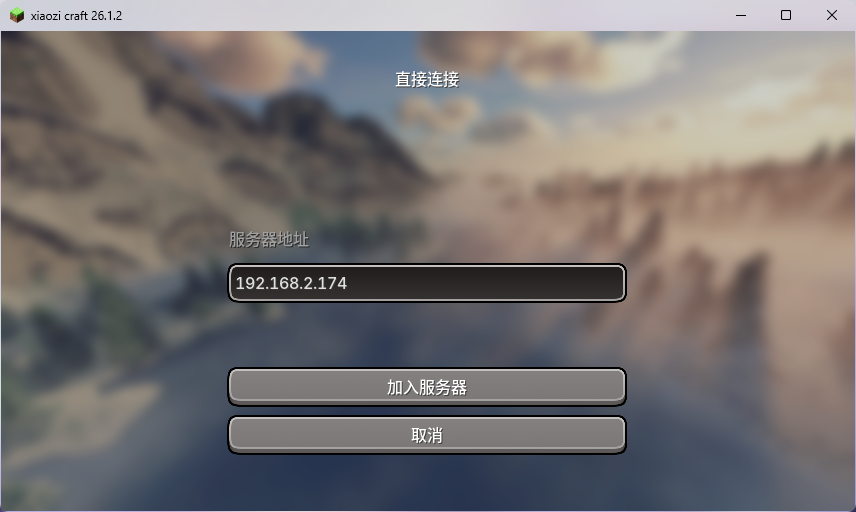
Looks successful~
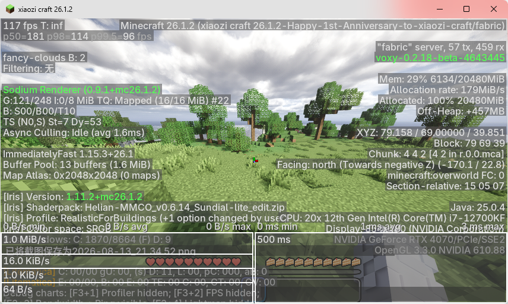