# Server / Windows

## 1. Download the server tools

Setting up a server directly from the command line is possible, but it is usually more complicated than necessary.

We recommend using MSLX Manager to download and manage the server.

MSLX Manager download page:

```text
https://mslx.mslmc.cn/
```

::: warning
## 2. MSLX Manager requires the .NET 10.0 SDK
:::

```text
https://dotnet.microsoft.com/download/dotnet/10.0
```

::: warning
Download the 64-bit .NET 10.0 SDK, not another edition.
:::

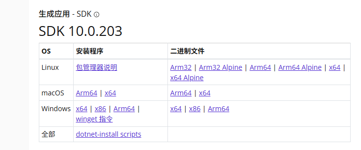

Then download MSLX Manager.


Click download.

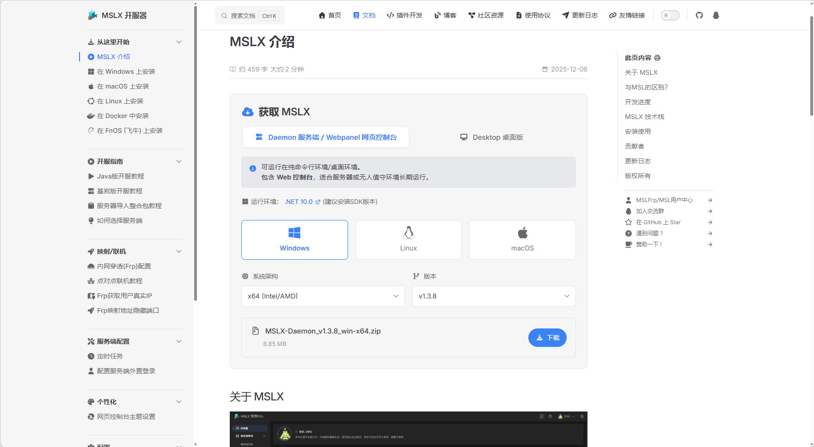

## 3. Extract the package

After downloading, you will get a file like this:

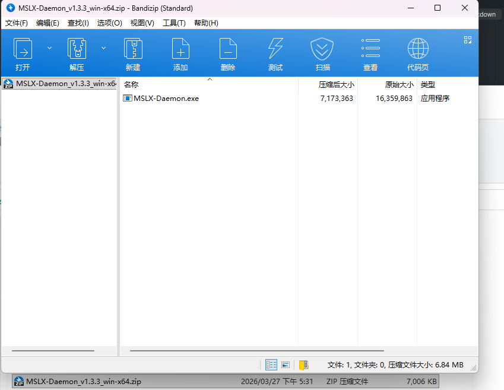

Extract it into the directory where you want to install the server tools. You can choose any folder name.

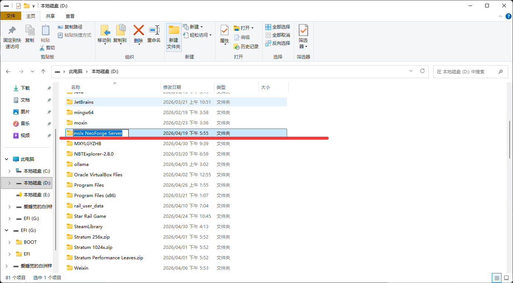

The extracted result should look similar to this:

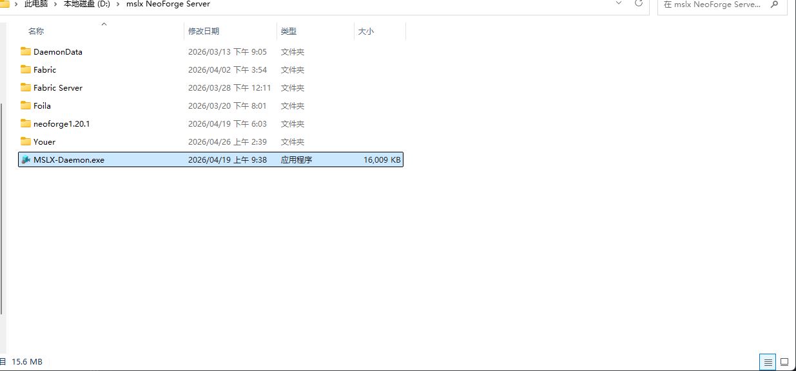

## 4. Start `MSLX-Daemon.exe`

Open the program folder and run `MSLX-Daemon.exe`.

You should see output similar to this:

```shell
info: Program[0]
      MSLX.Daemon is starting... listening at: http://localhost:1027
...
>> Browser URL: http://localhost:1027
```

Open that address in your browser and log in to MSLX Manager.

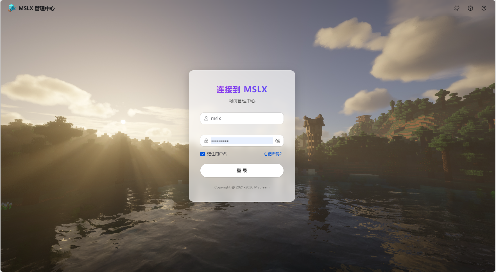

## 5. Configure the server

Go to the configuration page.

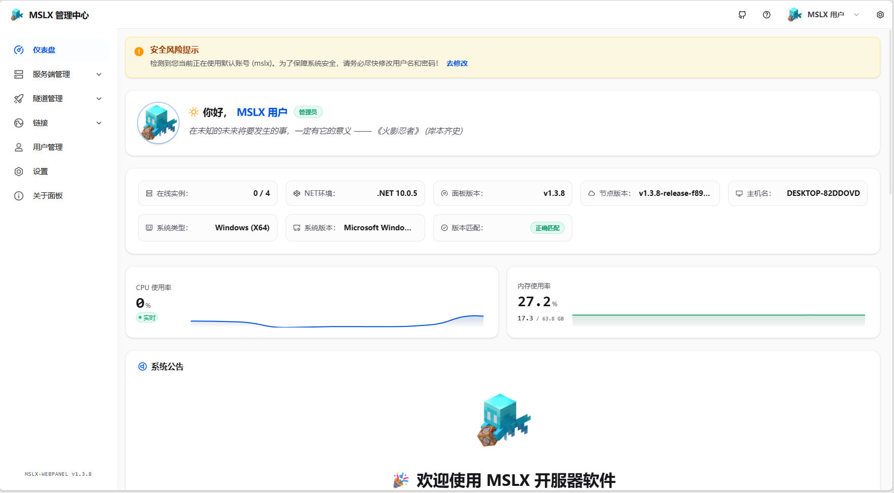

Click server management and create a server.

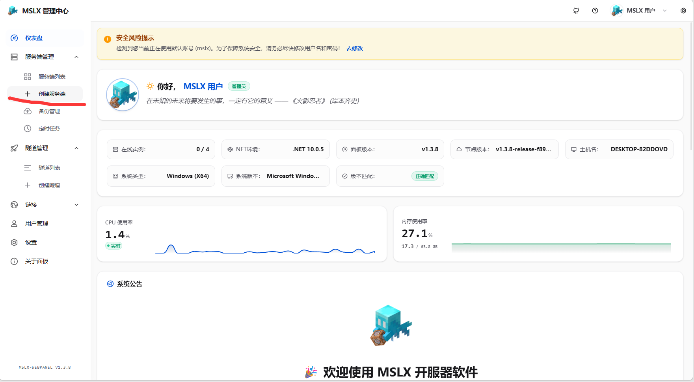

Choose a path and a server name, then continue.

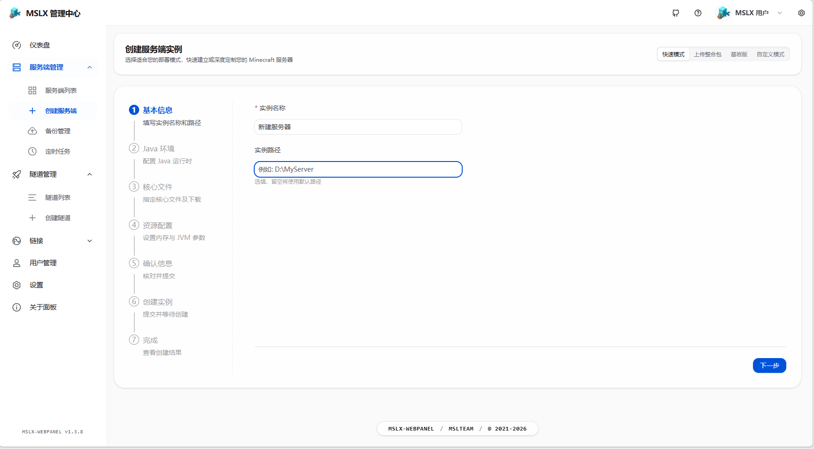

Select the required Java version exactly as prompted.

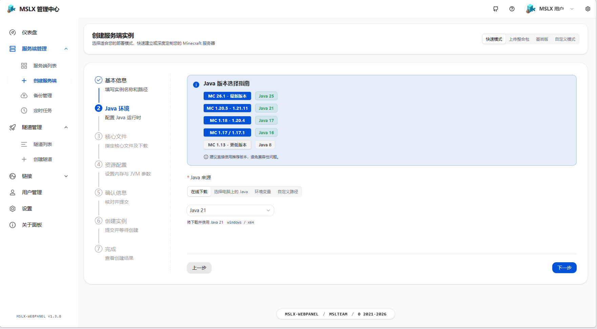

Choose the server core you want.

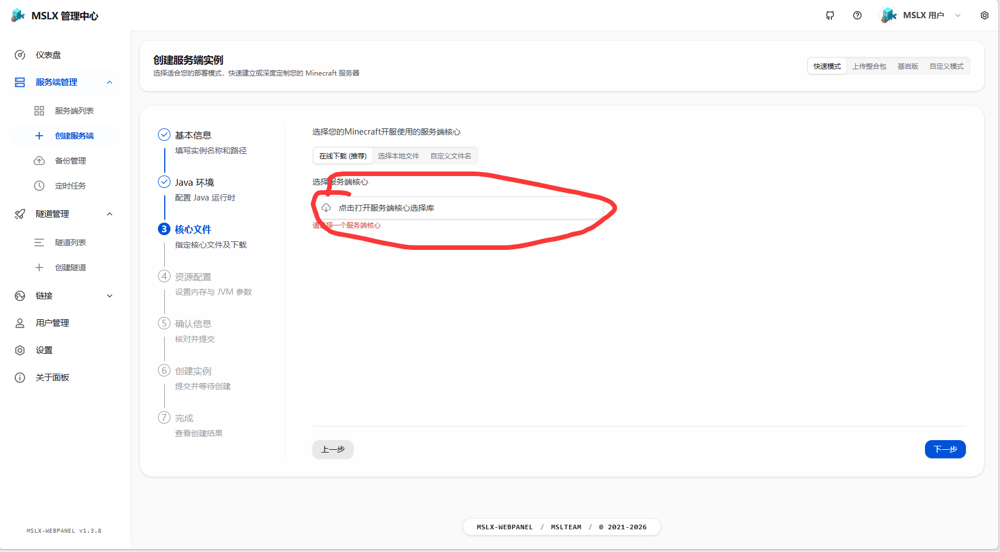

`xiaozi craft` requires Fabric Server. Select the version that matches your game version.

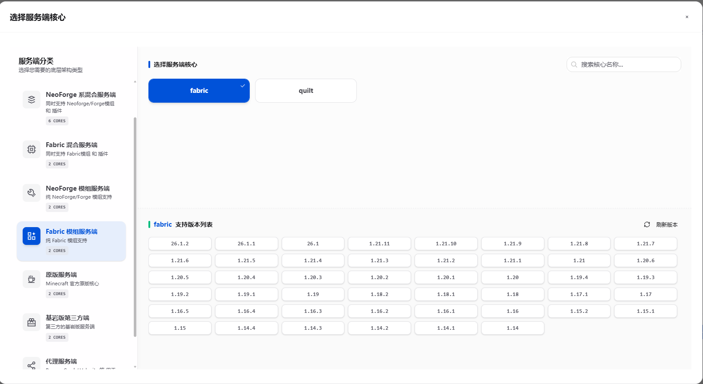

Continue to the next step.

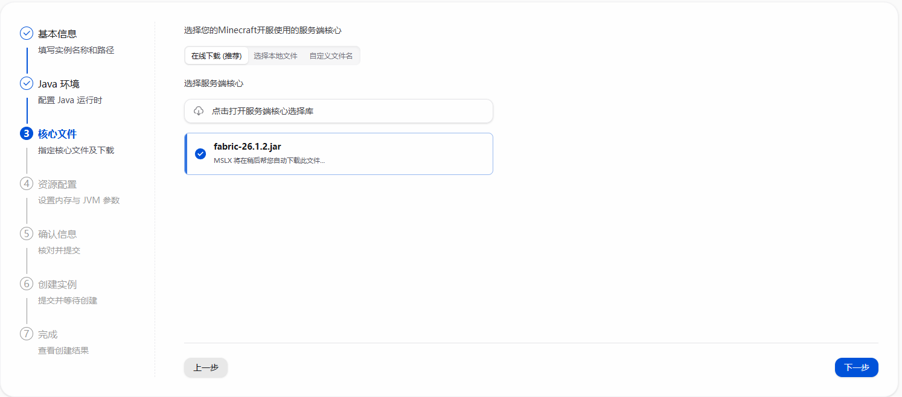

Configure memory:

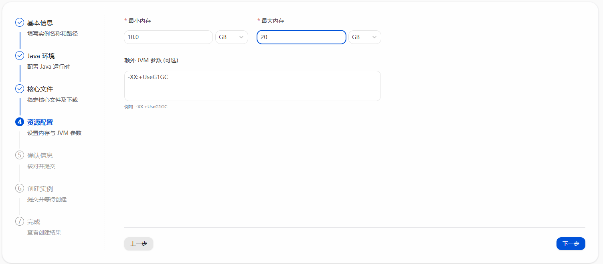

Reference values:

```text
-Xms6G -Xmx6G     // 1-5 players
-Xms12G -Xmx12G   // 10-20 players
-Xms24G -Xmx24G   // 20-40 players
-Xms32G -Xmx32G   // 40-80 players
-Xms64G -Xmx64G   // 80-160 players
-Xms128G -Xmx128G // 160-320 players
```

You can leave the JVM arguments field empty for now and configure it later.

## 6. Create and start the server

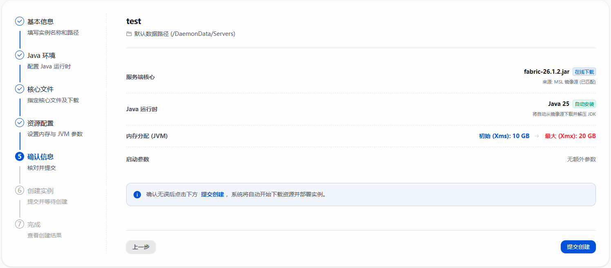

Go to the console:

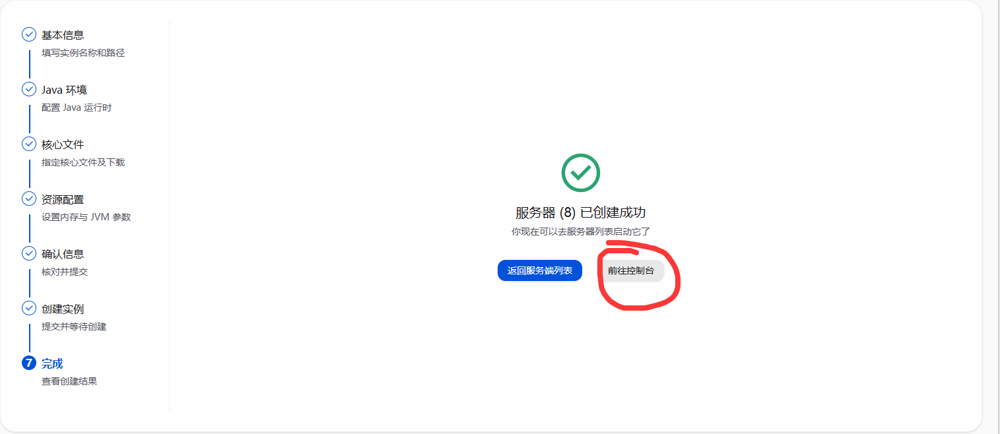

Start the server:

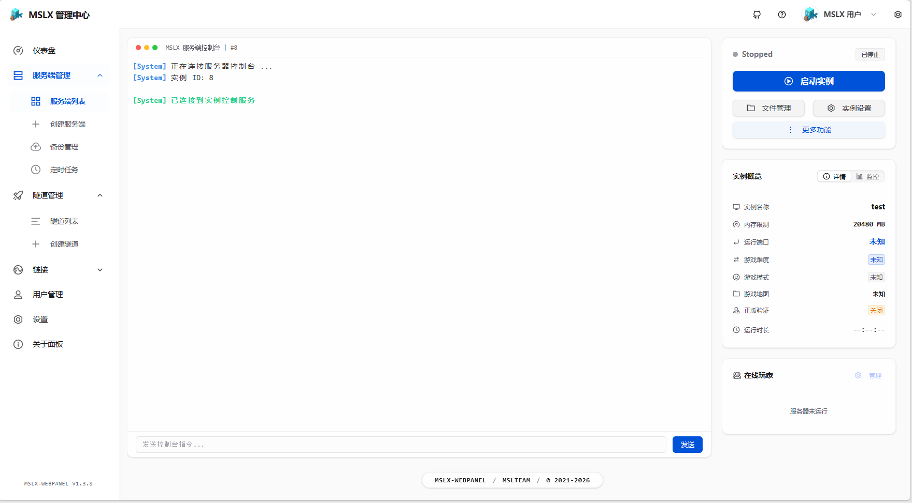

Accept the required agreement:

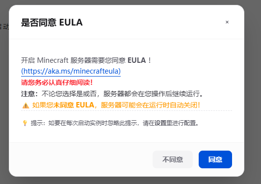

If you see output like this, the server has started successfully:

```shell
[22:24:37] [Server thread/INFO]: Done (4.166s)! For help, type "help"
```

Stop the server before adding the modpack files.

```shell
# In MSLX Manager, do not add a leading slash
stop
```

You can also use the UI button:

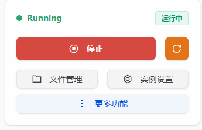

## 7. Add the `xiaozi craft` modpack content

In your local game instance, disable client-only or optimization mods before uploading files to the server. If a listed mod is missing, simply ignore it.

Then upload the remaining modpack files into the server `mods` folder and overwrite existing files when prompted.

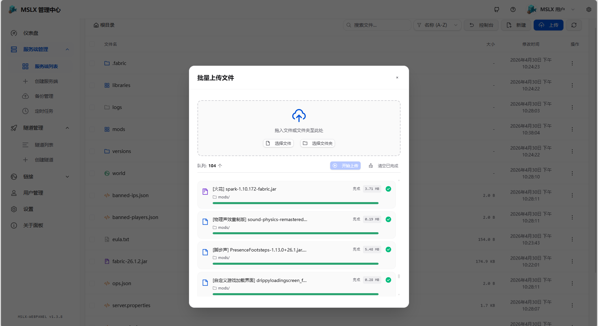

## Done

Start the server again and enjoy the game.
