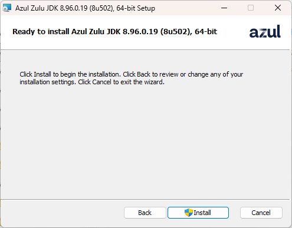

## Choose a Java Version That's Right for You

::: tip
When playing xiaozi craft or Minecraft, choosing the right Java version is very important—it can affect your game performance and stability.
:::

Ah, this is quite a philosophical question!
Next, I'll introduce you to installing Java distributions from different vendors on Windows.

## Comparison Table (Choose Based on Your Needs)

| Distribution                 | Maintained By                | Key Features                                                                                                 | Free for Commercial Use | Use Cases                                                                                                      | Suitable for Minecraft?                  |
| :--------------------------- | :--------------------------- | :----------------------------------------------------------------------------------------------------------- | :---------------------- | :------------------------------------------------------------------------------------------------------------- | :--------------------------------------- |
| Eclipse Temurin              | Eclipse Foundation           | Community-driven, neutral, reliable. Maintained by the Adoptium Working Group with transparent builds.      | Yes                     | Top choice for general enterprise applications—a safe, hassle-free default.                                   | Decent (performs adequately)             |
| Amazon Corretto              | Amazon Web Services (AWS)    | Cloud-native, battle-tested at massive scale. Performance validated by AWS's internal production workloads. | Yes                     | Teams heavily using AWS, or any organization seeking a high-quality free JDK.                                 | Stable but not high FPS (very stable)    |
| Microsoft Build of OpenJDK   | Microsoft                    | Well-integrated with Azure. Works smoothly with Microsoft tools like VS Code.                               | Yes                     | Teams primarily using Azure or a .NET/Java hybrid tech stack.                                                  | Usable, but FPS performance is mediocre  |
| Red Hat Build of OpenJDK     | Red Hat (IBM)                | Deeply integrated with RHEL/OpenShift ecosystem, rigorously tested and optimized on Red Hat Linux.          | Yes (requires Red Hat subscription) | Enterprises whose tech stack is centered on RHEL or OpenShift.                                                 | Works (average performance)              |
| Azul Zulu (Community Edition)| Azul Systems                 | Broadest platform support, including many legacy or specialized OS and chip architectures.                  | Yes                     | Diverse runtime environments, or low-latency requirements (Prime paid version available).                     | **Great! Excellent FPS—highly recommended** |
| Liberica JDK (Standard)      | BellSoft                     | A "drop-in" replacement for Oracle JDK, offers a full version including JavaFX.                             | Yes                     | Enterprises that want to avoid Oracle licensing fees while maintaining high compatibility.                    | Good—solid optimization, but more developer-oriented |
| Oracle JDK (Non-Commercial Only) | Oracle                  | The "official" standard—full feature set, most up-to-date updates.                                           | Development/testing only  | Learning, development, and testing environments (production requires a commercial subscription).              | Usable (use it as a baseline if you're indecisive) |
| GraalVM Community Edition    | Oracle                       | High performance and native images—compile Java apps into native executables with fast startup and low memory footprint. | Yes           | Microservices, Serverless, edge computing—scenarios sensitive to startup time and resource usage.            | Good—great performance, may need some environment setup |
| GraalVM Enterprise Edition   | Oracle                       | Enterprise-grade performance and support—includes advanced optimizations (e.g., PGO), 24x7 support.         | Free on OCI, subscription required elsewhere | Critical production environments with extreme performance demands (a good free option if deployed on Oracle Cloud). | Good—great performance, needs setup, and it's paid! |
| OpenJDK                      | OpenJDK Community            | Community-driven, neutral, reliable—same codebase as Oracle JDK, maintained by the community.               | Yes                     | General enterprise applications.                                                                               | **Hot garbage? (Not recommended—poor experience)** |

---

## Installing Different Distributions

The installation packages you download are usually `.zip`, `.msi`, or `.exe` files. Here's how to install them.

### Installing via .msi / .exe Installer

::: tip
Installer filenames usually look like `jdk-17_windows-x64.msi` or `jdk-17_windows-x64.exe`. These are Windows installers—very convenient, great for beginners.
:::

**Installation steps:**
Double-click the installer and follow the prompts.

You'll typically see a screen like this:


1. Accept the license agreement (there may be a checkbox), then click **Next**.
2. You'll see custom installation options:

:::tip
- **Azul Zulu JDK 26.30.11 x64** – the package you're installing.
- **Add to PATH** – whether to add Java to your system's `PATH` environment variable.
- **Set JAVA_HOME variable** – whether to set the `JAVA_HOME` environment variable.
  - Case 1: No Java on your PC—first installation will create `JAVA_HOME`.
  - Case 2: You already have some version of Java—checking this will overwrite the existing `JAVA_HOME`.
- **JAVASoft** – the core installation files.
:::

:::warning
If you already have Java installed and you check the environment variable options, the installer will overwrite your existing `JAVA_HOME`.
Afterward, running `java -version` in the command line will show the newly installed version.
:::


3. You'll see the installation ready screen (this shows Java 8, but the process is the same):


4. Click **Install** to begin.

:::tip
You may notice a shield icon next to the Install button—this means administrator privileges are required.
:::

5. The installer will request administrator permissions—click **Yes**.


6. Installation will proceed:


7. Once complete, click **Finish** to close the installer.


✅ Installation successful! Open a command prompt and type `java -version` to confirm the installed version.

:::tip
This method is a bit involved—there's an even simpler way, which I'll show you next.
:::

---

### Installing via Windows Installer Command-Line Parameters

The `.msi` installer is essentially a Windows Installer package. You can use command-line parameters for more control.

:::tip
In the command line, type `msiexec /?` to see all available parameters.
```cmd
C:\Users\xiaozi\Downloads>msiexec /?

Windows ® Installer. V 5.0.26100.8875

msiexec /Option <Required Parameter> [Optional Parameter]

Install Options
	</package | /i> <Product.msi>
		Installs or configures a product
	/a <Product.msi>
		Administrative install - installs a product on the network
	/j<u|m> <Product.msi> [/t <Transform List>] [/g <Language ID>]
		Advertises a product - m to all users, u to current user
	</uninstall | /x> <Product.msi | ProductCode>
		Uninstalls the product
Display Options
	/quiet
		Quiet mode, no user interaction
	/passive
		Unattended mode - progress bar only
	/q[n|b|r|f]
		Sets UI level
		n - No UI
		b - Basic UI
		r - Reduced UI
		f - Full UI (default)
	/help
		Help information
Restart Options
	/norestart
		Do not restart after installation
	/promptrestart
		Prompt the user for restart if necessary
	/forcerestart
		Always restart the computer after installation
Logging Options
	/l[i|w|e|a|r|u|c|m|o|p|v|x|+|!|*] <LogFile>
		i - Status messages
		w - Non-fatal warnings
		e - All error messages
		a - Start of actions
		r - Action-specific records
		u - User requests
		c - Initial UI parameters
		m - Out-of-memory or fatal exit information
		o - Out-of-disk-space messages
		p - Terminal properties
		v - Verbose output
		x - Extra debugging information
		+ - Append to existing log file
		! - Flush each line to the log
		* - Log all information, except for v and x options
	/log <LogFile>
		Equivalent to /l* <LogFile>
Update Options
	/update <Update1.msp>[;Update2.msp]
		Applies update(s)
	/uninstall <PatchCodeGuid>[;Update2.msp] /package <Product.msi | ProductCode>
		Removes update(s) for a product
Repair Options
	/f[p|e|c|m|s|o|d|a|u|v] <Product.msi | ProductCode>
		Repairs a product
		p - only if file is missing
		o - if file is missing or an older version is installed (default)
		e - if file is missing or an equal or older version is installed
		d - if file is missing or a different version is installed
		c - if file is missing or checksum does not match calculated value
		a - force reinstall of all files
		u - all required user-specific registry entries (default)
		m - all required machine-specific registry entries (default)
		s - all existing shortcuts (default)
		v - run from source and re-cache the local package
Setting Public Properties
	[PROPERTY=PropertyValue]

Please consult the Windows (R) Installer SDK for additional documentation on command-line syntax.

Copyright (C) Microsoft Corporation. All rights reserved.
Portions of this software are based on the work of the Independent JPEG Group.
```
:::

Navigate to the folder containing your downloaded `.msi` installer, type `cmd` in the address bar to open a command prompt there.


Use minimal UI installation—shows only the progress bar. It will still prompt for administrator permissions.

:::warning
Make sure to put the installer filename in quotes, otherwise you'll get an error.
```cmd
"zulu8.96.0.19-ca-jdk8.0.502-win_x64.msi" <-- keep these quotes
```
:::

**Passive mode (shows progress bar):**
```cmd
C:\Users\xiaozi\Downloads>"zulu8.96.0.19-ca-jdk8.0.502-win_x64.msi" /passive
```

**Quiet mode (no user interaction):**
```cmd
C:\Users\xiaozi\Downloads>"zulu8.96.0.19-ca-jdk8.0.502-win_x64.msi" /quiet
```

:::tip
I recommend using `/passive` so you can see the installation progress.
:::

---

### The Easiest Way: Installing Java with Winget

If even that feels like too much work, here's the most "wheelchair-friendly" (dead simple) method.

Open your terminal as Administrator:
- Windows 10: Right-click the Start menu and select "Windows PowerShell (Admin)"
- Windows 11: Right-click Start and select "Terminal (Admin)"


Type `winget` to verify it's available:
```cmd
winget
```

To see all commands, type `winget -?`:
```cmd
PS C:\Users\xiaozi> winget -?
Windows Package Manager v1.29.280
© 2026 Microsoft. All rights reserved.

WinGet is a command-line utility to install applications and other packages.

Usage: winget  [<command>] [<options>]

The following commands are available:
  install    Installs a given package
  show       Shows information about a package
  source     Manage package sources
  search     Find and show basic info about packages
  list       Show installed packages
  upgrade    Show and perform available upgrades
  uninstall  Uninstalls a given package
  hash       Helper for hashing installers
  validate   Validates a manifest file
  settings   Open settings or set admin settings
  features   Shows the status of experimental features
  export     Export the list of installed packages
  import     Install all packages in a file
  pin        Manage package pins
  configure  Configure the system to the desired state
  download   Download the installer from the given package
  repair     Repair the selected package
  dscv3      DSC v3 resource commands
  mcp        MCP information

For more details on a specific command, pass the help parameter. [-?]

The following options are available:
  -v,--version                Display the version of the tool
  --info                      Display general information about the tool
  -?,--help                   Display help for the selected command
  --wait                      Prompt the user to press any key before exiting
  --logs,--open-logs          Open the default log location
  --verbose,--verbose-logs    Enable verbose logging for WinGet
  --nowarn,--ignore-warnings  Suppress warning output
  --disable-interactivity     Disable interactive prompts
  --proxy                     Set the proxy to use for this execution
  --no-proxy                  Disable proxy usage for this execution

More help is available at: "https://aka.ms/winget-command-help"
PS C:\Users\xiaozi>
```

Use the `search` command to find Java packages:
```cmd
winget search java
```

You'll see a long list of Java packages. Here's a snippet:
```cmd
PS C:\Users\xiaozi> winget search java
Name                                                  ID                                              Version               匹配                          源
-------------------------------------------------------------------------------------------------------------------------------------------------------------
...
Azul Zulu JDK 8                                       Azul.Zulu.8.JDK                                8.96.0.19          Command: java                 winget
...
Eclipse Temurin JDK with Hotspot 17                   EclipseAdoptium.Temurin.17.JDK                 17.0.20.8          Command: java                 winget
...
Liberica JDK 25 Full                                  BellSoft.LibericaJDK.25.Full                   25.0.4.9           Tag: java                     winget
...
Microsoft Build of OpenJDK with Hotspot 17            Microsoft.OpenJDK.17                           17.0.20.8          Tag: java                     winget
...
```

Don't be overwhelmed by the output. The key pieces are **Name** and **ID**. Scan the list, find the Java JDK you like, then use its ID to install.

For example, to install the **Liberica JDK 25 Full** version, find its ID: `BellSoft.LibericaJDK.25.Full`

Now use `winget install` with that ID:
```powershell
PS C:\Users\xiaozi> winget install BellSoft.LibericaJDK.25.Full
Found Liberica JDK 25 Full [BellSoft.LibericaJDK.25.Full] Version 25.0.4.9
This application is licensed to you by its owner.
Microsoft is not responsible for, nor does it grant any licenses to, third-party packages.
Downloading https://download.bell-sw.com/java/25.0.4+9/bellsoft-jdk25.0.4+9-windows-amd64-full.msi
   \
     ███████████████▋                 172 MB /  328 MB
```

Wait for the download to complete—it will install automatically:
```powershell
Successfully verified installer hash
Starting package installation...
   \
```

When you see this, Java is successfully installed!
```powershell
Successfully installed
PS C:\Users\xiaozi>
```

Full output example:
```powershell
PS C:\Users\xiaozi> winget install BellSoft.LibericaJDK.25.Full
Found Liberica JDK 25 Full [BellSoft.LibericaJDK.25.Full] Version 25.0.4.9
This application is licensed to you by its owner.
Microsoft is not responsible for, nor does it grant any licenses to, third-party packages.
Downloading https://download.bell-sw.com/java/25.0.4+9/bellsoft-jdk25.0.4+9-windows-amd64-full.msi
  ██████████████████████████████   328 MB /  328 MB
Successfully verified installer hash
Starting package installation...
Successfully installed
PS C:\Users\xiaozi>
```

---

That's it! You now have multiple ways to install Java on Windows—choose whichever suits you best. Happy gaming (and coding)! 🎮☕