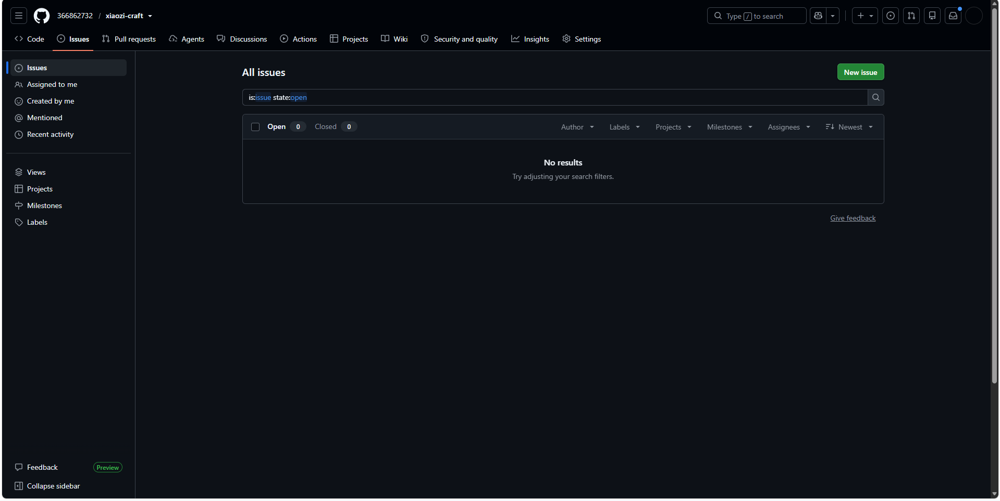
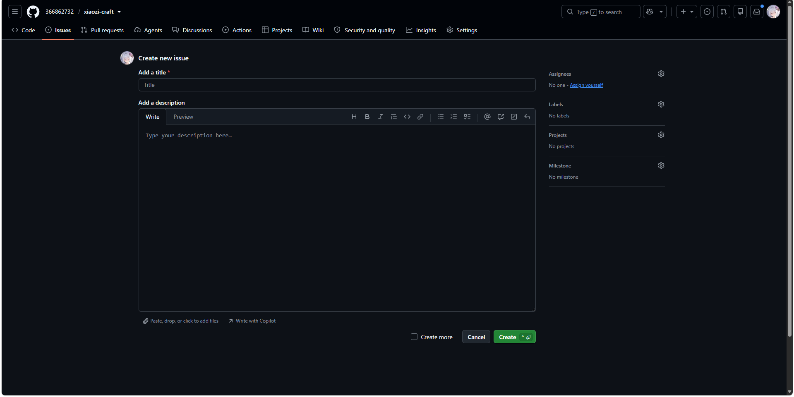
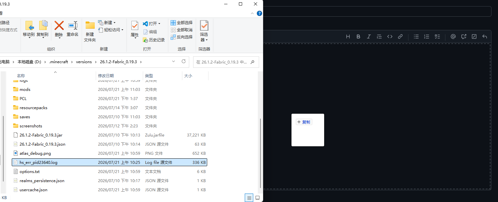
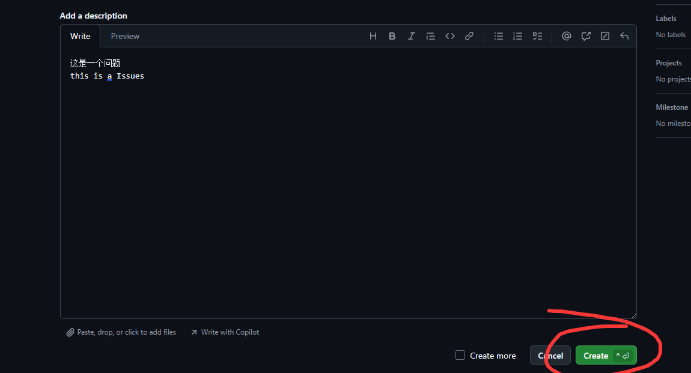

# 问题反馈

欢迎反馈你在 `xiaozi craft` 使用过程中遇到的问题。

## 反馈渠道

- 在 GitHub Issues 中提交问题报告
- 附上你的 Minecraft 版本、模组列表和相关日志

## 如何去提交问题报告？

## 第一种方式：在 GitHub Issues 中提交问题报告

1. 打开 [GitHub Issues](https://github.com/366862732/xiaozi-craft/issues) 页面。
你可以直接打击上方这一句话的超链接，也可以复制下方的 URL。
```text
https://github.com/366862732/xiaozi-craft/issues
```
如果你没有 GitHub 账号，你需要先注册一个。（或者是第二种方式）
## 1.首先我们先打开xiaozi craft的 GitHub Issues 页面

#### 点击视图中的绿色的"New Issue" 按钮。

## 2.填写问题报告的标题和描述。
:::tip
你需要知道写清楚是什么问题，以及问题的具体表现。以及如何复现这个问题。
:::

Add a Title代表你所报告问题的标题。
Add a Description代表你所报告问题的详细描述。（你可以使用Markdown格式。）
## 3.上传相关的日志文件。
:::tip
你需要上传相关的日志文件，比如 `latest.log`或者`debug.log`,当然你提供的日志文件越详细越好，因为这样我们可以更准确地定位问题。
上述日志文件一般会在你的xiaozi craft工作目录下的`logs`文件夹中。
:::
:::tip
当然如果你碰到的是JVM崩溃，类似`hs_err_pid23640.log`名字的文件，你也可以上传这个日志文件。
这个文件一般会在崩溃后直接存放在你的xiaozi craft工作目录下
:::
:::tip
但是如果是你报道游戏崩溃，游戏崩溃的日志文件你可以一并上传。
名字类似于`crash_report_2023-08-01_12-00-00.log`
这个文件一般会在崩溃后存放在你的xiaozi craft工作目录下的`crash_report`文件夹中。
:::
上传可以把文件从文件资源管理器中拖拽到上传区域。比如这样

:::warning
你需要上传相关的日志文件，否则我们无法定位问题。如果发生了问题只要产出的日志文件你皆可上传我们都会接受。
:::
## 4.点击 "Create" 按钮。
:::warning
但是在点击这个按钮之前你需要确认几件事：
1. 你需要填写清楚问题的标题和描述以及复现步骤。
2. 你需要上传相关的日志文件。
3. 你需要确认你上传的日志文件是相关的在同一次，而不是其他问题的日志文件。
4. 你需要附上是哪一个版本的xiaozi craft。包括游戏版本和xiaozi craft版本。(这个版本号可以在xiaozi craft标题界面的左上方查看)
5. 请不要上传旧版本的日志文件。，只接收最新版本的xiaozi craft和LTS/LTSC版本的的问题。(如果是旧版本，我们会拒绝处理。)
:::
在上面的确认清单中，你需要确认以上所有事项。然后点击"Create" 按钮。


## 第二种方式：通过邮件反馈问题
:::tip
考虑到你可能不一定有 GitHub 账号，你也可以通过邮件反馈问题。
:::
:::tip
你需要发送邮件到我们的邮箱。描述问题的具体表现以及复现步骤。与第一种方式的2~3区别不大。
:::
邮箱：[366862732@qq.com](mailto:366862732@qq.com)
当然你不喜欢超链接也可以直接复制邮箱地址。
```text
邮箱：366862732@qq.com
```