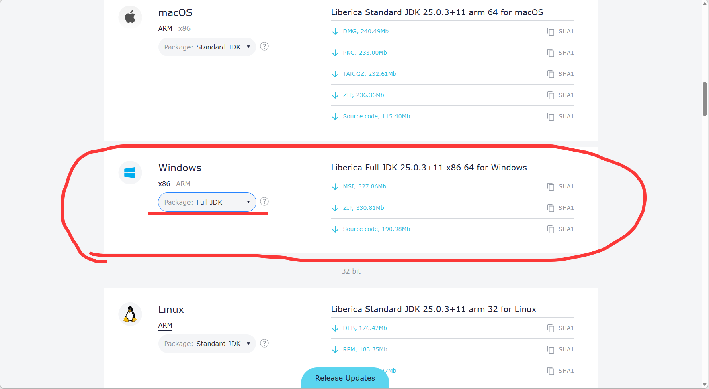
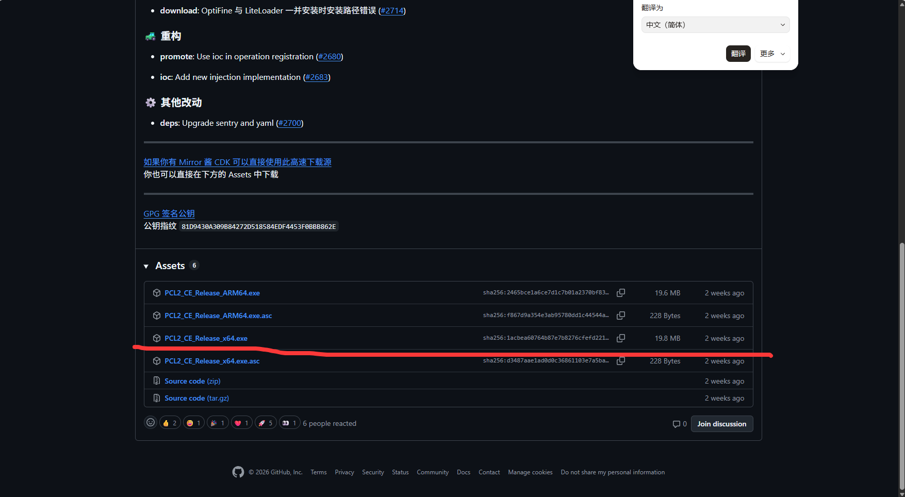
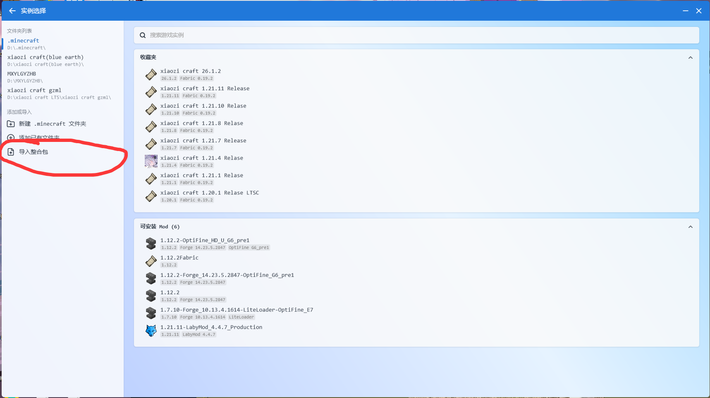
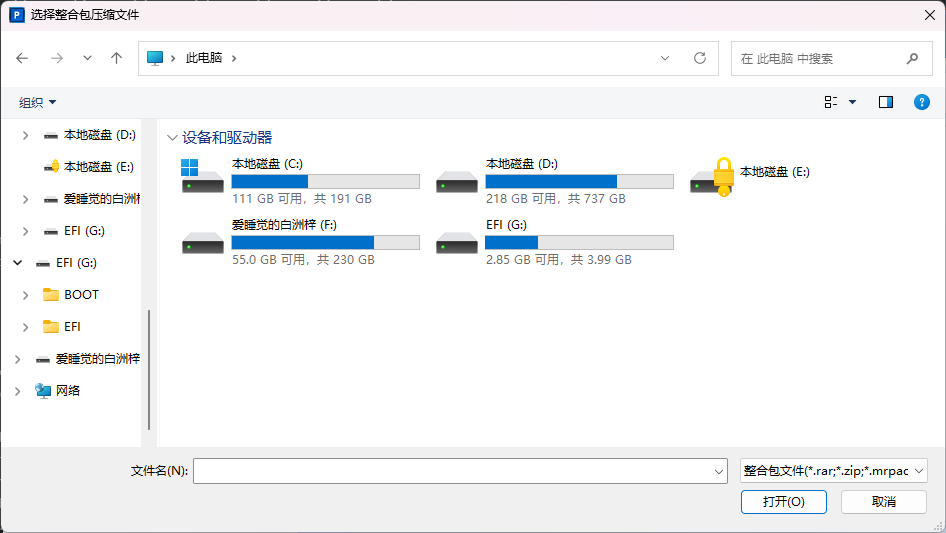
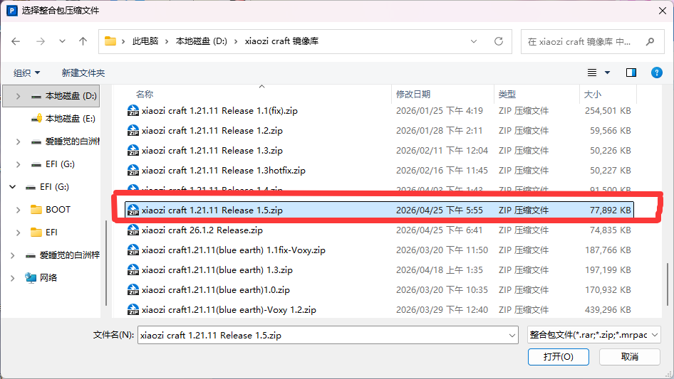
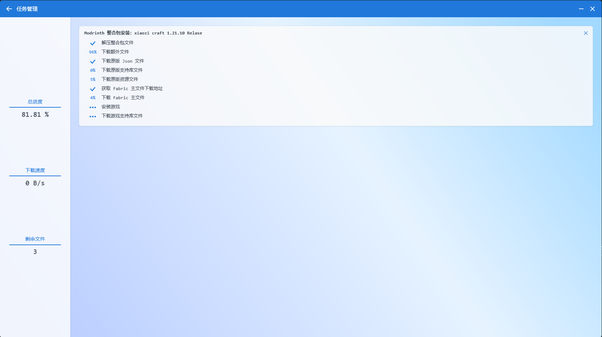
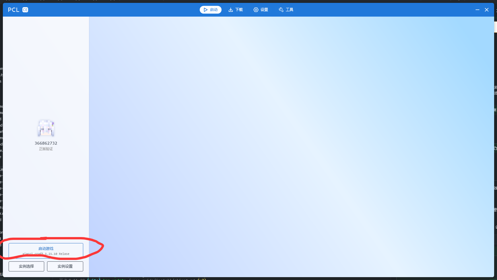
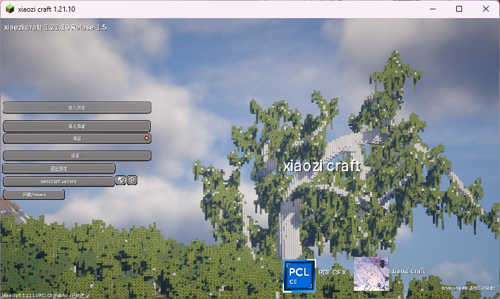

# 客户端

1.在开始之前玩我的世界java版本你肯定需要先安装一个java版本
```java
这里会有两个下载源，一个是oracle的下载源，一个是BellSoft的下载源
oracle的下载源：https://www.oracle.com/java/technologies/java-jdk-downloads.html
BellSoft的下载源：https://bellsoft.com/products/jdk/
//选择其中一个便可，必须需要64位的java版本
```
目前来说非常推荐你安装BellSoft的java版本

记得选择full版本下载
在此记得运行命令验证java版本是否安装成功
```java
java -version
```
一般会使用命令后会显示类似这样的信息：
```java
java version "17"
Java Runtime Environment (build 17+10)
OpenJDK Runtime Environment (build 17+10)
```
如果你看到类似这样的信息说明安装成功！

### 2.java有了，你还需要一个游戏的启动器，这里推荐你使用PCLCE启动器
```java
PCLCE启动器的下载地址：
https://github.com/PCL-Community/PCL-CE/releases/latest
```
也是根据你的操作系统架构选择对应的版本

#### 3.在下载完成后，你可以打开PCLCE启动器，在版本选择中，点击安装整合包。

在这里选择下载下来的整合包文件，xiaozi craft整合包的文件一般是.zip格式

一般长这样，选中后打开

你的PCLCE启动器就会开始自动安装整合包,如图所示

会自动下载所需文件进行安装

::: warning
如果你遇到了长时间下载不完成的情况，你可以尝试取消任务，重新实施步骤 3 中的操作。
:::
接下来肯定是启动游戏了!鼠标选择xiaozi craft整合包启动即可！

####看来非常完美~

