# 服务端/Windows

## 1. 下载服务端
虽然命令行可以直接交互，但是服务端是一个比较麻烦的过程

但是我们推荐你使用MSLX管理器来下载服务端

前往MSLX管理器的下载地址：
```text
https://mslx.mslmc.cn/
```
:::warning
## 2.但是MSLX管理器需要NET 10.0 SDK的环境才能运行!
:::
```text
https://dotnet.microsoft.com/zh-cn/download/dotnet/10.0
```
:::warning
你应该下载64位的NET 10.0 SDK环境，而不是其他的版本
:::
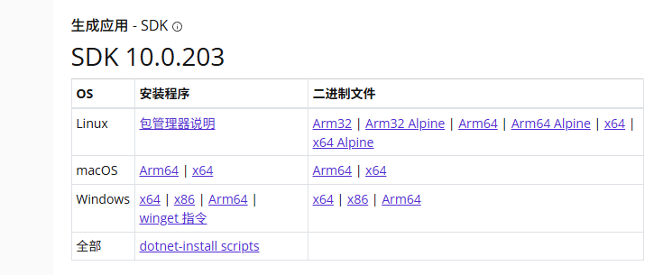
接下来下载MSLX管理器
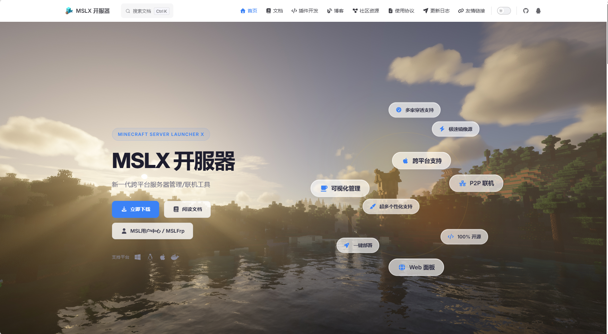
点击下载
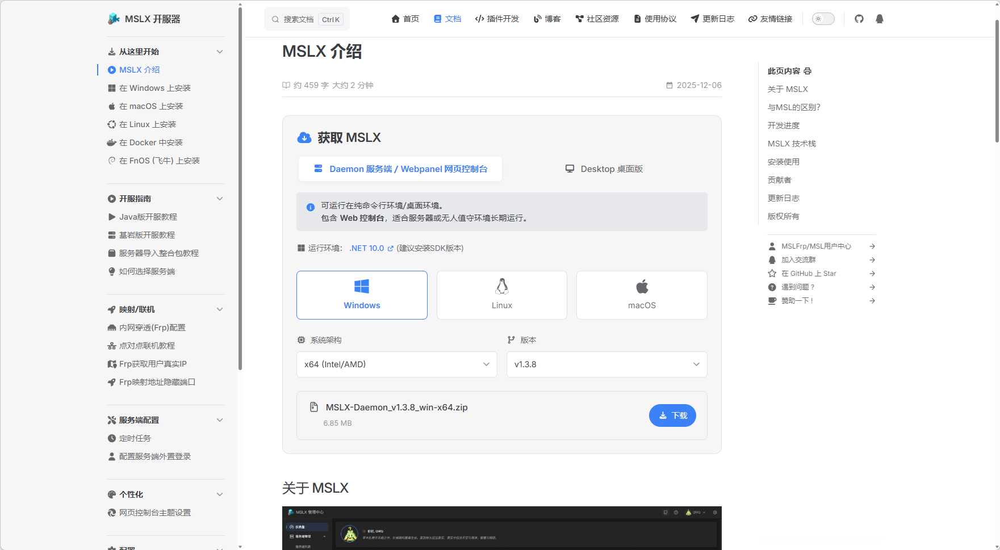
## 3.在下载完成后你会看见这样一个文件
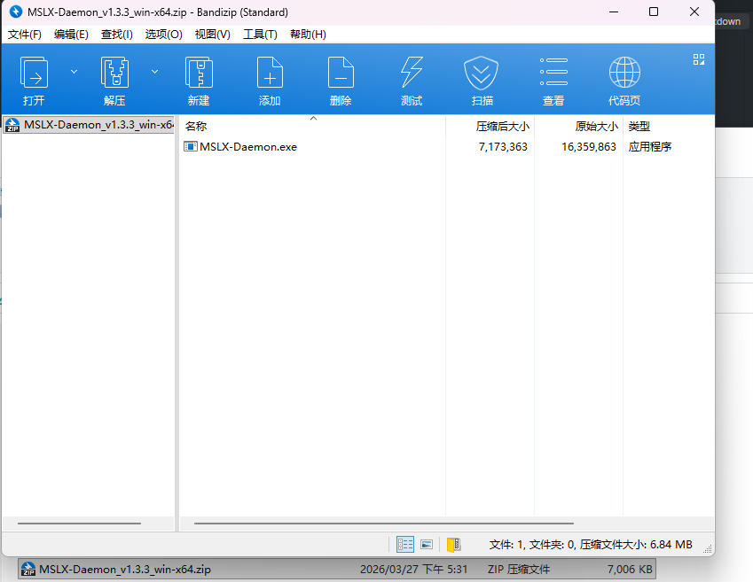
在你要安装的目录解压这个文件比如这样(文件夹的名字可以自己起)
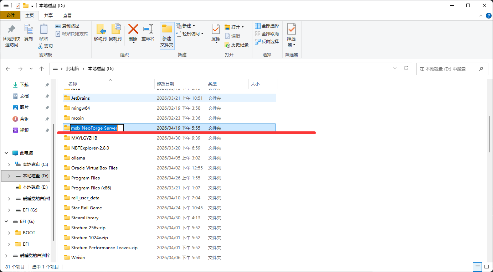
把你刚刚下载的压缩包文件解压到这个目录夹中，比如这样
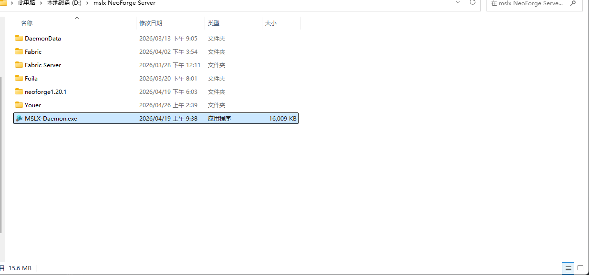
## 4.对着程序文件夹，双击运行MSLX-Daemon.exe文件
你会在弹出的命令行中看见这样的输出
```shell
info: MSLX.Daemon.Utils.ConfigUtils.IConfigService[0]
      成功加载配置文件
info: MSLX.Daemon.Utils.ConfigUtils.IConfigService[0]
      成功加载配置文件
info: Program[0]

  __  __   ____    _      __  __
 |  \/  | / ___|  | |     \ \/ /
 | |\/| | \___ \  | |      \  /
 | |  | |  ___) | | |___   /  \
 |_|  |_| |____/  |_____| /_/\_\

info: Program[0]
      MSLX.Daemon 守护进程正在启动... 监听地址: http://localhost:1027
info: Program[0]
      将使用 D:\mslx NeoForge Server\DaemonData 作为应用程序数据目录。
info: Program[0]
      欢迎使用MSLX！
[WebConsole] 自动检测到监听地址为 localhost，正在通过 localhost 打开控制台...
>> 浏览器打开地址: http://localhost:1027
info: Program[0]
      正在检查 MSLAPI V3 主服务连通性...
info: Program[0]
```
在开头你会看见你的MSLX管理器登录信息，比如这样，作者这里以及做好了
```shell
MSLX.Daemon 守护进程正在启动... 监听地址: http://localhost:1027
```
你可以在浏览器中打开这个地址，来登录MSLX管理器
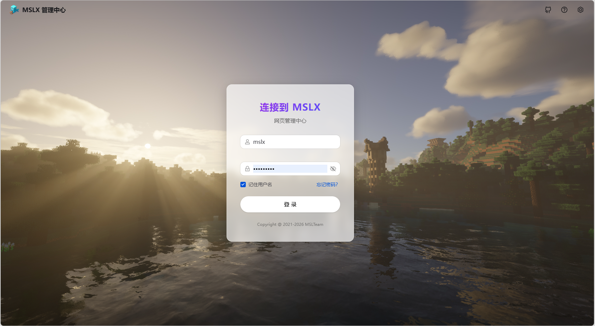
输入你刚刚在控制台看见的登录信息，来登录MSLX管理器
## 5.配置服务端
来到MSLX管理器的配置页面
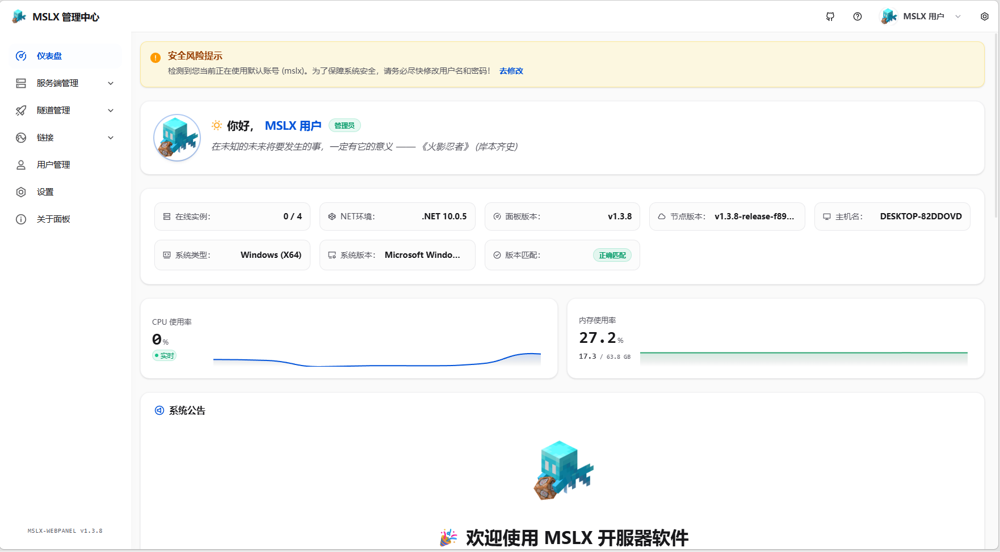
点击服务端管理，创建服务端
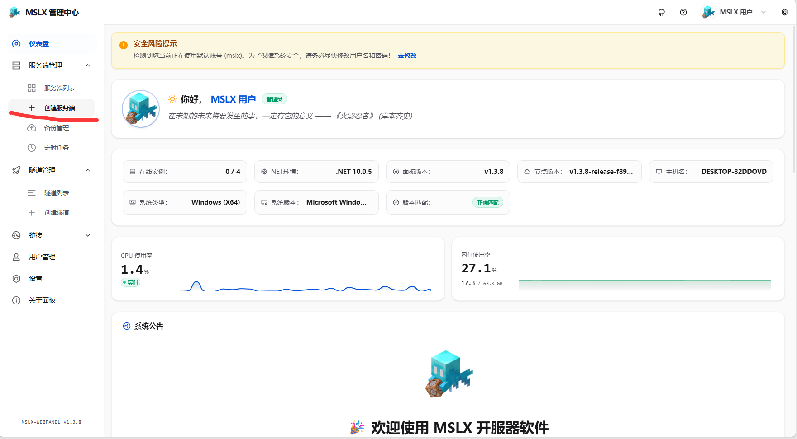
可以更改一个你喜欢的路径和名字，然后下一步
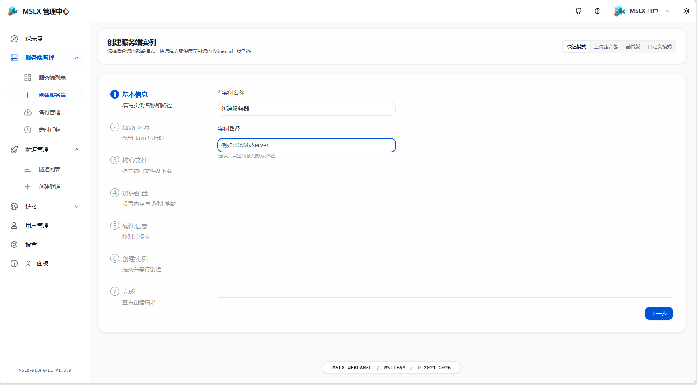
选择所需java版本，然后下一步,一定按照提示去选择，不然会无法启动！
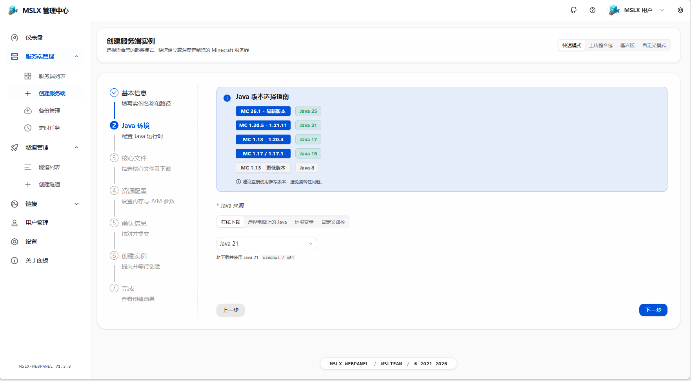
打开选择库，选择一个你喜欢的服务端核心
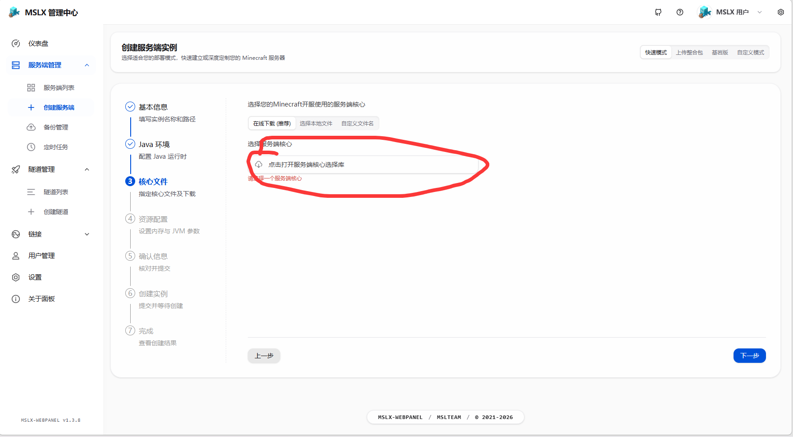
xiaozi craft所需要的服务端核心是Fabric Server,根据你游戏的版本选择对应版本
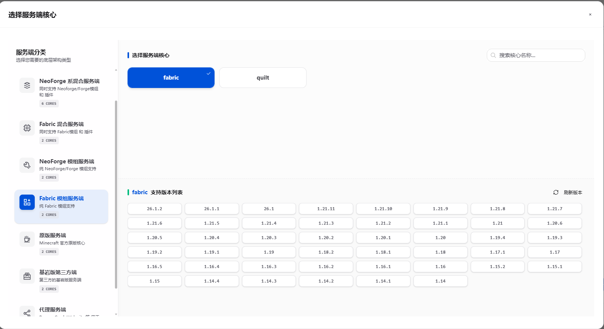
下一步
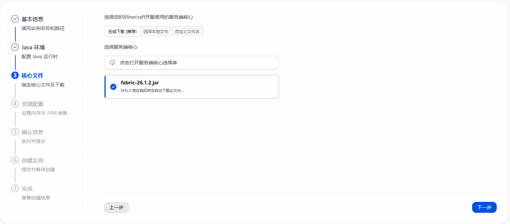
内存配置
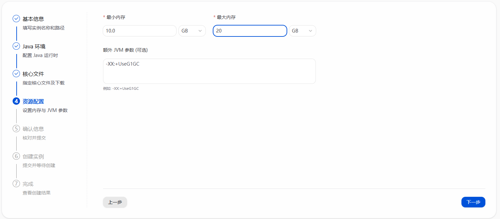
这是感觉开服人数的内存配置参照，根据你的需求选择合适的内存配置
```text
-Xms6G -Xmx6G   //最小内存6GB，最大内存6GB，适用于1-5人的小型服务器
-Xms12G -Xmx12G //最小内存12GB，最大内存12GB，适用于10-20人的大型服务器
-Xms24G -Xmx24G //最小内存24GB，最大内存24GB，适用于20-40人的大型服务器
-Xms32G -Xmx32G //最小内存32GB，最大内存32GB，适用于40-80人的大型服务器
-Xms64G -Xmx64G //最小内存64GB，最大内存64GB，适用于80-160人的大型服务器
-Xms128G -Xmx128G //最小内存128GB，最大内存128GB，适用于160-320人的大型服务器
```
还有JVM参数，会在下一章JVM参数中详细介绍,这里可以不填
## 6.提交创建服务端
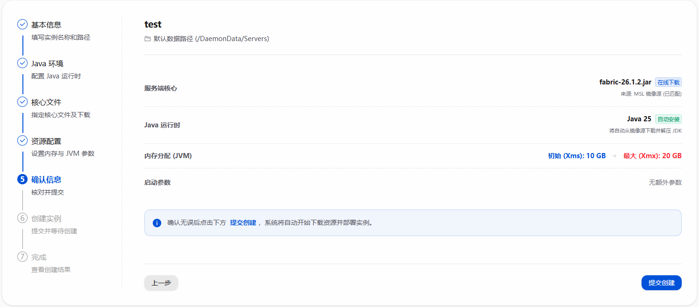
前往控制台

你应该做的是启动
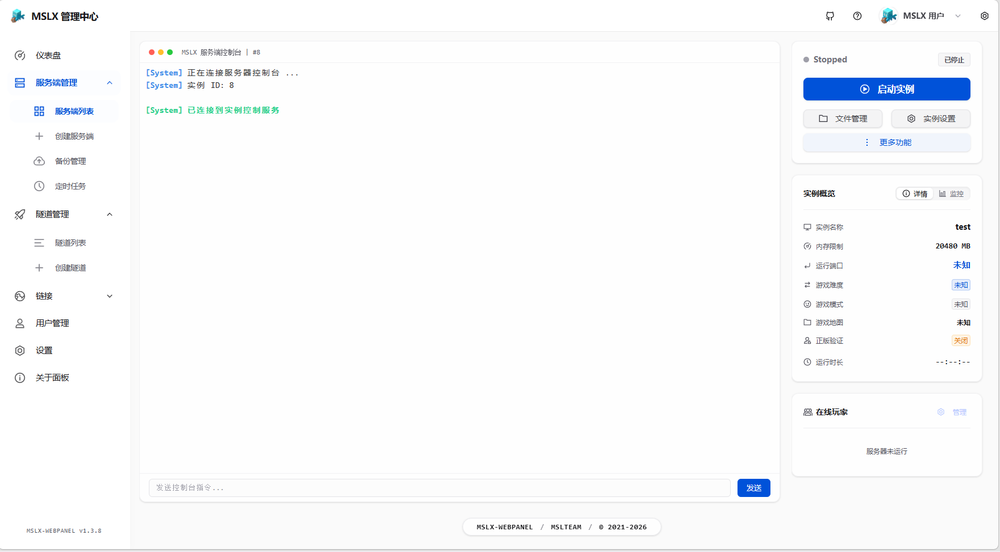
这个是要同意的
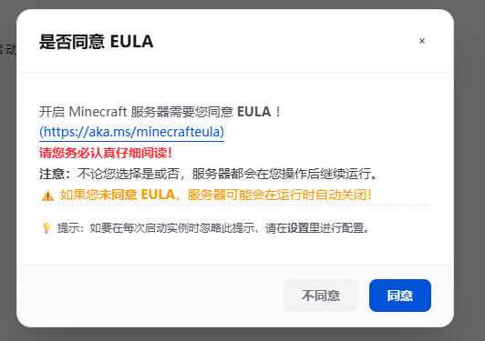
查看服务器的命令行输出，如果看见这样的输出，说明服务端启动成功！
```shell
[22:24:37] [Server thread/INFO]: Done (4.166s)! For help, type "help"
```
成功后，停止服务端，开始添加服务端
停止服务器命令
```shell
//注意！在MSLX管理器输入命令不需要加"/"
stop
```
其实这个也可以。。


## 7.添加xiaozi craft整合包的模组
找到你安装的游戏实例的模组设置，找到这些模组并禁用它们/只要某一个单词匹配就禁用，如没有就忽略
```text
dynamic-fps-3.11.6+minecraft-26.1.0-fabric.jar
krypton-0.3.0.jar
entityculling-fabric-1.10.1-mc26.1.jar
cullleaves-fabric-4.1.2+26.1.jar
sodium-fabric-0.8.10+mc26.1.2.jar
sodium-extra-fabric-0.8.7+mc26.1.1.jar
sodium-shadowy-path-blocks-fabric-7.0.0.jar
reeses-sodium-options-fabric-2.0.5+mc26.1.1.jar
BetterGrassify-1.8.6+fabric.26.1.2.jar
c2me-fabric-mc26.1.2-0.3.7+alpha.0.67.jar
ImmediatelyFast-Fabric-1.15.2+26.1.2.jar
moreculling-fabric-26.1.1-1.7.0.jar
BadOptimizations-2.4.1-26.1-fabric.jar
async-fabric-0.2.2+alpha-26.1.2.jar
packetfixer-fabric-3.3.5-26.1.2.jar
ScalableLux-0.2.0+fabric.2b63825-all.jar
voxy-0.2.14-alpha.jar
iris-fabric-1.10.9+mc26.1.1.jar
IrisExtension-fabric-1.0.2-mc26.1.jar
continuity-3.0.1-beta.2+26.1.jar
entity_model_features_26.1-fabric-3.2.2.jar
entity_texture_features_26.1-fabric-7.1.jar
lambdynamiclights-4.10.2+26.1.2.jar
EuphoriaPatcher-1.8.6-r5.7.1-fabric.jar
lsdc-fabric-6.0.0-snapshot+mc26.1-local.jar
sclp-fabric-5.4-snapshot+mc26.1-local.jar
fallingleaves-2.0.6+26.1.jar
EnchantmentDescriptions-fabric-MC26.1.2-26.1.2.1.jar
betterstats-5.2.1+fn-26.1.jar
modmenu-18.0.0-alpha.8.jar
MouseTweaks-fabric-mc26.1-2.31.jar
IMBlocker-7.1.1-fabric-26.1+.jar
clienttweaks-fabric-26.1.2-26.1.2.2.jar
drippyloadingscreen_fabric_3.1.1_MC_26.1.1.jar
fancymenu_fabric_3.8.6_MC_26.1.1.jar
language-reload-1.7.6+26.1.jar
fabrishot-1.17.0.jar
morechathistory-2.0.0.jar
AmbientSounds_FABRIC_v6.3.6_mc26.1.2.jar
sound-physics-remastered-fabric-1.5.1+26.1.2.jar
PresenceFootsteps-1.13.0+26.1.jar
boatiview-fabric-0.0.9-26.1.jar
litematica-fabric-26.1.2-0.27.2.jar
malilib-fabric-26.1.2-0.28.3.jar
CustomSkinLoader_Universal-14.28.jar
caxton-fabric-26.1.2-1.0.0-alpha.4.jar
Mo-Glass-1.12-MC26.1.2.jar
undergroundbeacons-26.1.2-1.1.jar
mcwifipnp-1.9.8-26.1-fabric.jar
cwb-4.0.2+26.1.jar
freecam-fabric-1.4.0-alpha.3+mc26.1.2.jar
vanilla-refresh-1.4.30.jar
camerautils-fabric-1.1.2+26.1.2.jar
tcdcommons-5.2.1+fn-26.1.jar
midnightlib-fabric-1.9.2+26.1.jar
konkrete_fabric_1.10.1_MC_26.1.1.jar
melody_fabric_1.0.16_MC_26.1.1.jar
sounds-2.4.24+lts+26.1-fabric.jar
visuality-0.7.13+26.1.jar
placeholder-api-3.0.0+26.1.jar
BiomesOPlenty-fabric-26.1.2-26.1.2.0.4.jar
FarmersDelight-26.1-3.5.3+refabricated.jar
ForgeConfigAPIPort-v26.1.3-mc26.1.x-Fabric.jar
yet_another_config_lib_v3-3.9.2+26.1-fabric.jar
```
然后把禁用完的模组文件夹上传到服务端的mods文件夹中,覆盖即可
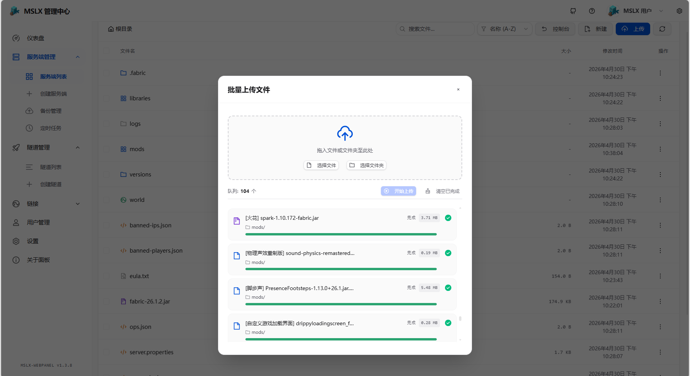
## 然后启动就可以游玩了！

