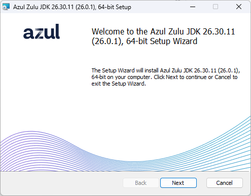
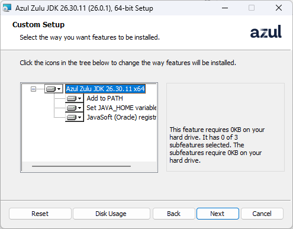
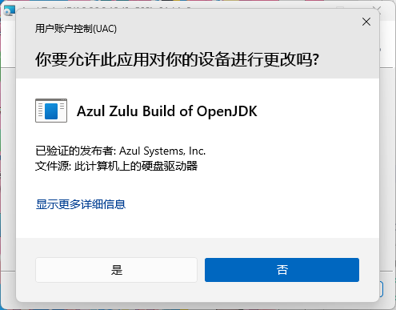
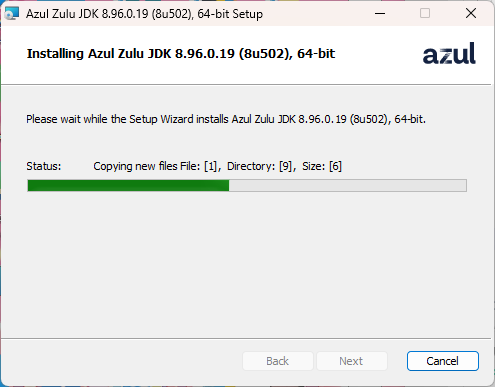
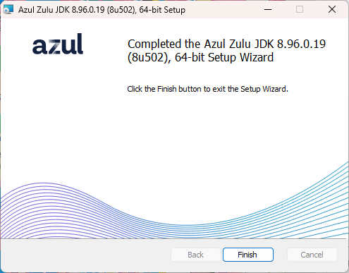
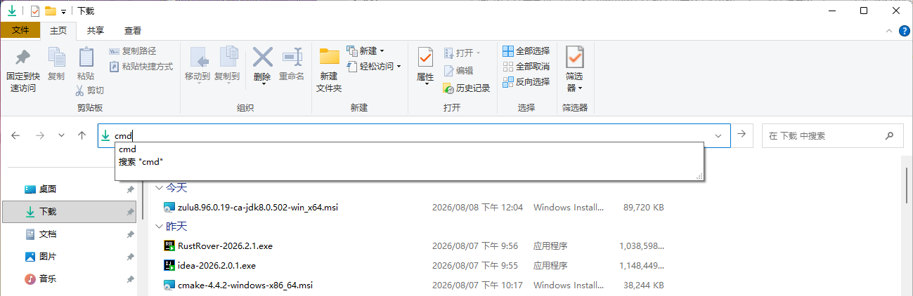
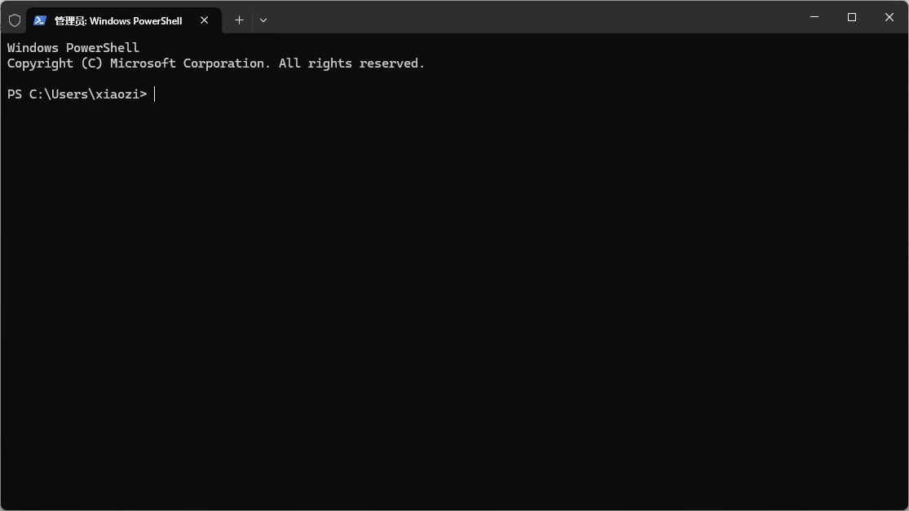

## 选择一个适合你的Java ！

::: tip
在游玩xiaozi craft或者是我的世界时，一个适合你的Java版本非常地重要。比较它能影响你的游戏性能和稳定性。
:::
哦！这可是一个非常有哲学的问题！
接下来我会为你介绍在windows上安装不同发行商的Java版本。

## 对照表（按需选择）

| 发行版                        | 维护方                       | 核心特点                                        | 是否免费商用            | 适用场景                                     |         是否适合游玩我的世界         |
| :------------------------- | :------------------------ | :------------------------------------------ | :---------------- | :--------------------------------------- | :------------------------: |
| Eclipse Temurin            | Eclipse 基金会               | 社区驱动、中立、可靠。由 Adoptium 工作组维护，构建过程透明。         | 是                 | 通用企业应用首选，安全省心的默认选择。                      |         还行（表现中规中矩）         |
| Amazon Corretto            | Amazon Web Services (AWS) | 云原生、经过大规模验证。性能经 AWS 内部海量生产环境检验。             | 是                 | 深度使用 AWS 的团队，或任何追求高质量免费 JDK 的企业。         | 要帧数有稳定性，要性能有稳定性（非常稳定但帧数不高） |
| Microsoft Build of OpenJDK | Microsoft                 | 与 Azure 集成良好。与 VS Code 等微软工具配合顺畅。           | 是                 | 主要使用 Azure 云或 .NET/Java 混合技术栈的团队。        |        可以用，但帧数表现比较平庸       |
| Red Hat Build of OpenJDK   | Red Hat (IBM)             | 与 RHEL/OpenShift 生态深度绑定，在红帽 Linux 上经严格测试优化。 | 是（需有红帽订阅）         | 技术栈以 RHEL 或 OpenShift 为核心的企业。            |          能用（表现普通）          |
| Azul Zulu (社区版)            | Azul Systems              | 平台支持最广，支持众多老旧或特殊的操作系统和芯片架构。                 | 是                 | 运行环境多样，或对低延迟有要求（可选用付费 Prime 版）。          |     夯！好用到爆！帧数表现很好，非常推荐     |
| Liberica JDK (标准版)         | BellSoft                  | Oracle JDK 的“即插即用”替代品，提供包含 JavaFX 的完整版。     | 是                 | 希望规避 Oracle 授权费用，又想保持高度兼容的企业。            |    可以用，综合优化不错，但它更适合开发人员    |
| Oracle JDK (仅限非商业用途)       | Oracle                    | “官方”标准，功能最全，更新最及时。                          | 仅限开发/测试           | 学习、开发和测试环境（生产环境使用需购买商业订阅）。               |   可以用（如果你有选择困难症，直接用它当基准）   |
| GraalVM Community Edition  | Oracle                    | 高性能与原生镜像，可将 Java 应用编译为启动极快、内存占用小的原生可执行文件。   | 是                 | 微服务、Serverless、边缘计算等对启动速度和资源占用敏感的场景。     |    好用，性能非常好，但可能需要配置一下环境    |
| GraalVM Enterprise Edition | Oracle                    | 企业级性能与支持，包含更多高级优化（如 PGO），提供 24x7 支持。        | 在 OCI 上免费，其他环境需订阅 | 核心生产环境，且对性能有极致要求（部署在 Oracle 云上是不错的免费选择）。 |    好用，性能非常好，但需要配置环境，且收费！   |
| OpenJDK                    | OpenJDK 社区                | 社区驱动、中立、可靠。与 Oracle JDK 代码相同，由社区维护。         | 是                 | 通用企业应用。                                  |      哪来的大粪？（不推荐，体验很差）      |

## 你下载到不同发行商的安装包，一般是.zip或者是msi/exe格式的。在这里，我会介绍如何安装它们。

首先是你下载到的msi/exe格式的安装包。
::: tip
安装包的文件名一般是`jdk-17_windows-x64.msi`或者`jdk-17_windows-x64.exe`。这一类的安装包是Windows下的安装包。安装非常的方便。适合小白使用。
:::
安装方法如下：
双击打开安装程序，按照提示安装即可。
打开安装程序，你一遍会见到这样一个界面：

先同意协议，继续安装。可能会有同意协议打勾的选项，那就同意协议。然后点击Next。
这里会有自定义安装选项，
:::tip
Azul Zulu JDK 26.30.11 x64指的是你要安装的软件包。

Add to PATH指的是你是否要把安装的Java添加到系统环境变量的路径。

Set JAVA_HOME variable指的是你是否要把安装的Java添加到环境变量的JAVA_HOME中。但是这个分两种情况：
1. 你的电脑上没有Java，第一次安装安装程序会创建JAVA_HOME环境变量。
2. 你的电脑上本来已经有了Java的任意版本，你可以如果这个时候你勾选这个选项，那么安装程序覆盖掉系统本来的JAVA_HOME环境变量。

JAVASoft指的是你安装的本体文件

:::
:::warning
但是你需要注意，如果你的电脑上本来已经有了Java的任意版本，那么你勾选了跟环境变量有关的选项，那么安装程序会覆盖掉系统本来的JAVA_HOME环境变量。
那么你再在命令行中，输入`java -version`，会看到最新安装的Java版本。
:::

然后你会看到开始安装的界面（这里虽然变成了Java 8，但是不影响教学）

点击install正式开始安装。

:::tip
细心的你可能会发现，install按钮左边有一个盾牌，也就是说安装时需要使用管理员权限。
:::
到这里它开始申请管理员权限，你需要点击是。

这样安装程序就会开始安装了。

这样遍算安装成功，点击Finish关闭安装程序。

安装成功！你可以打开命令行，输入`java -version`，会看到最新安装的Java版本。
:::tip
## 当然这种安装方法太复杂，其实还有更简单的方法,接下来我会为你介绍。
:::
## 使用Windows installer的命令行参数安装
你在下载到的msi格式的安装包中，它本质其实是一个Windows installer安装程序。
那我们怎么去获取installer的命令行参数呢？
:::tip
在命令行中，输入`msiexec /?`，会看到所有的命令行参数。
```cmd
C:\Users\xiaozi\Downloads>msiexec /?

Windows ® Installer. V 5.0.26100.8875

msiexec /Option <Required Parameter> [Optional Parameter]

安装选项
	</package | /i> <Product.msi>
		安装或配置产品
	/a <Product.msi>
		管理安装 - 在网络上安装产品
	/j<u|m> <Product.msi> [/t <Transform List>] [/g <Language ID>]
		公布产品 - m 公布到所有用户，u 公布到当前用户
	</uninstall | /x> <Product.msi | ProductCode>
		卸载产品
显示选项
	/quiet
		安静模式，无用户交互
	/passive
		无人参与模式 - 只显示进度栏
	/q[n|b|r|f]
		设置用户界面级别
		n - 无用户界面
		b - 基本界面
		r - 精简界面
		f - 完整界面(默认值)
	/help
		帮助信息
重新启动选项
	/norestart
		安装完成后不重新启动
	/promptrestart
		必要时提示用户重新启动
	/forcerestart
		安装后始终重新启动计算机
日志选项
	/l[i|w|e|a|r|u|c|m|o|p|v|x|+|!|*] <LogFile>
		i - 状态消息
		w - 非致命警告
		e - 所有错误消息
		a - 操作的启动
		r - 操作特定记录
		u - 用户请求
		c - 初始用户界面参数
		m - 内存不足或致命退出信息
		o - 磁盘空间不足消息
		p - 终端属性
		v - 详细输出
		x - 额外调试信息
		+ - 扩展到现有日志文件
		! - 每一行刷新到日志
		* - 记录所有信息，除了 v 和 x 选项
	/log <LogFile>
		与 /l* <LogFile> 相同
更新选项
	/update <Update1.msp>[;Update2.msp]
		应用更新
	/uninstall <PatchCodeGuid>[;Update2.msp] /package <Product.msi | ProductCode>
		删除产品的更新
修复选项
	/f[p|e|c|m|s|o|d|a|u|v] <Product.msi | ProductCode>
		修复产品
		p - 仅当文件丢失时
		o - 如果文件丢失或安装了更旧的版本(默认值)
		e - 如果文件丢失或安装了相同或更旧的版本
		d - 如果文件丢失或安装了不同版本
		c - 如果文件丢失或较验和与计算的值不匹配
		a - 强制重新安装所有文件
		u - 所有必要的用户特定注册表项(默认值)
		m - 所有必要的计算机特定注册表项(默认值)
		s - 所有现有的快捷键方式(默认值)
		v - 从源运行并重新缓存本地安装包
设置公共属性
	[PROPERTY=PropertyValue]

请查阅 Windows (R) Installer SDK 获得有关命令行语法的其他文档。

版权所有 (C) Microsoft Corporation. 保留所有权利。
此软件的部分内容系基于 Independent JPEG Group 的工作。

```
:::
然后我们在我们下载的msi格式的安装包的目录下，在地址栏中，输入cmd打开命令行。比如说我下载的安装包在`C:\Users\xiaozi\Downloads`目录下


使用最小化界面安装，只会显示进度栏。但是还是会提示吗申请管理员权限。

:::warning
前面的打引号的东西是指的你安装包，切勿漏打，否则会报错。
```cmd
"zulu8.96.0.19-ca-jdk8.0.502-win_x64.msi"<--这个引号
```
:::
```cmd
C:\Users\xiaozi\Downloads>"zulu8.96.0.19-ca-jdk8.0.502-win_x64.msi" /passive 
```
使用静默安装，不会与用户交互。
```cmd
C:\Users\xiaozi\Downloads>"zulu8.96.0.19-ca-jdk8.0.502-win_x64.msi" /quiet
```
:::tip
但是我更推荐你使用/passive参数，因为它能够让你了解安装进度。
:::
## 当然你还是会觉得，这些方法都需要自行下载文件，那我会教你更轮椅的方式安装Java。
首先使用管理员权限打开你的终端，比如说在Windows 10中，你可以右键点击开始菜单，选择管理员权限运行PowerShell。
在Windows 11中叫终端（管理员）

输入winget
```cmd
winget 
```
先输入winget -?，会看到所有的命令行参数。
```cmd
PS C:\Users\xiaozi> winget -?
Windows 程序包管理器 v1.29.280
© 2026 Microsoft。保留所有权利。

WinGet 命令行实用工具可从命令行安装应用程序和其他程序包。

使用情况: winget  [<命令>] [<选项>]

下列命令有效:
  install    安装给定的程序包
  show       显示包的相关信息
  source     管理程序包的来源
  search     查找并显示程序包的基本信息
  list       显示已安装的程序包
  upgrade    显示并执行可用升级
  uninstall  卸载给定的程序包
  hash       哈希安装程序的帮助程序
  validate   验证清单文件
  settings   打开设置或设置管理员设置
  features   显示实验性功能的状态
  export     导出已安装程序包的列表
  import     安装文件中的所有程序包
  pin        管理包钉
  configure  将系统配置为所需状态
  download   从给定的程序包下载安装程序
  repair     修复所选包
  dscv3      DSC v3 资源命令
  mcp        MCP 信息

如需特定命令的更多详细信息，请向其传递帮助参数。 [-?]

下列选项可用：
  -v,--version                显示工具的版本
  --info                      显示工具的常规信息
  -?,--help                   显示选定命令的帮助信息
  --wait                      提示用户在退出前按任意键
  --logs,--open-logs          打开默认日志位置
  --verbose,--verbose-logs    启用 WinGet 的详细日志记录
  --nowarn,--ignore-warnings  禁止显示警告输出
  --disable-interactivity     禁用交互式提示
  --proxy                     设置要用于此执行的代理
  --no-proxy                  禁止对此执行使用代理

可在此找到更多帮助: "https://aka.ms/winget-command-help"
PS C:\Users\xiaozi>
```
我们需要使用search命令来搜索Java获取Java的包名。
```cmd
winget search java
```
你会看到一大堆的Java包名。
```cmd
PS C:\Users\xiaozi> winget search java
名称                                                  ID                                             版本               匹配                          源
-------------------------------------------------------------------------------------------------------------------------------------------------------------
AdoptOpenJDK JDK with Hotspot 16                      AdoptOpenJDK.OpenJDK.16                        16.0.1.9           Command: java                 winget
AdoptOpenJDK JDK with Eclipse OpenJ9 16               AdoptOpenJDK.OpenJDK.16.OpenJ9                 16.0.1.9           Command: java                 winget
AdoptOpenJDK JDK with Hotspot 17                      AdoptOpenJDK.OpenJDK.17                        17.0.0.20          Command: java                 winget
AdoptOpenJDK JDK with Eclipse OpenJ9 17               AdoptOpenJDK.OpenJDK.17.OpenJ9                 17.0.0.18          Command: java                 winget
Amazon Corretto 11                                    Amazon.Corretto.11.JDK                         11.0.32.9          Command: java                 winget
Amazon Corretto 17                                    Amazon.Corretto.17.JDK                         17.0.20.8          Command: java                 winget
Amazon Corretto 18                                    Amazon.Corretto.18.JDK                         18.0.2.9           Command: java                 winget
Amazon Corretto 19                                    Amazon.Corretto.19.JDK                         19.0.2.7           Command: java                 winget
Amazon Corretto 20                                    Amazon.Corretto.20.JDK                         20.0.2.10          Command: java                 winget
Amazon Corretto 21                                    Amazon.Corretto.21.JDK                         21.0.12.8          Command: java                 winget
Amazon Corretto 22                                    Amazon.Corretto.22.JDK                         22.0.2.9           Command: java                 winget
Amazon Corretto 23                                    Amazon.Corretto.23.JDK                         23.0.2.7           Command: java                 winget
Amazon Corretto 24                                    Amazon.Corretto.24.JDK                         24.0.2.12          Command: java                 winget
Amazon Corretto 25                                    Amazon.Corretto.25.JDK                         25.0.4.7           Command: java                 winget
Amazon Corretto 26                                    Amazon.Corretto.26.JDK                         26.0.2.10          Command: java                 winget
Amazon Corretto 8                                     Amazon.Corretto.8.JDK                          1.8.0.502          Command: java                 winget
Amazon Corretto JRE 8                                 Amazon.Corretto.8.JRE                          1.8.0.502          Command: java                 winget
Azul Zulu JDK 10                                      Azul.Zulu.10.JDK                               10.3               Command: java                 winget
Azul Zulu JDK 11                                      Azul.Zulu.11.JDK                               11.90.19           Command: java                 winget
Azul Zulu JRE 11                                      Azul.Zulu.11.JRE                               11.90.19           Command: java                 winget
Azul Zulu JDK 12                                      Azul.Zulu.12.JDK                               12.3.11            Command: java                 winget
Azul Zulu JRE 12                                      Azul.Zulu.12.JRE                               12.1.3             Command: java                 winget
Azul Zulu JDK 13                                      Azul.Zulu.13.JDK                               13.54.17           Command: java                 winget
Azul Zulu JRE 13                                      Azul.Zulu.13.JRE                               13.54.17           Command: java                 winget
Azul Zulu JDK 14                                      Azul.Zulu.14.JDK                               14.29.23           Command: java                 winget
Azul Zulu JDK 15                                      Azul.Zulu.15.JDK                               15.46.17           Command: java                 winget
Azul Zulu JRE 15                                      Azul.Zulu.15.JRE                               15.46.17           Command: java                 winget
Azul Zulu JDK 16                                      Azul.Zulu.16.JDK                               16.32.15           Command: java                 winget
Azul Zulu JRE 16                                      Azul.Zulu.16.JRE                               16.32.15           Command: java                 winget
Azul Zulu JDK 17                                      Azul.Zulu.17.JDK                               17.68.17           Command: java                 winget
Azul Zulu JRE 17                                      Azul.Zulu.17.JRE                               17.68.17           Command: java                 winget
Azul Zulu JDK 18                                      Azul.Zulu.18.JDK                               18.32.13           Command: java                 winget
Azul Zulu JRE 18                                      Azul.Zulu.18.JRE                               18.32.13           Command: java                 winget
Azul Zulu JDK 19                                      Azul.Zulu.19.JDK                               19.32.13           Command: java                 winget
Azul Zulu JDK 20                                      Azul.Zulu.20.JDK                               20.32.11           Command: java                 winget
Azul Zulu JDK 21                                      Azul.Zulu.21.JDK                               21.52.15           Command: java                 winget
Azul Zulu JRE 21                                      Azul.Zulu.21.JRE                               21.52.15           Command: java                 winget
Azul Zulu JDK 22                                      Azul.Zulu.22.JDK                               22.32.15           Command: java                 winget
Azul Zulu JDK 23                                      Azul.Zulu.23.JDK                               23.32.11           Command: java                 winget
Azul Zulu JDK 24                                      Azul.Zulu.24.JDK                               24.32.13           Command: java                 winget
Azul Zulu JDK 25                                      Azul.Zulu.25.JDK                               25.36.15           Command: java                 winget
Azul Zulu JRE 25                                      Azul.Zulu.25.JRE                               25.36.15           Command: java                 winget
Azul Zulu JDK 26                                      Azul.Zulu.26.JDK                               26.32.13           Command: java                 winget
Azul Zulu JDK 6                                       Azul.Zulu.6.JDK                                6.22.0.3           Command: java                 winget
Azul Zulu JDK 7                                       Azul.Zulu.7.JDK                                7.56.0.11          Command: java                 winget
Azul Zulu JRE 7                                       Azul.Zulu.7.JRE                                7.56.0.11          Command: java                 winget
Azul Zulu JDK 8                                       Azul.Zulu.8.JDK                                8.96.0.19          Command: java                 winget
Azul Zulu JRE 8                                       Azul.Zulu.8.JRE                                8.96.0.19          Command: java                 winget
Azul Zulu JDK 9                                       Azul.Zulu.9.JDK                                9.0.7.1            Command: java                 winget
Azul Zulu JRE 9                                       Azul.Zulu.9.JRE                                9.0.0.15           Command: java                 winget
Azul ZuluFX JDK 11                                    Azul.ZuluFX.11.JDK                             11.90.19           Command: java                 winget
Azul ZuluFX JDK 15                                    Azul.ZuluFX.15.JDK                             15.46.17           Command: java                 winget
Azul ZuluFX JDK 17                                    Azul.ZuluFX.17.JDK                             17.68.17           Command: java                 winget
Azul ZuluFX JRE 17                                    Azul.ZuluFX.17.JRE                             17.28.13           Command: java                 winget
Azul ZuluFX JDK 18                                    Azul.ZuluFX.18.JDK                             18.32.13           Command: java                 winget
Azul ZuluFX JDK 19                                    Azul.ZuluFX.19.JDK                             19.32.15           Command: java                 winget
Azul ZuluFX JDK 20                                    Azul.ZuluFX.20.JDK                             20.32.11           Command: java                 winget
Azul ZuluFX JDK 21                                    Azul.ZuluFX.21.JDK                             21.52.15           Command: java                 winget
Azul ZuluFX JRE 21                                    Azul.ZuluFX.21.JRE                             21.52.15           Command: java                 winget
Azul ZuluFX JDK 22                                    Azul.ZuluFX.22.JDK                             22.32.15           Command: java                 winget
Azul ZuluFX JDK 23                                    Azul.ZuluFX.23.JDK                             25.28.85           Command: java                 winget
Azul ZuluFX JDK 24                                    Azul.ZuluFX.24.JDK                             24.32.13           Command: java                 winget
Azul ZuluFX JDK 25                                    Azul.ZuluFX.25.JDK                             25.36.15           Command: java                 winget
Azul ZuluFX JRE 25                                    Azul.ZuluFX.25.JRE                             25.36.15           Command: java                 winget
Azul ZuluFX JDK 26                                    Azul.ZuluFX.26.JDK                             26.32.13           Command: java                 winget
Azul ZuluFX JDK 8                                     Azul.ZuluFX.8.JDK                              8.96.0             Command: java                 winget
Eclipse Temurin JDK with Hotspot 11                   EclipseAdoptium.Temurin.11.JDK                 11.0.32.9          Command: java                 winget
Eclipse Temurin JRE with Hotspot 11                   EclipseAdoptium.Temurin.11.JRE                 11.0.32.9          Command: java                 winget
Eclipse Temurin JDK with Hotspot 16                   EclipseAdoptium.Temurin.16.JDK                 16.0.2.7           Command: java                 winget
Eclipse Temurin JDK with Hotspot 17                   EclipseAdoptium.Temurin.17.JDK                 17.0.20.8          Command: java                 winget
Eclipse Temurin JRE with Hotspot 17                   EclipseAdoptium.Temurin.17.JRE                 17.0.20.8          Command: java                 winget
Eclipse Temurin JDK with Hotspot 18                   EclipseAdoptium.Temurin.18.JDK                 18.0.2.101         Command: java                 winget
Eclipse Temurin JRE with Hotspot 18                   EclipseAdoptium.Temurin.18.JRE                 18.0.2.101         Command: java                 winget
Eclipse Temurin JDK with Hotspot 19                   EclipseAdoptium.Temurin.19.JDK                 19.0.2.7           Command: java                 winget
Eclipse Temurin JRE with Hotspot 19                   EclipseAdoptium.Temurin.19.JRE                 19.0.2.7           Command: java                 winget
Eclipse Temurin JRE with Hotspot 19 (x86)             EclipseAdoptium.Temurin.19.JRE.x86             19.0.2.7           Command: java                 winget
Eclipse Temurin JDK with Hotspot 20                   EclipseAdoptium.Temurin.20.JDK                 20.0.2.9           Command: java                 winget
Eclipse Temurin JRE with Hotspot 20                   EclipseAdoptium.Temurin.20.JRE                 20.0.2.9           Command: java                 winget
Eclipse Temurin JDK with Hotspot 21                   EclipseAdoptium.Temurin.21.JDK                 21.0.12.8          Command: java                 winget
Eclipse Temurin JRE with Hotspot 21                   EclipseAdoptium.Temurin.21.JRE                 21.0.12.8          Command: java                 winget
Eclipse Temurin JDK with Hotspot 22                   EclipseAdoptium.Temurin.22.JDK                 22.0.2.9           Command: java                 winget
Eclipse Temurin JRE with Hotspot 22                   EclipseAdoptium.Temurin.22.JRE                 22.0.2.9           Command: java                 winget
Eclipse Temurin JDK with Hotspot 23                   EclipseAdoptium.Temurin.23.JDK                 23.0.2.7           Command: java                 winget
Eclipse Temurin JRE with Hotspot 23                   EclipseAdoptium.Temurin.23.JRE                 23.0.2.7           Command: java                 winget
Eclipse Temurin JDK with Hotspot 24                   EclipseAdoptium.Temurin.24.JDK                 24.0.2.12          Command: java                 winget
Eclipse Temurin JRE with Hotspot 24                   EclipseAdoptium.Temurin.24.JRE                 24.0.2.12          Command: java                 winget
Eclipse Temurin JDK with Hotspot 25                   EclipseAdoptium.Temurin.25.JDK                 25.0.4.7           Command: java                 winget
Eclipse Temurin JRE with Hotspot 25                   EclipseAdoptium.Temurin.25.JRE                 25.0.4.7           Command: java                 winget
Eclipse Temurin JDK with Hotspot 26                   EclipseAdoptium.Temurin.26.JDK                 26.0.2.10          Command: java                 winget
Eclipse Temurin JRE with Hotspot 26                   EclipseAdoptium.Temurin.26.JRE                 26.0.2.10          Command: java                 winget
Eclipse Temurin JDK with Hotspot 8                    EclipseAdoptium.Temurin.8.JDK                  8.0.502.7          Command: java                 winget
Eclipse Temurin JRE with Hotspot 8                    EclipseAdoptium.Temurin.8.JRE                  8.0.502.7          Command: java                 winget
IBM Semeru Runtime Open Edition (JDK) 11              IBM.Semeru.11.JDK                              11.0.32.0          Command: java                 winget
IBM Semeru Runtime Open Edition (JRE) 11              IBM.Semeru.11.JRE                              11.0.32.0          Command: java                 winget
IBM Semeru Runtime Open Edition (JDK) 16              IBM.Semeru.16.JDK                              11.0.23.9          Command: java                 winget
IBM Semeru Runtime Open Edition (JRE) 16              IBM.Semeru.16.JRE                              11.0.23.9          Command: java                 winget
IBM Semeru Runtime Open Edition (JDK) 17              IBM.Semeru.17.JDK                              17.0.20.0          Command: java                 winget
IBM Semeru Runtime Open Edition (JRE) 17              IBM.Semeru.17.JRE                              17.0.20.0          Command: java                 winget
IBM Semeru Runtime Open Edition (JDK) 18              IBM.Semeru.18.JDK                              18.0.2.9           Command: java                 winget
IBM Semeru Runtime Open Edition (JRE) 18              IBM.Semeru.18.JRE                              18.0.2.9           Command: java                 winget
IBM Semeru Runtime Open Edition (JDK) 19              IBM.Semeru.19.JDK                              19.0.2.7           Command: java                 winget
IBM Semeru Runtime Open Edition (JRE) 19              IBM.Semeru.19.JRE                              19.0.2.7           Command: java                 winget
IBM Semeru Runtime Open Edition (JDK) 20              IBM.Semeru.20.JDK                              20.0.2.9           Command: java                 winget
IBM Semeru Runtime Open Edition (JRE) 20              IBM.Semeru.20.JRE                              20.0.2.9           Command: java                 winget
IBM Semeru Runtime Open Edition (JDK)                 IBM.Semeru.21.JDK                              21.0.12.0          Command: java                 winget
IBM Semeru Runtime Open Edition (JRE)                 IBM.Semeru.21.JRE                              21.0.12.0          Command: java                 winget
IBM Semeru Runtime Open Edition (JDK) 22              IBM.Semeru.22.JDK                              22.0.2.9           Command: java                 winget
IBM Semeru Runtime Open Edition (JRE) 22              IBM.Semeru.22.JRE                              22.0.2.9           Command: java                 winget
IBM Semeru Runtime Open Edition (JDK) 23              IBM.Semeru.23.JDK                              23.0.2.7           Command: java                 winget
IBM Semeru Runtime Open Edition (JRE) 23              IBM.Semeru.23.JRE                              23.0.2.7           Command: java                 winget
IBM Semeru Runtime Open Edition (JDK) 24              IBM.Semeru.24.JDK                              24.0.2.12          Command: java                 winget
IBM Semeru Runtime Open Edition (JRE) 24              IBM.Semeru.24.JRE                              24.0.2.12          Command: java                 winget
IBM Semeru Runtime Open Edition (JDK) 25              IBM.Semeru.25.JDK                              25.0.4.0           Command: java                 winget
IBM Semeru Runtime Open Edition (JRE) 25              IBM.Semeru.25.JRE                              25.0.4.0           Command: java                 winget
IBM Semeru Runtime Open Edition (JDK) 26              IBM.Semeru.26.JDK                              26.0.2.0           Command: java                 winget
IBM Semeru Runtime Open Edition (JRE) 26              IBM.Semeru.26.JRE                              26.0.2.0           Command: java                 winget
IBM Semeru Runtime Open Edition (JDK) 8               IBM.Semeru.8.JDK                               8.0.502.0          Command: java                 winget
IBM Semeru Runtime Open Edition (JRE) 8               IBM.Semeru.8.JRE                               8.0.502.0          Command: java                 winget
Java(TM) SE Development Kit 17                        Oracle.JDK.17                                  17.0.12.0          Command: java                 winget
Java(TM) SE Development Kit 18                        Oracle.JDK.18                                  18.0.2.1           Command: java                 winget
Java(TM) SE Development Kit 19                        Oracle.JDK.19                                  19.0.2.0           Command: java                 winget
Java(TM) SE Development Kit 20                        Oracle.JDK.20                                  20.0.2.0           Command: java                 winget
Java(TM) SE Development Kit 21                        Oracle.JDK.21                                  21.0.12.0          Command: java                 winget
Java(TM) SE Development Kit 22                        Oracle.JDK.22                                  22.0.2.0           Command: java                 winget
Java(TM) SE Development Kit 23                        Oracle.JDK.23                                  23.0.2.0           Command: java                 winget
Java(TM) SE Development Kit 24                        Oracle.JDK.24                                  24.0.2.0           Command: java                 winget
Java(TM) SE Development Kit 25                        Oracle.JDK.25                                  25.0.4.0           Command: java                 winget
Java(TM) SE Development Kit 26                        Oracle.JDK.26                                  26.0.2.0           Command: java                 winget
Java 8                                                Oracle.JavaRuntimeEnvironment                  8.0.5010.8         Command: java                 winget
SapMachine 11 JDK                                     SAP.SapMachine.11.JDK                          11.0.25            Command: java                 winget
SapMachine 11 JRE                                     SAP.SapMachine.11.JRE                          11.0.25            Command: java                 winget
SapMachine 17 JDK                                     SAP.SapMachine.17.JDK                          17.0.20            Command: java                 winget
SapMachine 17 JRE                                     SAP.SapMachine.17.JRE                          17.0.20            Command: java                 winget
SapMachine 21 JDK                                     SAP.SapMachine.21.JDK                          21.0.12            Command: java                 winget
SapMachine 21 JRE                                     SAP.SapMachine.21.JRE                          21.0.12            Command: java                 winget
SapMachine 22 JDK                                     SAP.SapMachine.22.JDK                          22.0.2             Command: java                 winget
SapMachine 22 JRE                                     SAP.SapMachine.22.JRE                          22.0.2             Command: java                 winget
SapMachine 23 JDK                                     SAP.SapMachine.23.JDK                          23.0.2             Command: java                 winget
SapMachine 23 JRE                                     SAP.SapMachine.23.JRE                          23.0.2             Command: java                 winget
SapMachine 24 JDK                                     SAP.SapMachine.24.JDK                          24.0.2             Command: java                 winget
SapMachine 24 JRE                                     SAP.SapMachine.24.JRE                          24.0.2             Command: java                 winget
SapMachine 25 JDK                                     SAP.SapMachine.25.JDK                          25.0.4             Command: java                 winget
SapMachine 25 JRE                                     SAP.SapMachine.25.JRE                          25.0.4             Command: java                 winget
SapMachine 26 JDK                                     SAP.SapMachine.26.JDK                          26.0.2             Command: java                 winget
SapMachine 26 JRE                                     SAP.SapMachine.26.JRE                          26.0.2             Command: java                 winget
AdoptOpenJDK JDK with Hotspot 11                      AdoptOpenJDK.OpenJDK.11                        11.0.11.9          Tag: java                     winget
AdoptOpenJDK JDK with Hotspot 14                      AdoptOpenJDK.OpenJDK.14                        14.0.2.12          Tag: java                     winget
AdoptOpenJDK JDK with Hotspot 15                      AdoptOpenJDK.OpenJDK.15                        15.0.2.7           Tag: java                     winget
AdoptOpenJDK JDK with Hotspot 8                       AdoptOpenJDK.OpenJDK.8                         8.0.292.10         Tag: java                     winget
blobsaver                                             Airsquared.Blobsaver                           3.6.0              Tag: java                     winget
AnyLogic Personal Learning Edition                    AnyLogic.AnyLogic.Personal                     8.9.9              Tag: java                     winget
AnyLogic Professional                                 AnyLogic.AnyLogic.Professional                 8.9.9              Tag: java                     winget
AnyLogic University                                   AnyLogic.AnyLogic.University                   8.9.9              Tag: java                     winget
IcedTea-Web                                           Azul.IcedTea-Web                               1.8.8.0            Tag: java                     winget
NClass                                                BalazsTihanyi.NClass                           2.04               Tag: java                     winget
Liberica JDK 11                                       BellSoft.LibericaJDK.11                        11.0.32.11         Tag: java                     winget
Liberica JDK 11 Full                                  BellSoft.LibericaJDK.11.Full                   11.0.32.11         Tag: java                     winget
Liberica JDK 11 Lite                                  BellSoft.LibericaJDK.11.Lite                   11.0.32.11         Tag: java                     winget
Liberica JDK 12                                       BellSoft.LibericaJDK.12                        12.0.2+10          Tag: java                     winget
Liberica JDK 12 Lite                                  BellSoft.LibericaJDK.12.Lite                   12.0.2+10          Tag: java                     winget
Liberica JDK 13                                       BellSoft.LibericaJDK.13                        13.0.2+9           Tag: java                     winget
Liberica JDK 13 Full                                  BellSoft.LibericaJDK.13.Full                   13.0.2+9           Tag: java                     winget
Liberica JDK 13 Lite                                  BellSoft.LibericaJDK.13.Lite                   13.0.2+9           Tag: java                     winget
Liberica JDK 14                                       BellSoft.LibericaJDK.14                        14.0.2.13          Tag: java                     winget
Liberica JDK 14 Full                                  BellSoft.LibericaJDK.14.Full                   14.0.2.13          Tag: java                     winget
Liberica JDK 14 Lite                                  BellSoft.LibericaJDK.14.Lite                   14.0.2+13          Tag: java                     winget
Liberica JDK 15                                       BellSoft.LibericaJDK.15                        15.0.2.10          Tag: java                     winget
Liberica JDK 15 Full                                  BellSoft.LibericaJDK.15.Full                   15.0.2.10          Tag: java                     winget
Liberica JDK 15 Lite                                  BellSoft.LibericaJDK.15.Lite                   15.0.2+10          Tag: java                     winget
Liberica JDK 16                                       BellSoft.LibericaJDK.16                        16.0.2.7           Tag: java                     winget
Liberica JDK 16 Full                                  BellSoft.LibericaJDK.16.Full                   16.0.2.7           Tag: java                     winget
Liberica JDK 16 Lite                                  BellSoft.LibericaJDK.16.Lite                   16.0.2+7           Tag: java                     winget
Liberica JDK 17                                       BellSoft.LibericaJDK.17                        17.0.20.10         Tag: java                     winget
Liberica JDK 17 Full                                  BellSoft.LibericaJDK.17.Full                   17.0.20.10         Tag: java                     winget
Liberica JDK 17 Lite                                  BellSoft.LibericaJDK.17.Lite                   17.0.20.10         Tag: java                     winget
Liberica JDK 18                                       BellSoft.LibericaJDK.18                        18.0.2.101         Tag: java                     winget
Liberica JDK 18 Full                                  BellSoft.LibericaJDK.18.Full                   18.0.2.101         Tag: java                     winget
Liberica JDK 18 Lite                                  BellSoft.LibericaJDK.18.Lite                   18.0.2.1+1         Tag: java                     winget
Liberica JDK 19                                       BellSoft.LibericaJDK.19                        19.0.2.9           Tag: java                     winget
Liberica JDK 19 Full                                  BellSoft.LibericaJDK.19.Full                   19.0.2.9           Tag: java                     winget
Liberica JDK 19 Lite                                  BellSoft.LibericaJDK.19.Lite                   19.0.2+9           Tag: java                     winget
Liberica JDK 20                                       BellSoft.LibericaJDK.20                        20.0.2.10          Tag: java                     winget
Liberica JDK 20 Full                                  BellSoft.LibericaJDK.20.Full                   20.0.2.10          Tag: java                     winget
Liberica JDK 20 Lite                                  BellSoft.LibericaJDK.20.Lite                   20.0.2.10          Tag: java                     winget
Liberica JDK 21                                       BellSoft.LibericaJDK.21                        21.0.12.10         Tag: java                     winget
Liberica JDK 21 Full                                  BellSoft.LibericaJDK.21.Full                   21.0.12.10         Tag: java                     winget
Liberica JDK 21 Lite                                  BellSoft.LibericaJDK.21.Lite                   21.0.12.10         Tag: java                     winget
Liberica JDK 22                                       BellSoft.LibericaJDK.22                        22.0.2.11          Tag: java                     winget
Liberica JDK 22 Full                                  BellSoft.LibericaJDK.22.Full                   22.0.2.11          Tag: java                     winget
Liberica JDK 22 Lite                                  BellSoft.LibericaJDK.22.Lite                   22.0.2.11          Tag: java                     winget
Liberica JDK 23                                       BellSoft.LibericaJDK.23                        23.0.2.9           Tag: java                     winget
Liberica JDK 23 Full                                  BellSoft.LibericaJDK.23.Full                   23.0.2.9           Tag: java                     winget
Liberica JDK 23 Lite                                  BellSoft.LibericaJDK.23.Lite                   23.0.2+9           Tag: java                     winget
Liberica JDK 24                                       BellSoft.LibericaJDK.24                        24.0.2.12          Tag: java                     winget
Liberica JDK 24 Full                                  BellSoft.LibericaJDK.24.Full                   24.0.2.12          Tag: java                     winget
Liberica JDK 24 Lite                                  BellSoft.LibericaJDK.24.Lite                   24.0.2+12          Tag: java                     winget
Liberica JDK 25                                       BellSoft.LibericaJDK.25                        25.0.4.9           Tag: java                     winget
Liberica JDK 25 Full                                  BellSoft.LibericaJDK.25.Full                   25.0.4.9           Tag: java                     winget
Liberica JDK 25 Lite                                  BellSoft.LibericaJDK.25.Lite                   25.0.4.9           Tag: java                     winget
Liberica JDK 26                                       BellSoft.LibericaJDK.26                        26.0.2.13          Tag: java                     winget
Liberica JDK 26 Full                                  BellSoft.LibericaJDK.26.Full                   26.0.2.13          Tag: java                     winget
Liberica JDK 26 Lite                                  BellSoft.LibericaJDK.26.Lite                   26.0.2.13          Tag: java                     winget
Liberica JDK 8                                        BellSoft.LibericaJDK.8                         8.0.502.9          Tag: java                     winget
Liberica JDK 8 Full                                   BellSoft.LibericaJDK.8.Full                    8.0.502.9          Tag: java                     winget
Liberica JDK 8 Lite                                   BellSoft.LibericaJDK.8.Lite                    8.0.502.9          Tag: java                     winget
Liberica JRE 22                                       BellSoft.LibericaJRE.22                        22.0.2+11          Tag: java                     winget
Liberica JRE 22 Full                                  BellSoft.LibericaJRE.22.Full                   22.0.2+11          Tag: java                     winget
Liberica JRE 23                                       BellSoft.LibericaJRE.23                        23.0.2+9           Tag: java                     winget
Liberica JRE 23 Full                                  BellSoft.LibericaJRE.23.Full                   23.0.2+9           Tag: java                     winget
Liberica JRE 24                                       BellSoft.LibericaJRE.24                        24.0.2+12          Tag: java                     winget
Liberica JRE 24 Full                                  BellSoft.LibericaJRE.24.Full                   24.0.2+12          Tag: java                     winget
Liberica JRE 25                                       BellSoft.LibericaJRE.25                        25.0.4.9           Tag: java                     winget
Liberica JRE 25 Full                                  BellSoft.LibericaJRE.25.Full                   25.0.4.9           Tag: java                     winget
Liberica NIK 22 (JDK 11)                              BellSoft.LibericaNIK.22.JDK11                  22.3.5             Tag: java                     winget
Liberica NIK Core 22 (JDK 11)                         BellSoft.LibericaNIK.22.JDK11.Core             22.3.5             Tag: java                     winget
Liberica NIK 22 Full (JDK 11)                         BellSoft.LibericaNIK.22.JDK11.Full             22.3.5             Tag: java                     winget
Liberica NIK 23 (JDK 17)                              BellSoft.LibericaNIK.23.JDK17                  23.0.5             Tag: java                     winget
Liberica NIK Core 23 (JDK 17)                         BellSoft.LibericaNIK.23.JDK17.Core             23.0.5             Tag: java                     winget
Liberica NIK 23 Full (JDK 17)                         BellSoft.LibericaNIK.23.JDK17.Full             23.0.5             Tag: java                     winget
Liberica NIK 23 (JDK 21)                              BellSoft.LibericaNIK.23.JDK21                  23.1.4             Tag: java                     winget
Liberica NIK Core 23 (JDK 21)                         BellSoft.LibericaNIK.23.JDK21.Core             23.1.4             Tag: java                     winget
Liberica NIK 23 Full (JDK 21)                         BellSoft.LibericaNIK.23.JDK21.Full             23.1.4             Tag: java                     winget
Liberica NIK 24 (JDK 22)                              BellSoft.LibericaNIK.24.JDK22                  24.0.2             Tag: java                     winget
Liberica NIK 24 Full (JDK 22)                         BellSoft.LibericaNIK.24.JDK22.Full             24.0.2             Tag: java                     winget
simc                                                  Bitmutex.Simc                                  1.8.28             Tag: java                     winget
BlueJ                                                 BlueJTeam.BlueJ                                6.0.0              Tag: java                     winget
CP Editor                                             CPEditor.CPEditor                              7.0.2              Tag: java                     winget
Chatty                                                Chatty.Chatty                                  0.28               Tag: java                     winget
ChemAxon Marvin Suite                                 ChemAxon.Marvin                                23.4.0             Tag: java                     winget
Instant JChem                                         ChemAxon.instantjchem                          25.3.1             Tag: java                     winget
Sourcetrail 64-bit                                    CoatiSoftware.Sourcetrail                      2021.4.19          Tag: java                     winget
Apache NetBeans                                       Codelerity.NetBeans                            30                 Tag: java                     winget
FutureRestore GUI                                     CoocooFroggy.FutureRestore-GUI                 1.98.3             Tag: java                     winget
Apache JMeter                                         DEVCOM.JMeter                                  5.6.3              Tag: java                     winget
Elasticsearch                                         Elastic.Elasticsearch                          7.16.3             Tag: java                     winget
Fluxzero CLI                                          Fluxzero.FluxzeroCLI                           1.14.0             Tag: java                     winget
Apache NetBeans                                       FriendsOfApacheNetBeans.NetBeans               30                 Tag: java                     winget
Copilot modernization agent                           GitHub.Copilot.modernization.agent             1.0.74             Tag: java                     winget
SceneBuilder                                          Gluon.SceneBuilder                             25.0.0             Tag: java                     winget
flatbuffers                                           Google.flatbuffers                             25.12.19           Tag: java                     winget
Greenfoot                                             GreenfootTeam.Greenfoot                        3.9.0              Tag: java                     winget
jreleaser                                             JReleaser.jreleaser                            1.25.0             Tag: java                     winget
IntelliJ IDEA                                         JetBrains.IntelliJIDEA                         2026.2.0.1         Tag: java                     winget
IntelliJ IDEA Community Edition                       JetBrains.IntelliJIDEA.Community               2025.2.6.2         Tag: java                     winget
IntelliJ IDEA Community Edition (EAP)                 JetBrains.IntelliJIDEA.Community.EAP           252.26199.7        Tag: java                     winget
IntelliJ IDEA (EAP)                                   JetBrains.IntelliJIDEA.EAP                     262.9437.22        Tag: java                     winget
IntelliJ IDEA Educational Edition                     JetBrains.IntelliJIDEA.Educational             2022.2.2           Tag: java                     winget
IntelliJ IDEA Ultimate Edition                        JetBrains.IntelliJIDEA.Ultimate                2025.2.5           Tag: java                     winget
IntelliJ IDEA Ultimate Edition (EAP)                  JetBrains.IntelliJIDEA.Ultimate.EAP            252.26199.7        Tag: java                     winget
Kopi                                                  Kopi-vm.Kopi                                   0.2.3              Tag: java                     winget
Laragon                                               LeNgocKhoa.Laragon                             8.6.1              Tag: java                     winget
Microsoft Build of OpenJDK with Hotspot 11            Microsoft.OpenJDK.11                           11.0.32.9          Tag: java                     winget
Microsoft Build of OpenJDK with Hotspot 16            Microsoft.OpenJDK.16                           16.0.2.7           Tag: java                     winget
Microsoft Build of OpenJDK with Hotspot 17            Microsoft.OpenJDK.17                           17.0.20.8          Tag: java                     winget
Microsoft Build of OpenJDK with Hotspot 21            Microsoft.OpenJDK.21                           21.0.12.8          Tag: java                     winget
Microsoft Build of OpenJDK with Hotspot 25            Microsoft.OpenJDK.25                           25.0.4.7           Tag: java                     winget
Modelio Open Source                                   Modeliosoft.Modelio                            5.4.1              Tag: java                     winget
JD-GUI Duo                                            Nbauma109.JDGUIDuo                             2.0.113            Tag: java                     winget
NewzenLauncher                                        NewzenMC.NewzenLauncher                        1.0.2              Tag: java                     winget
PLEX Rich Presence                                    Ombrelin.PlexRichPresence                      2.0.25             Tag: java                     winget
OwlPlug                                               OwlPlug.OwlPlug                                1.33.1             Tag: java                     winget
Plain Craft Launcher Community Edition                PCLCommunity.PCL2-CE                           2.15.0             Tag: java                     winget
Plain Craft Launcher Community Beta Edition           PCLCommunity.PCL2-CE.Beta                      2.15.0-beta.7      Tag: java                     winget
PGPTool                                               PGPTool.PGPTool                                0.5.9.3            Tag: java                     winget
TokenTool                                             RPTools.TokenTool                              2.2.2              Tag: java                     winget
jadx                                                  Skylot.jadx                                    1.5.5              Tag: java                     winget
Stirling-PDF                                          StirlingTools.StirlingPDF                      2.14.3             Tag: java                     winget
Scala CLI                                             VirtusLab.ScalaCLI                             1.15.0             Tag: java                     winget
hale studio                                           Wetransform.HaleStudio                         5.4.0              Tag: java                     winget
zg-zsso                                               Zheguisoft.zg-zsso                             2.0.2              Tag: java                     winget
Zhegui turnover packaging appliance management system Zheguisoft.zg_pkg                              1.0.0.0            Tag: java                     winget
Jerry - Das Schachprogramm                            asdfjkl.JerryChess                             5.0.0              Tag: java                     winget
Audiveris                                             audiveris.org.Audiveris                        5.11.0             Tag: java                     winget
binjr                                                 binjr.core-x64                                 3.29.1             Tag: java                     winget
Portfolio Performance                                 buchen.portfolio                               0.86.0             Tag: java                     winget
JProfiler 13                                          ej-technologies.JProfiler.13                   13.0.7             Tag: java                     winget
JProfiler 13 Agent                                    ej-technologies.JProfiler.13.Agent             13.0.7             Tag: java                     winget
JProfiler 14                                          ej-technologies.JProfiler.14                   14.0.6             Tag: java                     winget
JProfiler 14 Agent                                    ej-technologies.JProfiler.14.Agent             14.0.6             Tag: java                     winget
JProfiler 15                                          ej-technologies.JProfiler.15                   15.0.4             Tag: java                     winget
JProfiler 15 Agent                                    ej-technologies.JProfiler.15.Agent             15.0.4             Tag: java                     winget
JProfiler 16                                          ej-technologies.JProfiler.16                   16.2               Tag: java                     winget
JProfiler 16 Agent                                    ej-technologies.JProfiler.16.Agent             16.2               Tag: java                     winget
exe4j 9                                               ej-technologies.exe4j.9                        9.0                Tag: java                     winget
perfino 4                                             ej-technologies.perfino.4                      4.3                Tag: java                     winget
I2P Easy Install Bundle                               i2p.I2PEasyInstallBundle                       2.12.0             Tag: java                     winget
OpenWebStart                                          karakun.OpenWebStart                           1.14.0             Tag: java                     winget
lfr-cli                                               lgdd.lfr-cli                                   3.3.1              Tag: java                     winget
Logisim-evolution                                     logisim-evolution.logisim-evolution            4.1.0              Tag: java                     winget
sbt                                                   sbt.sbt                                        2.0.6              Tag: java                     winget
JWMV                                                  stescobedo92.JWMV                              1.0.0              Tag: java                     winget
Utsu                                                  titinko.utsu                                   0.4.5              Tag: java                     winget
Update Watcher for AdoptOpenJDK                       tushev.org.AJUpdateWatcher                     2.0.5.0            Tag: java                     winget
Ant Commander Pro                                     Japplis.AntCommander.Pro                       6.2                Tag: Java                     winget
Applet Runner Pro                                     Japplis.AppletRunnerPro                        2.18               Tag: Java                     winget
Japplis Toolbox                                       Japplis.Toolbox                                6.0                Tag: Java                     winget
Japplis Toolbox Pro                                   Japplis.Toolbox.Pro                            6.1.1              Tag: Java                     winget
Java Programming                                      9NHVRHCM59ZX                                   Unknown                                          msstore
JavaScript Engineer AI - Learn Game Programming       9PN0V3G6PGH5                                   Unknown                                          msstore
Java for everyone                                     9NBLGGH08HWJ                                   Unknown                                          msstore
Java Formatter                                        9P1WVJ3S3GBX                                   Unknown                                          msstore
Eclipse IDE for Java Developers                       EclipseFoundation.Eclipse.Java                 2026-06                                          winget
Lua JLS                                               JavaLikeScript.LuaJLS                          0.8.2                                            winget
Neat Download Manager                                 JavadMotallebi.NeatDownloadManager             1.4                                              winget
javascript-package-delegator                          the-code-fixer-23.javascript-package-delegator 5.0.0                                            winget
Eclipse IDE for Java and DSL Developers               EclipseFoundation.Eclipse.DSL                  2026-03                                          winget
Eclipse IDE for Enterprise Java and Web Developers    EclipseFoundation.Eclipse.JEE                  2026-03                                          winget
zg-ipchat Peer-to-peer chat tool                      Zheguisoft.zg-ipchat                           1.00.05            Moniker: java-ipmsg           winget
Groovy 2                                              Apache.Groovy.2                                2.5.23             Command: java2groovy          winget
Groovy 3                                              Apache.Groovy.3                                3.0.25             Command: java2groovy          winget
Groovy 4                                              Apache.Groovy.4                                4.0.32             Command: java2groovy          winget
Groovy 5                                              Apache.Groovy.5                                5.0.6              Command: java2groovy          winget
PrimeVideo                                            AariyJP.PrimeVideo                             0.0.5              Tag: javascript               winget
AfterLife                                             AderitoNeto.AfterLife                          1.0.0              Tag: javascript               winget
Codium                                                Alex313031.Codium                              1.93.1.24277       Tag: javascript               winget
Altus                                                 AmanHarwara.Altus                              5.8.1              Tag: javascript               winget
Andromeda                                             Andromeda.Andromeda                            0.1.14             Tag: javascript               winget
News CLI                                              Atticus64.news                                 1.3.0              Tag: javascript               winget
R6RC                                                  AustinLeath.R6RC                               0.4.6              Tag: javascript               winget
Biome                                                 BiomeJS.Biome                                  2.5.7              Tag: javascript               winget
Kaku                                                  Chia-Lung.Kaku                                 2.0.2              Tag: javascript               winget
CodeLite                                              CodeLite.CodeLite                              17.0.0             Tag: javascript               winget
Resonance                                             DBMobile.Resonance                             3.1.8              Tag: javascript               winget
Deno                                                  DenoLand.Deno                                  2.9.5              Tag: javascript               winget
macintosh.js                                          FelixRieseberg.MacintoshJS                     1.2.0              Tag: javascript               winget
FreakJS                                               FreakJS.FreakJS                                0.1.0              Tag: javascript               winget
Gleam                                                 Gleam.Gleam                                    1.18.1             Tag: javascript               winget
Huawei QuickApp IDE                                   Huawei.QuickAppIde                             14.0.1             Tag: javascript               winget
Japplis Website Optimizer                             Japplis.WebsiteOptimizer                       4.3                Tag: javascript               winget
PhpStorm                                              JetBrains.PhpStorm                             2026.2.0.1         Tag: javascript               winget
PhpStorm (EAP)                                        JetBrains.PhpStorm.EAP                         262.9437.28        Tag: javascript               winget
WebStorm                                              JetBrains.WebStorm                             2026.2.1           Tag: javascript               winget
WebStorm (EAP)                                        JetBrains.WebStorm.EAP                         262.9437.27        Tag: javascript               winget
Kanban-Desktop                                        JimHan.Kanban-Desktop                          2.9.0              Tag: javascript               winget
KeeWeb                                                KeeWeb.KeeWeb                                  1.18.7             Tag: javascript               winget
LRCGET                                                LRCLIB.LRCGET                                  2.1.0              Tag: javascript               winget
Lianja App Builder                                    Lianja.LianjaAppBuilder                        12.0.3             Tag: javascript               winget
Pulse SMS                                             MapleMedia.PulseSMS                            4.5.3              Tag: javascript               winget
PostyBirb+                                            MichaelDiCarlo.PostyBirb+                      3.1.73             Tag: javascript               winget
TypeScript SDK                                        Microsoft.VisualStudio.Extensions.TypeScript   4.3                Tag: javascript               winget
jsshell                                               Mozilla.jsshell                                147.0.3            Tag: javascript               winget
電子佛典                                              MrMYHuang.cbetar2                              22.0.0             Tag: javascript               winget
3va                                                   OdinoCano.3va                                  2.4.0              Tag: javascript               winget
OpenComic                                             OleguerLlopart.OpenComic                       1.6.5              Tag: javascript               winget
Electron                                              OpenJS.Electron.33                             33.4.11            Tag: javascript               winget
Electron                                              OpenJS.Electron.34                             34.5.8             Tag: javascript               winget
Electron                                              OpenJS.Electron.35                             35.7.5             Tag: javascript               winget
Electron                                              OpenJS.Electron.36                             36.9.5             Tag: javascript               winget
Electron                                              OpenJS.Electron.37                             37.10.3            Tag: javascript               winget
Electron                                              OpenJS.Electron.38                             38.8.6             Tag: javascript               winget
Electron                                              OpenJS.Electron.39                             39.8.10            Tag: javascript               winget
Electron                                              OpenJS.Electron.40                             40.10.6            Tag: javascript               winget
Electron                                              OpenJS.Electron.41                             41.10.4            Tag: javascript               winget
Electron                                              OpenJS.Electron.42                             42.8.1             Tag: javascript               winget
Electron                                              OpenJS.Electron.43                             43.3.0             Tag: javascript               winget
Node.js                                               OpenJS.NodeJS                                  26.7.0             Tag: javascript               winget
Node.js 10                                            OpenJS.NodeJS.10                               10.24.1            Tag: javascript               winget
Node.js 12                                            OpenJS.NodeJS.12                               12.22.12           Tag: javascript               winget
Node.js 14                                            OpenJS.NodeJS.14                               14.21.3            Tag: javascript               winget
Node.js 15                                            OpenJS.NodeJS.15                               15.14.0            Tag: javascript               winget
Node.js 16                                            OpenJS.NodeJS.16                               16.20.2            Tag: javascript               winget
Node.js 17                                            OpenJS.NodeJS.17                               17.9.1             Tag: javascript               winget
Node.js 18                                            OpenJS.NodeJS.18                               18.20.8            Tag: javascript               winget
Node.js 19                                            OpenJS.NodeJS.19                               19.9.0             Tag: javascript               winget
Node.js 20                                            OpenJS.NodeJS.20                               20.20.2            Tag: javascript               winget
Node.js 21                                            OpenJS.NodeJS.21                               21.7.3             Tag: javascript               winget
Node.js 22                                            OpenJS.NodeJS.22                               22.23.2            Tag: javascript               winget
Node.js 23                                            OpenJS.NodeJS.23                               23.11.0            Tag: javascript               winget
Node.js 4                                             OpenJS.NodeJS.4                                4.8.7              Tag: javascript               winget
Node.js 6                                             OpenJS.NodeJS.6                                6.17.0             Tag: javascript               winget
Node.js 7                                             OpenJS.NodeJS.7                                7.1.0              Tag: javascript               winget
Node.js 8                                             OpenJS.NodeJS.8                                8.11.3             Tag: javascript               winget
Node.js (LTS)                                         OpenJS.NodeJS.LTS                              24.19.0            Tag: javascript               winget
Bun                                                   Oven-sh.Bun                                    1.3.14             Tag: javascript               winget
Bun Baseline                                          Oven-sh.Bun.Baseline                           1.3.14             Tag: javascript               winget
Bun Baseline Profile                                  Oven-sh.Bun.BaselineProfile                    1.3.14             Tag: javascript               winget
Bun Profile                                           Oven-sh.Bun.Profile                            1.3.14             Tag: javascript               winget
Moosync                                               Ovenoboyo.Moosync                              11.0.2             Tag: javascript               winget
mStream Server                                        PaulSori.mStreamServer                         5.13.1             Tag: javascript               winget
Pulsar                                                Pulsar-Edit.Pulsar                             1.132.1            Tag: javascript               winget
txiki.js                                              Saghul.TxikiJS                                 26.5.0             Tag: javascript               winget
VRCXF                                                 VRCXF.VRCXF                                    2026.08.03-4b71472 Tag: javascript               winget
VSCodium                                              VSCodium.VSCodium                              1.126.04524        Tag: javascript               winget
VSCodium Insiders                                     VSCodium.VSCodium.Insiders                     1.126.04518        Tag: javascript               winget
Voiden                                                VoidenHQ.Voiden                                2.2.2              Tag: javascript               winget
Volta                                                 Volta.Volta                                    2.0.2              Tag: javascript               winget
Warzone 2100                                          Warzone2100Project.Warzone2100                 4.7.0              Tag: javascript               winget
Yarn                                                  Yarn.Yarn                                      1.22.22            Tag: javascript               winget
YTDownloader                                          aandrew-me.ytDownloader                        3.22.0             Tag: javascript               winget
DiscordBotClient                                      aiko-chan-ai.DiscordBotClient                  3.9.2              Tag: javascript               winget
Markdownify                                           amitmerchant1990.electron-markdownify          1.2.0              Tag: javascript               winget
Unfx Proxy Checker                                    assnctr.unfx-proxy-checker                     1.7.2              Tag: javascript               winget
Bdash                                                 bdash-app.bdash                                1.34.0             Tag: javascript               winget
Brackets                                              brackets-cont.brackets                         2.2.1              Tag: javascript               winget
Vizb                                                  goptics.vizb                                   0.18.1             Tag: javascript               winget
Raven Reader                                          hello-efficiency-inc.raven-reader              1.0.80             Tag: javascript               winget
GPUpad                                                houmain.GPUpad                                 3.4.1              Tag: javascript               winget
Frpc-Desktop                                          luckjiawei.frp-desktop                         1.2.4              Tag: javascript               winget
RunJS                                                 lukehaas.RunJS                                 3.2.0              Tag: javascript               winget
oxfmt                                                 oxc-project.oxfmt                              0.62.0             Tag: javascript               winget
oxlint                                                oxc-project.oxlint                             1.77.0             Tag: javascript               winget
pnpm                                                  pnpm.pnpm                                      11.20.0            Tag: javascript               winget
pnpm                                                  pnpm.pnpm.preview                              9.0.0-alpha.4      Tag: javascript               winget
quick-lint-js                                         quick-lint.quick-lint-js                       3.2.0              Tag: javascript               winget
modV                                                  vcync.modV                                     3.30.0             Tag: javascript               winget
Hello Minecraft! Launcher Dev                         HMCL.HMCL.Dev                                  3.17.0.353         Tag: javafx                   winget
Hello Minecraft! Launcher Dev                         HMCL.HMCL.Dev.CNB                              3.17.0.353         Tag: javafx                   winget
Hello Minecraft! Launcher Stable                      HMCL.HMCL.Stable                               3.16.3             Tag: javafx                   winget
Hello Minecraft! Launcher Stable                      HMCL.HMCL.Stable.CNB                           3.16.3             Tag: javafx                   winget
NTag                                                  nrittsti.NTag                                  1.2.15             Tag: javafx                   winget
Nub                                                   Nub.Nub                                        0.7.2              Tag: javascript-runtime       winget
Minecraft Launcher                                    Mojang.MinecraftLauncher                       2.0.0.0            Tag: minecraft-java           winget
Rambox                                                Rambox.Rambox                                  2.7.0              Tag: javascript-css-injection winget
jar-cart                                              Sudhanshu-Ambastha.jar-cart                    0.6.0              Tag: java,                    winget
WebKitty                                              YikuanSun.WebKitty                             3.2.1              Tag: html-css-javascript      winget
KEmulator                                             shinovon.KEmnn                                 2.24.1             Tag: java-me                  winget
PS C:\Users\xiaozi>
```
你不应该被这么多的输出所干扰，其实真正有用的是名称和ID,先遍历列表,找到你喜欢的Java JDK,然后根据名称和ID去安装。

比如我在这里想要去安装Liberica发行商的 JDK 25 Full版本，我们在列表中找到它的ID是`BellSoft.LibericaJDK.25.Full`

既然我们知道了ID，我们就可以使用winget去建立安装命令了。
```powershell
PS C:\Users\xiaozi> winget install BellSoft.LibericaJDK.25.Full
已找到 Liberica JDK 25 Full [BellSoft.LibericaJDK.25.Full] 版本 25.0.4.9
此应用程序由其所有者授权给你。
Microsoft 对第三方程序包概不负责，也不向第三方程序包授予任何许可证。
正在下载 https://download.bell-sw.com/java/25.0.4+9/bellsoft-jdk25.0.4+9-windows-amd64-full.msi
   \
     ███████████████▋                 172 MB /  328 MB
```
等待其下载完成它会自动安装。
```powershell
已成功验证安装程序哈希
正在启动程序包安装...
   \
```
出现这个代表你成功安装了Java !
```powershell
已成功安装
PS C:\Users\xiaozi>
```
完整的输出如下：
```powershell
PS C:\Users\xiaozi> winget install BellSoft.LibericaJDK.25.Full
已找到 Liberica JDK 25 Full [BellSoft.LibericaJDK.25.Full] 版本 25.0.4.9
此应用程序由其所有者授权给你。
Microsoft 对第三方程序包概不负责，也不向第三方程序包授予任何许可证。
正在下载 https://download.bell-sw.com/java/25.0.4+9/bellsoft-jdk25.0.4+9-windows-amd64-full.msi
  ██████████████████████████████   328 MB /  328 MB
已成功验证安装程序哈希
正在启动程序包安装...
已成功安装
PS C:\Users\xiaozi>
```